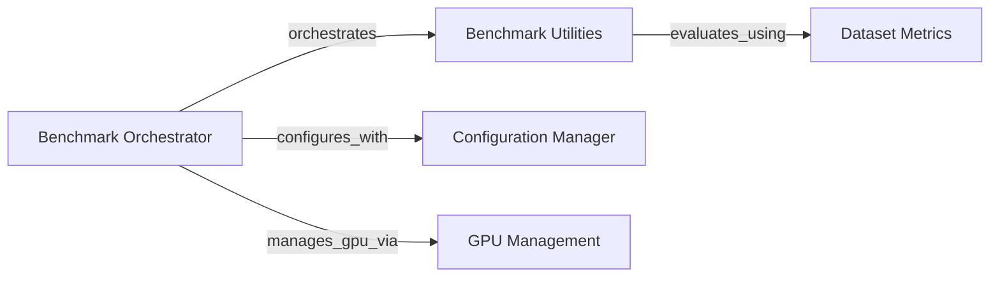

## Component Details

This component serves as the central orchestrator for running federated learning experiments. It manages the entire benchmark lifecycle, from parsing command-line arguments and loading configurations to initializing data loaders, executing training routines (both pooled and federated), evaluating models, and logging results.

### Benchmark Orchestrator
This component serves as the main entry point for initiating and managing the federated learning benchmark experiments. It orchestrates the entire flow, from configuration loading and data initialization to training, evaluation, and result logging.

**Related Classes/Methods**:

- <a href="https://github.com/owkin/FLamby/blob/master/flamby/benchmarks/fed_benchmark.py#L29-L462" target="_blank" rel="noopener noreferrer">`flamby.benchmarks.fed_benchmark.main` (29:462)</a>

### Benchmark Utilities
This component provides a set of essential utility functions that support various stages of the federated learning benchmark. It includes functionalities for setting random seeds, initializing data loaders, managing experiment plans, training models, evaluating performance, and processing results.

**Related Classes/Methods**:

- <a href="https://github.com/owkin/FLamby/blob/master/flamby/benchmarks/benchmark_utils.py#L14-L25" target="_blank" rel="noopener noreferrer">`flamby.benchmarks.benchmark_utils.set_seed` (14:25)</a>
- <a href="https://github.com/owkin/FLamby/blob/master/flamby/benchmarks/benchmark_utils.py#L581-L633" target="_blank" rel="noopener noreferrer">`flamby.benchmarks.benchmark_utils.set_dataset_specific_config` (581:633)</a>
- <a href="https://github.com/owkin/FLamby/blob/master/flamby/benchmarks/benchmark_utils.py#L183-L245" target="_blank" rel="noopener noreferrer">`flamby.benchmarks.benchmark_utils.init_data_loaders` (183:245)</a>
- <a href="https://github.com/owkin/FLamby/blob/master/flamby/benchmarks/benchmark_utils.py#L457-L526" target="_blank" rel="noopener noreferrer">`flamby.benchmarks.benchmark_utils.init_xp_plan` (457:526)</a>
- <a href="https://github.com/owkin/FLamby/blob/master/flamby/benchmarks/benchmark_utils.py#L347-L454" target="_blank" rel="noopener noreferrer">`flamby.benchmarks.benchmark_utils.train_single_centric` (347:454)</a>
- <a href="https://github.com/owkin/FLamby/blob/master/flamby/benchmarks/benchmark_utils.py#L289-L344" target="_blank" rel="noopener noreferrer">`flamby.benchmarks.benchmark_utils.evaluate_model_on_local_and_pooled_tests` (289:344)</a>
- <a href="https://github.com/owkin/FLamby/blob/master/flamby/benchmarks/benchmark_utils.py#L28-L84" target="_blank" rel="noopener noreferrer">`flamby.benchmarks.benchmark_utils.fill_df_with_xp_results` (28:84)</a>
- <a href="https://github.com/owkin/FLamby/blob/master/flamby/benchmarks/benchmark_utils.py#L248-L263" target="_blank" rel="noopener noreferrer">`flamby.benchmarks.benchmark_utils.prepare_dict` (248:263)</a>
- <a href="https://github.com/owkin/FLamby/blob/master/flamby/benchmarks/benchmark_utils.py#L529-L578" target="_blank" rel="noopener noreferrer">`flamby.benchmarks.benchmark_utils.ensemble_perf_from_predictions` (529:578)</a>
- <a href="https://github.com/owkin/FLamby/blob/master/flamby/benchmarks/benchmark_utils.py#L87-L180" target="_blank" rel="noopener noreferrer">`flamby.benchmarks.benchmark_utils.find_xps_in_df` (87:180)</a>
- <a href="https://github.com/owkin/FLamby/blob/master/flamby/benchmarks/benchmark_utils.py#L266-L286" target="_blank" rel="noopener noreferrer">`flamby.benchmarks.benchmark_utils.get_logfile_name_from_strategy` (266:286)</a>

### Configuration Manager
This component is responsible for handling all aspects of benchmark configuration. It provides functions to check the validity of configurations, retrieve dataset-specific arguments, determine federated learning strategies, and manage result file paths.

**Related Classes/Methods**:

- <a href="https://github.com/owkin/FLamby/blob/master/flamby/benchmarks/conf.py#L9-L47" target="_blank" rel="noopener noreferrer">`flamby.benchmarks.conf.check_config` (9:47)</a>
- <a href="https://github.com/owkin/FLamby/blob/master/flamby/benchmarks/conf.py#L50-L103" target="_blank" rel="noopener noreferrer">`flamby.benchmarks.conf.get_dataset_args` (50:103)</a>
- <a href="https://github.com/owkin/FLamby/blob/master/flamby/benchmarks/conf.py#L106-L196" target="_blank" rel="noopener noreferrer">`flamby.benchmarks.conf.get_strategies` (106:196)</a>
- <a href="https://github.com/owkin/FLamby/blob/master/flamby/benchmarks/conf.py#L199-L203" target="_blank" rel="noopener noreferrer">`flamby.benchmarks.conf.get_results_file` (199:203)</a>

### GPU Management
This component provides utilities for managing GPU device usage within the FLamby framework, specifically for setting the active GPU index for computations.

**Related Classes/Methods**:

- <a href="https://github.com/owkin/FLamby/blob/master/flamby/gpu_utils.py#L5-L30" target="_blank" rel="noopener noreferrer">`flamby.gpu_utils.use_gpu_idx` (5:30)</a>

### Dataset Metrics
This component encapsulates dataset-specific evaluation metrics. It provides functions to calculate performance metrics, such as Dice scores, tailored to the characteristics of individual datasets like LIDC-IDRI and KiTS19.

**Related Classes/Methods**:

- <a href="https://github.com/owkin/FLamby/blob/master/flamby/datasets/fed_lidc_idri/metric.py#L20-L65" target="_blank" rel="noopener noreferrer">`flamby.datasets.fed_lidc_idri.metric.evaluate_dice_on_tests_by_chunks` (20:65)</a>
- <a href="https://github.com/owkin/FLamby/blob/master/flamby/datasets/fed_kits19/metric.py#L41-L83" target="_blank" rel="noopener noreferrer">`flamby.datasets.fed_kits19.metric.evaluate_dice_on_tests` (41:83)</a>

### [FAQ](https://github.com/CodeBoarding/GeneratedOnBoardings/tree/main?tab=readme-ov-file#faq)