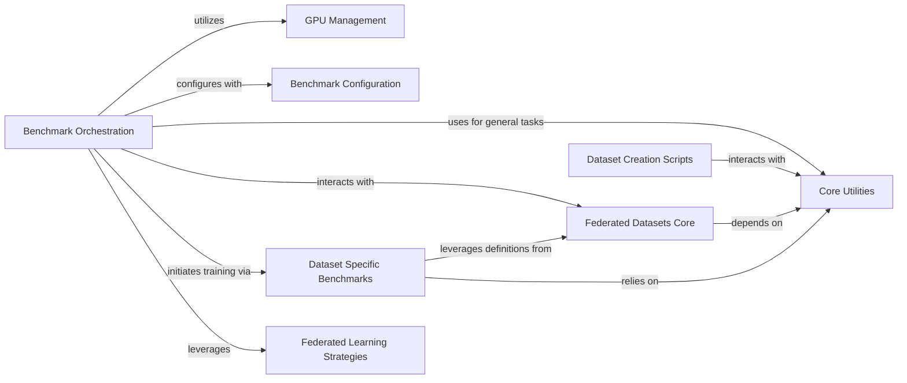

## Component Details

This graph provides a comprehensive overview of the FLamby framework's core components and their interactions. It highlights the central role of 'Benchmark Orchestration' in managing the federated learning process, from configuration and data loading to training and evaluation. Various utility components support these operations, including 'Core Utilities' for general tasks, 'GPU Management' for hardware acceleration, and 'Benchmark Configuration' for experiment setup. The 'Federated Datasets Core' defines the structure and properties of different datasets, which are prepared by 'Dataset Creation Scripts' and utilized by 'Dataset Specific Benchmarks' for individual dataset evaluations. Finally, 'Federated Learning Strategies' encapsulate the algorithms used for collaborative model training.

### Core Utilities
This component provides fundamental utility functions for managing application configurations, handling dataset validation, license acceptance, and general helper functions across the FLamby framework.

**Related Classes/Methods**:

- <a href="https://github.com/owkin/FLamby/blob/master/flamby/utils.py#L134-L172" target="_blank" rel="noopener noreferrer">`FLamby.flamby.utils.create_config` (134:172)</a>
- <a href="https://github.com/owkin/FLamby/blob/master/flamby/utils.py#L79-L98" target="_blank" rel="noopener noreferrer">`FLamby.flamby.utils.read_config` (79:98)</a>
- <a href="https://github.com/owkin/FLamby/blob/master/flamby/utils.py#L175-L198" target="_blank" rel="noopener noreferrer">`FLamby.flamby.utils.write_value_in_config` (175:198)</a>
- <a href="https://github.com/owkin/FLamby/blob/master/flamby/utils.py#L201-L255" target="_blank" rel="noopener noreferrer">`FLamby.flamby.utils.check_dataset_from_config` (201:255)</a>
- <a href="https://github.com/owkin/FLamby/blob/master/flamby/utils.py#L101-L131" target="_blank" rel="noopener noreferrer">`FLamby.flamby.utils.get_config_file_path` (101:131)</a>
- <a href="https://github.com/owkin/FLamby/blob/master/flamby/utils.py#L258-L317" target="_blank" rel="noopener noreferrer">`flamby.utils.accept_license` (258:317)</a>
- <a href="https://github.com/owkin/FLamby/blob/master/flamby/utils.py#L17-L76" target="_blank" rel="noopener noreferrer">`flamby.utils.evaluate_model_on_tests` (17:76)</a>

### GPU Management
This component provides utilities for managing GPU device selection and usage within the FLamby framework, ensuring that computations can be efficiently offloaded to available graphics processing units.

**Related Classes/Methods**:

- <a href="https://github.com/owkin/FLamby/blob/master/flamby/gpu_utils.py#L5-L30" target="_blank" rel="noopener noreferrer">`flamby.gpu_utils.use_gpu_idx` (5:30)</a>

### Benchmark Orchestration
This component is responsible for orchestrating the overall federated learning benchmark execution. It handles setting up the experiment plan, initializing data loaders, training models (both federated and centralized), evaluating performance, and logging results.

**Related Classes/Methods**:

- <a href="https://github.com/owkin/FLamby/blob/master/flamby/benchmarks/fed_benchmark.py#L29-L462" target="_blank" rel="noopener noreferrer">`FLamby.flamby.benchmarks.fed_benchmark.main` (29:462)</a>
- <a href="https://github.com/owkin/FLamby/blob/master/flamby/benchmarks/benchmark_utils.py#L14-L25" target="_blank" rel="noopener noreferrer">`flamby.benchmarks.benchmark_utils.set_seed` (14:25)</a>
- <a href="https://github.com/owkin/FLamby/blob/master/flamby/benchmarks/benchmark_utils.py#L581-L633" target="_blank" rel="noopener noreferrer">`flamby.benchmarks.benchmark_utils.set_dataset_specific_config` (581:633)</a>
- <a href="https://github.com/owkin/FLamby/blob/master/flamby/benchmarks/benchmark_utils.py#L183-L245" target="_blank" rel="noopener noreferrer">`flamby.benchmarks.benchmark_utils.init_data_loaders` (183:245)</a>
- <a href="https://github.com/owkin/FLamby/blob/master/flamby/benchmarks/benchmark_utils.py#L457-L526" target="_blank" rel="noopener noreferrer">`flamby.benchmarks.benchmark_utils.init_xp_plan` (457:526)</a>
- <a href="https://github.com/owkin/FLamby/blob/master/flamby/benchmarks/benchmark_utils.py#L347-L454" target="_blank" rel="noopener noreferrer">`flamby.benchmarks.benchmark_utils.train_single_centric` (347:454)</a>
- <a href="https://github.com/owkin/FLamby/blob/master/flamby/benchmarks/benchmark_utils.py#L289-L344" target="_blank" rel="noopener noreferrer">`flamby.benchmarks.benchmark_utils.evaluate_model_on_local_and_pooled_tests` (289:344)</a>
- <a href="https://github.com/owkin/FLamby/blob/master/flamby/benchmarks/benchmark_utils.py#L28-L84" target="_blank" rel="noopener noreferrer">`flamby.benchmarks.benchmark_utils.fill_df_with_xp_results` (28:84)</a>
- <a href="https://github.com/owkin/FLamby/blob/master/flamby/benchmarks/benchmark_utils.py#L529-L578" target="_blank" rel="noopener noreferrer">`flamby.benchmarks.benchmark_utils.ensemble_perf_from_predictions` (529:578)</a>
- <a href="https://github.com/owkin/FLamby/blob/master/flamby/benchmarks/benchmark_utils.py#L87-L180" target="_blank" rel="noopener noreferrer">`flamby.benchmarks.benchmark_utils.find_xps_in_df` (87:180)</a>
- <a href="https://github.com/owkin/FLamby/blob/master/flamby/benchmarks/benchmark_utils.py#L266-L286" target="_blank" rel="noopener noreferrer">`flamby.benchmarks.benchmark_utils.get_logfile_name_from_strategy` (266:286)</a>

### Benchmark Configuration
This component manages the configuration specific to the benchmarks, including checking overall benchmark settings, retrieving dataset-specific arguments, defining federated learning strategies, and determining output file paths for results.

**Related Classes/Methods**:

- <a href="https://github.com/owkin/FLamby/blob/master/flamby/benchmarks/conf.py#L9-L47" target="_blank" rel="noopener noreferrer">`flamby.benchmarks.conf.check_config` (9:47)</a>
- <a href="https://github.com/owkin/FLamby/blob/master/flamby/benchmarks/conf.py#L50-L103" target="_blank" rel="noopener noreferrer">`flamby.benchmarks.conf.get_dataset_args` (50:103)</a>
- <a href="https://github.com/owkin/FLamby/blob/master/flamby/benchmarks/conf.py#L106-L196" target="_blank" rel="noopener noreferrer">`flamby.benchmarks.conf.get_strategies` (106:196)</a>
- <a href="https://github.com/owkin/FLamby/blob/master/flamby/benchmarks/conf.py#L199-L203" target="_blank" rel="noopener noreferrer">`flamby.benchmarks.conf.get_results_file` (199:203)</a>

### Federated Datasets Core
This component encapsulates the core definitions for various federated datasets, including their dataset classes (e.g., FedTcgaBrca), baseline models, loss functions, and evaluation metrics. It also includes raw dataset initializers and dataset-specific utility functions.

**Related Classes/Methods**:

- <a href="https://github.com/owkin/FLamby/blob/master/flamby/datasets/fed_tcga_brca/loss.py#L6-L36" target="_blank" rel="noopener noreferrer">`flamby.datasets.fed_tcga_brca.loss.BaselineLoss` (6:36)</a>
- <a href="https://github.com/owkin/FLamby/blob/master/flamby/datasets/fed_tcga_brca/dataset.py#L53-L105" target="_blank" rel="noopener noreferrer">`flamby.datasets.fed_tcga_brca.dataset.FedTcgaBrca` (53:105)</a>
- <a href="https://github.com/owkin/FLamby/blob/master/flamby/datasets/fed_tcga_brca/model.py#L6-L18" target="_blank" rel="noopener noreferrer">`flamby.datasets.fed_tcga_brca.model.Baseline` (6:18)</a>
- <a href="https://github.com/owkin/FLamby/blob/master/flamby/datasets/fed_tcga_brca/metric.py#L3-L22" target="_blank" rel="noopener noreferrer">`flamby.datasets.fed_tcga_brca.metric.metric` (3:22)</a>
- <a href="https://github.com/owkin/FLamby/blob/master/flamby/datasets/fed_tcga_brca/dataset.py#L28-L42" target="_blank" rel="noopener noreferrer">`FLamby.flamby.datasets.fed_tcga_brca.dataset.TcgaBrcaRaw.__init__` (28:42)</a>
- <a href="https://github.com/owkin/FLamby/blob/master/flamby/datasets/fed_isic2019/dataset.py#L103-L189" target="_blank" rel="noopener noreferrer">`flamby.datasets.fed_isic2019.dataset.FedIsic2019` (103:189)</a>
- <a href="https://github.com/owkin/FLamby/blob/master/flamby/datasets/fed_isic2019/model.py#L10-L35" target="_blank" rel="noopener noreferrer">`flamby.datasets.fed_isic2019.model.Baseline` (10:35)</a>
- <a href="https://github.com/owkin/FLamby/blob/master/flamby/datasets/fed_isic2019/loss.py#L17-L57" target="_blank" rel="noopener noreferrer">`flamby.datasets.fed_isic2019.loss.BaselineLoss` (17:57)</a>
- <a href="https://github.com/owkin/FLamby/blob/master/flamby/datasets/fed_isic2019/dataset.py#L43-L80" target="_blank" rel="noopener noreferrer">`FLamby.flamby.datasets.fed_isic2019.dataset.Isic2019Raw.__init__` (43:80)</a>
- <a href="https://github.com/owkin/FLamby/blob/master/flamby/datasets/fed_heart_disease/dataset.py#L208-L292" target="_blank" rel="noopener noreferrer">`flamby.datasets.fed_heart_disease.dataset.FedHeartDisease` (208:292)</a>
- <a href="https://github.com/owkin/FLamby/blob/master/flamby/datasets/fed_heart_disease/model.py#L4-L10" target="_blank" rel="noopener noreferrer">`flamby.datasets.fed_heart_disease.model.Baseline` (4:10)</a>
- <a href="https://github.com/owkin/FLamby/blob/master/flamby/datasets/fed_heart_disease/loss.py#L4-L10" target="_blank" rel="noopener noreferrer">`flamby.datasets.fed_heart_disease.loss.BaselineLoss` (4:10)</a>
- <a href="https://github.com/owkin/FLamby/blob/master/flamby/datasets/fed_heart_disease/metric.py#L3-L13" target="_blank" rel="noopener noreferrer">`flamby.datasets.fed_heart_disease.metric.metric` (3:13)</a>
- <a href="https://github.com/owkin/FLamby/blob/master/flamby/datasets/fed_heart_disease/dataset.py#L54-L187" target="_blank" rel="noopener noreferrer">`FLamby.flamby.datasets.fed_heart_disease.dataset.HeartDiseaseRaw.__init__` (54:187)</a>
- <a href="https://github.com/owkin/FLamby/blob/master/flamby/datasets/fed_camelyon16/dataset.py#L179-L250" target="_blank" rel="noopener noreferrer">`flamby.datasets.fed_camelyon16.dataset.FedCamelyon16` (179:250)</a>
- <a href="https://github.com/owkin/FLamby/blob/master/flamby/datasets/fed_camelyon16/model.py#L8-L52" target="_blank" rel="noopener noreferrer">`flamby.datasets.fed_camelyon16.model.Baseline` (8:52)</a>
- <a href="https://github.com/owkin/FLamby/blob/master/flamby/datasets/fed_camelyon16/loss.py#L4-L10" target="_blank" rel="noopener noreferrer">`flamby.datasets.fed_camelyon16.loss.BaselineLoss` (4:10)</a>
- <a href="https://github.com/owkin/FLamby/blob/master/flamby/datasets/fed_camelyon16/metric.py#L4-L11" target="_blank" rel="noopener noreferrer">`flamby.datasets.fed_camelyon16.metric.metric` (4:11)</a>
- <a href="https://github.com/owkin/FLamby/blob/master/flamby/datasets/fed_camelyon16/dataset.py#L57-L163" target="_blank" rel="noopener noreferrer">`FLamby.flamby.datasets.fed_camelyon16.dataset.Camelyon16Raw.__init__` (57:163)</a>
- <a href="https://github.com/owkin/FLamby/blob/master/flamby/datasets/fed_synthetic/dataset.py#L133-L196" target="_blank" rel="noopener noreferrer">`flamby.datasets.fed_synthetic.dataset.FedSynthetic` (133:196)</a>
- <a href="https://github.com/owkin/FLamby/blob/master/flamby/datasets/fed_synthetic/model.py#L4-L10" target="_blank" rel="noopener noreferrer">`flamby.datasets.fed_synthetic.model.Baseline` (4:10)</a>
- <a href="https://github.com/owkin/FLamby/blob/master/flamby/datasets/fed_synthetic/loss.py#L4-L10" target="_blank" rel="noopener noreferrer">`flamby.datasets.fed_synthetic.loss.BaselineLoss` (4:10)</a>
- <a href="https://github.com/owkin/FLamby/blob/master/flamby/datasets/fed_synthetic/metric.py#L4-L7" target="_blank" rel="noopener noreferrer">`flamby.datasets.fed_synthetic.metric.metric` (4:7)</a>
- <a href="https://github.com/owkin/FLamby/blob/master/flamby/datasets/fed_synthetic/dataset.py#L49-L119" target="_blank" rel="noopener noreferrer">`FLamby.flamby.datasets.fed_synthetic.dataset.SyntheticRaw.__init__` (49:119)</a>
- <a href="https://github.com/owkin/FLamby/blob/master/flamby/datasets/fed_lidc_idri/dataset.py#L69-L122" target="_blank" rel="noopener noreferrer">`FLamby.flamby.datasets.fed_lidc_idri.dataset.LidcIdriRaw.__init__` (69:122)</a>
- <a href="https://github.com/owkin/FLamby/blob/master/flamby/datasets/fed_lidc_idri/data_utils.py#L5-L83" target="_blank" rel="noopener noreferrer">`flamby.datasets.fed_lidc_idri.data_utils.Sampler` (5:83)</a>
- <a href="https://github.com/owkin/FLamby/blob/master/flamby/datasets/fed_lidc_idri/data_utils.py#L86-L107" target="_blank" rel="noopener noreferrer">`flamby.datasets.fed_lidc_idri.data_utils.ClipNorm` (86:107)</a>
- <a href="https://github.com/owkin/FLamby/blob/master/flamby/datasets/fed_kits19/dataset.py#L311-L375" target="_blank" rel="noopener noreferrer">`flamby.datasets.fed_kits19.dataset.FedKits19` (311:375)</a>
- <a href="https://github.com/owkin/FLamby/blob/master/flamby/datasets/fed_kits19/model.py#L24-L60" target="_blank" rel="noopener noreferrer">`flamby.datasets.fed_kits19.model.Baseline` (24:60)</a>
- <a href="https://github.com/owkin/FLamby/blob/master/flamby/datasets/fed_kits19/loss.py#L3-L24" target="_blank" rel="noopener noreferrer">`flamby.datasets.fed_kits19.loss.BaselineLoss` (3:24)</a>
- <a href="https://github.com/owkin/FLamby/blob/master/flamby/datasets/fed_kits19/metric.py#L41-L83" target="_blank" rel="noopener noreferrer">`flamby.datasets.fed_kits19.metric.evaluate_dice_on_tests` (41:83)</a>
- <a href="https://github.com/owkin/FLamby/blob/master/flamby/datasets/fed_kits19/dataset.py#L65-L145" target="_blank" rel="noopener noreferrer">`FLamby.flamby.datasets.fed_kits19.dataset.Kits19Raw.__init__` (65:145)</a>
- <a href="https://github.com/owkin/FLamby/blob/master/flamby/datasets/fed_ixi/dataset.py#L169-L236" target="_blank" rel="noopener noreferrer">`flamby.datasets.fed_ixi.dataset.FedIXITiny` (169:236)</a>
- <a href="https://github.com/owkin/FLamby/blob/master/flamby/datasets/fed_ixi/model.py#L17-L130" target="_blank" rel="noopener noreferrer">`flamby.datasets.fed_ixi.model.Baseline` (17:130)</a>
- <a href="https://github.com/owkin/FLamby/blob/master/flamby/datasets/fed_ixi/loss.py#L4-L26" target="_blank" rel="noopener noreferrer">`flamby.datasets.fed_ixi.loss.BaselineLoss` (4:26)</a>
- <a href="https://github.com/owkin/FLamby/blob/master/flamby/datasets/fed_ixi/dataset.py#L45-L105" target="_blank" rel="noopener noreferrer">`FLamby.flamby.datasets.fed_ixi.dataset.IXITinyRaw.__init__` (45:105)</a>
- <a href="https://github.com/owkin/FLamby/blob/master/flamby/datasets/fed_ixi/utils.py#L10-L10" target="_blank" rel="noopener noreferrer">`flamby.datasets.fed_ixi.utils._extract_center_name_from_filename` (10:10)</a>
- <a href="https://github.com/owkin/FLamby/blob/master/flamby/datasets/fed_ixi/utils.py#L10-L10" target="_blank" rel="noopener noreferrer">`flamby.datasets.fed_ixi.utils._get_id_from_filename` (10:10)</a>
- <a href="https://github.com/owkin/FLamby/blob/master/flamby/datasets/fed_synthetic/common.py#L14-L23" target="_blank" rel="noopener noreferrer">`flamby.datasets.fed_synthetic.common.get_nb_max_rounds` (14:23)</a>

### Dataset Creation Scripts
This component contains the scripts and utilities necessary for downloading, processing, and preparing various federated datasets. It handles tasks such as data generation, file tiling, and managing dataset-specific environment variables.

**Related Classes/Methods**:

- <a href="https://github.com/owkin/FLamby/blob/master/flamby/datasets/fed_heart_disease/dataset_creation_scripts/download.py#L11-L104" target="_blank" rel="noopener noreferrer">`FLamby.flamby.datasets.fed_heart_disease.dataset_creation_scripts.download.main` (11:104)</a>
- <a href="https://github.com/owkin/FLamby/blob/master/flamby/datasets/fed_camelyon16/dataset_creation_scripts/tiling_slides.py#L105-L335" target="_blank" rel="noopener noreferrer">`FLamby.flamby.datasets.fed_camelyon16.dataset_creation_scripts.tiling_slides.main` (105:335)</a>
- <a href="https://github.com/owkin/FLamby/blob/master/flamby/datasets/fed_camelyon16/dataset_creation_scripts/tiling_slides.py#L96-L97" target="_blank" rel="noopener noreferrer">`FLamby.flamby.datasets.fed_camelyon16.dataset_creation_scripts.tiling_slides.dict_to_df` (96:97)</a>
- <a href="https://github.com/owkin/FLamby/blob/master/flamby/datasets/fed_camelyon16/dataset_creation_scripts/tiling_slides.py#L73-L93" target="_blank" rel="noopener noreferrer">`FLamby.flamby.datasets.fed_camelyon16.dataset_creation_scripts.tiling_slides.DatasetFromCoords` (73:93)</a>
- <a href="https://github.com/owkin/FLamby/blob/master/flamby/datasets/fed_camelyon16/dataset_creation_scripts/tiling_slides.py#L46-L70" target="_blank" rel="noopener noreferrer">`FLamby.flamby.datasets.fed_camelyon16.dataset_creation_scripts.tiling_slides.SlideDataset` (46:70)</a>
- <a href="https://github.com/owkin/FLamby/blob/master/flamby/datasets/fed_camelyon16/dataset_creation_scripts/tiling_slides.py#L100-L102" target="_blank" rel="noopener noreferrer">`FLamby.flamby.datasets.fed_camelyon16.dataset_creation_scripts.tiling_slides.save_dict_to_csv` (100:102)</a>
- <a href="https://github.com/owkin/FLamby/blob/master/flamby/datasets/fed_camelyon16/dataset_creation_scripts/download.py#L20-L152" target="_blank" rel="noopener noreferrer">`FLamby.flamby.datasets.fed_camelyon16.dataset_creation_scripts.download.main` (20:152)</a>
- <a href="https://github.com/owkin/FLamby/blob/master/flamby/datasets/fed_synthetic/dataset_creation_scripts/download.py#L9-L64" target="_blank" rel="noopener noreferrer">`FLamby.flamby.datasets.fed_synthetic.dataset_creation_scripts.download.main` (9:64)</a>
- <a href="https://github.com/owkin/FLamby/blob/master/flamby/datasets/fed_synthetic/synthetic_generator.py#L4-L220" target="_blank" rel="noopener noreferrer">`flamby.datasets.fed_synthetic.synthetic_generator.generate_synthetic_dataset` (4:220)</a>
- <a href="https://github.com/owkin/FLamby/blob/master/flamby/datasets/fed_lidc_idri/dataset_creation_scripts/download_ct_scans.py#L116-L221" target="_blank" rel="noopener noreferrer">`FLamby.flamby.datasets.fed_lidc_idri.dataset_creation_scripts.download_ct_scans.download_LIDC` (116:221)</a>
- <a href="https://github.com/owkin/FLamby/blob/master/flamby/datasets/fed_lidc_idri/dataset_creation_scripts/download_ct_scans.py#L67-L92" target="_blank" rel="noopener noreferrer">`FLamby.flamby.datasets.fed_lidc_idri.dataset_creation_scripts.download_ct_scans.download_zip_from_url` (67:92)</a>
- <a href="https://github.com/owkin/FLamby/blob/master/flamby/datasets/fed_lidc_idri/dataset_creation_scripts/download_ct_scans.py#L45-L64" target="_blank" rel="noopener noreferrer">`FLamby.flamby.datasets.fed_lidc_idri.dataset_creation_scripts.download_ct_scans.download_dicom_series` (45:64)</a>
- <a href="https://github.com/owkin/FLamby/blob/master/flamby/datasets/fed_lidc_idri/dataset_creation_scripts/download_ct_scans.py#L224-L258" target="_blank" rel="noopener noreferrer">`FLamby.flamby.datasets.fed_lidc_idri.dataset_creation_scripts.download_ct_scans.LIDC_to_niftis` (224:258)</a>
- <a href="https://github.com/owkin/FLamby/blob/master/flamby/datasets/fed_lidc_idri/dataset_creation_scripts/download_ct_scans.py#L261-L275" target="_blank" rel="noopener noreferrer">`FLamby.flamby.datasets.fed_lidc_idri.dataset_creation_scripts.download_ct_scans.main` (261:275)</a>
- <a href="https://github.com/owkin/FLamby/blob/master/flamby/datasets/fed_kits19/dataset_creation_scripts/utils/set_environment_variables.py#L5-L19" target="_blank" rel="noopener noreferrer">`flamby.datasets.fed_kits19.dataset_creation_scripts.utils.set_environment_variables.set_environment_variables` (5:19)</a>
- <a href="https://github.com/owkin/FLamby/blob/master/flamby/datasets/fed_kits19/dataset_creation_scripts/utils/data_augmentations.py#L54-L211" target="_blank" rel="noopener noreferrer">`flamby.datasets.fed_kits19.dataset_creation_scripts.utils.data_augmentations.transformations` (54:211)</a>
- <a href="https://github.com/owkin/FLamby/blob/master/flamby/datasets/fed_ixi/dataset_creation_scripts/download.py#L13-L65" target="_blank" rel="noopener noreferrer">`FLamby.flamby.datasets.fed_ixi.dataset_creation_scripts.download.dl_ixi_tiny` (13:65)</a>

### Dataset Specific Benchmarks
This component contains the main entry points and training logic for running benchmarks on individual federated datasets. It often includes dataset-specific training loops and evaluation routines that leverage the core dataset definitions.

**Related Classes/Methods**:

- <a href="https://github.com/owkin/FLamby/blob/master/flamby/datasets/fed_tcga_brca/benchmark.py#L129-L194" target="_blank" rel="noopener noreferrer">`FLamby.flamby.datasets.fed_tcga_brca.benchmark.main` (129:194)</a>
- <a href="https://github.com/owkin/FLamby/blob/master/flamby/datasets/fed_tcga_brca/benchmark.py#L27-L126" target="_blank" rel="noopener noreferrer">`FLamby.flamby.datasets.fed_tcga_brca.benchmark.train_model` (27:126)</a>
- <a href="https://github.com/owkin/FLamby/blob/master/flamby/datasets/fed_tcga_brca/benchmark.py#L20-L24" target="_blank" rel="noopener noreferrer">`FLamby.flamby.datasets.fed_tcga_brca.benchmark.dict_mean` (20:24)</a>
- <a href="https://github.com/owkin/FLamby/blob/master/flamby/datasets/fed_isic2019/benchmark.py#L133-L212" target="_blank" rel="noopener noreferrer">`FLamby.flamby.datasets.fed_isic2019.benchmark.main` (133:212)</a>
- <a href="https://github.com/owkin/FLamby/blob/master/flamby/datasets/fed_isic2019/benchmark.py#L23-L130" target="_blank" rel="noopener noreferrer">`FLamby.flamby.datasets.fed_isic2019.benchmark.train_model` (23:130)</a>
- <a href="https://github.com/owkin/FLamby/blob/master/flamby/datasets/fed_heart_disease/benchmark.py#L21-L120" target="_blank" rel="noopener noreferrer">`FLamby.flamby.datasets.fed_heart_disease.benchmark.main` (21:120)</a>
- <a href="https://github.com/owkin/FLamby/blob/master/flamby/datasets/fed_camelyon16/benchmark.py#L23-L132" target="_blank" rel="noopener noreferrer">`FLamby.flamby.datasets.fed_camelyon16.benchmark.main` (23:132)</a>
- <a href="https://github.com/owkin/FLamby/blob/master/flamby/datasets/fed_synthetic/benchmark.py#L21-L128" target="_blank" rel="noopener noreferrer">`FLamby.flamby.datasets.fed_synthetic.benchmark.main` (21:128)</a>
- <a href="https://github.com/owkin/FLamby/blob/master/flamby/datasets/fed_kits19/benchmark.py#L121-L184" target="_blank" rel="noopener noreferrer">`FLamby.flamby.datasets.fed_kits19.benchmark.main` (121:184)</a>
- <a href="https://github.com/owkin/FLamby/blob/master/flamby/datasets/fed_ixi/benchmark.py#L23-L124" target="_blank" rel="noopener noreferrer">`FLamby.flamby.datasets.fed_ixi.benchmark.main` (23:124)</a>

### Federated Learning Strategies
This component defines and implements various federated learning strategies, such as Federated Averaging (FedAvg), FedProx, Scaffold, and others. It provides the core algorithms for collaborative model training in a federated setting.

**Related Classes/Methods**:

- <a href="https://github.com/owkin/FLamby/blob/master/flamby/strategies/cyclic.py#L1-L200" target="_blank" rel="noopener noreferrer">`flamby.strategies.cyclic` (1:200)</a>
- <a href="https://github.com/owkin/FLamby/blob/master/flamby/strategies/fed_avg.py#L1-L200" target="_blank" rel="noopener noreferrer">`flamby.strategies.fed_avg` (1:200)</a>
- <a href="https://github.com/owkin/FLamby/blob/master/flamby/strategies/fed_avg_fine_tuning.py#L1-L200" target="_blank" rel="noopener noreferrer">`flamby.strategies.fed_avg_fine_tuning` (1:200)</a>
- <a href="https://github.com/owkin/FLamby/blob/master/flamby/strategies/fed_opt.py#L1-L200" target="_blank" rel="noopener noreferrer">`flamby.strategies.fed_opt` (1:200)</a>
- <a href="https://github.com/owkin/FLamby/blob/master/flamby/strategies/fed_prox.py#L1-L200" target="_blank" rel="noopener noreferrer">`flamby.strategies.fed_prox` (1:200)</a>
- <a href="https://github.com/owkin/FLamby/blob/master/flamby/strategies/scaffold.py#L1-L200" target="_blank" rel="noopener noreferrer">`flamby.strategies.scaffold` (1:200)</a>
- <a href="https://github.com/owkin/FLamby/blob/master/flamby/strategies/utils.py#L1-L200" target="_blank" rel="noopener noreferrer">`flamby.strategies.utils` (1:200)</a>

### [FAQ](https://github.com/CodeBoarding/GeneratedOnBoardings/tree/main?tab=readme-ov-file#faq)