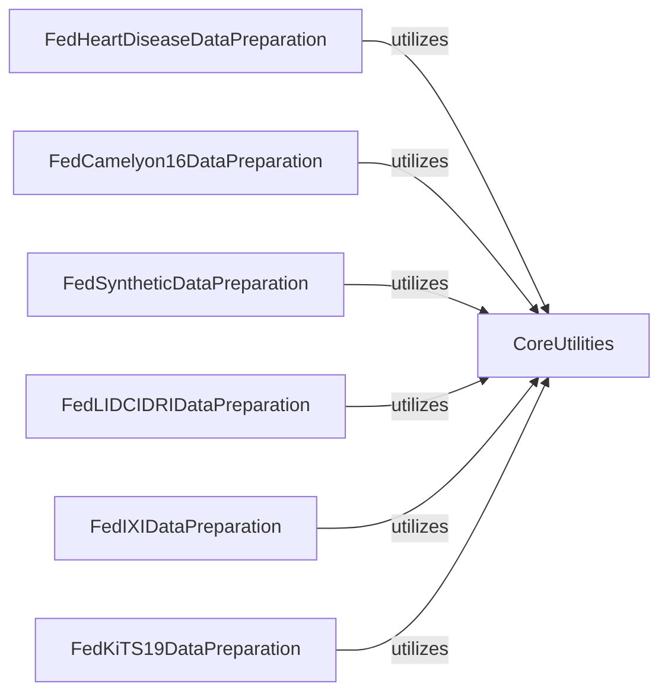

## Component Details

The Data Preparation & Utilities component in FLamby provides a comprehensive suite of tools and scripts essential for managing and preparing diverse datasets for federated learning. It encompasses core utilities for configuration management and dataset splitting, alongside specialized modules for downloading, processing, and transforming various data types, including complex medical images. Each dataset-specific preparation component leverages the core utilities to ensure proper setup and adherence to licensing, while handling unique data acquisition and preprocessing challenges.

### CoreUtilities
Provides fundamental utility functions for FLamby, including managing configuration files (reading, writing, creating), handling license agreements, and offering various strategies for splitting datasets among different clients (linear, Dirichlet distribution). It acts as a foundational layer for dataset preparation and management across the FLamby ecosystem.

**Related Classes/Methods**:

- <a href="https://github.com/owkin/FLamby/blob/master/flamby/utils.py#L258-L317" target="_blank" rel="noopener noreferrer">`flamby.utils.accept_license` (258:317)</a>
- <a href="https://github.com/owkin/FLamby/blob/master/flamby/utils.py#L134-L172" target="_blank" rel="noopener noreferrer">`flamby.utils.create_config` (134:172)</a>
- <a href="https://github.com/owkin/FLamby/blob/master/flamby/utils.py#L175-L198" target="_blank" rel="noopener noreferrer">`flamby.utils.write_value_in_config` (175:198)</a>
- <a href="https://github.com/owkin/FLamby/blob/master/flamby/utils.py#L79-L98" target="_blank" rel="noopener noreferrer">`flamby.utils.read_config` (79:98)</a>
- <a href="https://github.com/owkin/FLamby/blob/master/flamby/utils.py#L101-L131" target="_blank" rel="noopener noreferrer">`flamby.utils.get_config_file_path` (101:131)</a>
- <a href="https://github.com/owkin/FLamby/blob/master/flamby/utils.py#L201-L255" target="_blank" rel="noopener noreferrer">`flamby.utils.check_dataset_from_config` (201:255)</a>
- <a href="https://github.com/owkin/FLamby/blob/master/flamby/datasets/split_utils.py#L155-L282" target="_blank" rel="noopener noreferrer">`FLamby.flamby.datasets.split_utils.split_dataset` (155:282)</a>
- <a href="https://github.com/owkin/FLamby/blob/master/flamby/datasets/split_utils.py#L126-L152" target="_blank" rel="noopener noreferrer">`FLamby.flamby.datasets.split_utils.get_client_sizes` (126:152)</a>
- <a href="https://github.com/owkin/FLamby/blob/master/flamby/datasets/split_utils.py#L5-L48" target="_blank" rel="noopener noreferrer">`FLamby.flamby.datasets.split_utils.split_indices_linear` (5:48)</a>
- <a href="https://github.com/owkin/FLamby/blob/master/flamby/datasets/split_utils.py#L51-L123" target="_blank" rel="noopener noreferrer">`FLamby.flamby.datasets.split_utils.split_indices_dirichlet` (51:123)</a>

### FedHeartDiseaseDataPreparation
Manages the download and initial setup of the FedHeartDisease dataset, ensuring proper license acceptance and configuration.

**Related Classes/Methods**:

- <a href="https://github.com/owkin/FLamby/blob/master/flamby/datasets/fed_heart_disease/dataset_creation_scripts/download.py#L11-L104" target="_blank" rel="noopener noreferrer">`FLamby.flamby.datasets.fed_heart_disease.dataset_creation_scripts.download.main` (11:104)</a>

### FedCamelyon16DataPreparation
Handles the download of the FedCamelyon16 dataset and the complex process of tiling whole slide images into smaller patches, including managing coordinates and saving processed data.

**Related Classes/Methods**:

- <a href="https://github.com/owkin/FLamby/blob/master/flamby/datasets/fed_camelyon16/dataset_creation_scripts/download.py#L20-L152" target="_blank" rel="noopener noreferrer">`FLamby.flamby.datasets.fed_camelyon16.dataset_creation_scripts.download.main` (20:152)</a>
- <a href="https://github.com/owkin/FLamby/blob/master/flamby/datasets/fed_camelyon16/dataset_creation_scripts/tiling_slides.py#L46-L70" target="_blank" rel="noopener noreferrer">`FLamby.flamby.datasets.fed_camelyon16.dataset_creation_scripts.tiling_slides.SlideDataset` (46:70)</a>
- <a href="https://github.com/owkin/FLamby/blob/master/flamby/datasets/fed_camelyon16/dataset_creation_scripts/tiling_slides.py#L100-L102" target="_blank" rel="noopener noreferrer">`FLamby.flamby.datasets.fed_camelyon16.dataset_creation_scripts.tiling_slides.save_dict_to_csv` (100:102)</a>
- <a href="https://github.com/owkin/FLamby/blob/master/flamby/datasets/fed_camelyon16/dataset_creation_scripts/tiling_slides.py#L105-L335" target="_blank" rel="noopener noreferrer">`FLamby.flamby.datasets.fed_camelyon16.dataset_creation_scripts.tiling_slides.main` (105:335)</a>
- <a href="https://github.com/owkin/FLamby/blob/master/flamby/datasets/fed_camelyon16/dataset_creation_scripts/tiling_slides.py#L26-L43" target="_blank" rel="noopener noreferrer">`FLamby.flamby.datasets.fed_camelyon16.dataset_creation_scripts.tiling_slides.add_borders` (26:43)</a>
- <a href="https://github.com/owkin/FLamby/blob/master/flamby/datasets/fed_camelyon16/dataset_creation_scripts/tiling_slides.py#L96-L97" target="_blank" rel="noopener noreferrer">`FLamby.flamby.datasets.fed_camelyon16.dataset_creation_scripts.tiling_slides.dict_to_df` (96:97)</a>
- <a href="https://github.com/owkin/FLamby/blob/master/flamby/datasets/fed_camelyon16/dataset_creation_scripts/tiling_slides.py#L73-L93" target="_blank" rel="noopener noreferrer">`FLamby.flamby.datasets.fed_camelyon16.dataset_creation_scripts.tiling_slides.DatasetFromCoords` (73:93)</a>

### FedSyntheticDataPreparation
Manages the generation and download of the FedSynthetic dataset, ensuring the synthetic data is properly created and stored for federated learning simulations.

**Related Classes/Methods**:

- <a href="https://github.com/owkin/FLamby/blob/master/flamby/datasets/fed_synthetic/dataset_creation_scripts/download.py#L9-L64" target="_blank" rel="noopener noreferrer">`FLamby.flamby.datasets.fed_synthetic.dataset_creation_scripts.download.main` (9:64)</a>
- <a href="https://github.com/owkin/FLamby/blob/master/flamby/datasets/fed_synthetic/synthetic_generator.py#L4-L220" target="_blank" rel="noopener noreferrer">`flamby.datasets.fed_synthetic.synthetic_generator.generate_synthetic_dataset` (4:220)</a>

### FedLIDCIDRIDataPreparation
Manages the entire lifecycle of the LIDC-IDRI dataset, including downloading CT scans via the TCIA client, processing raw DICOM data into Nifti format, building consensus annotations, and providing data utilities for sampling and normalization.

**Related Classes/Methods**:

- <a href="https://github.com/owkin/FLamby/blob/master/flamby/datasets/fed_lidc_idri/data_utils.py#L5-L83" target="_blank" rel="noopener noreferrer">`FLamby.flamby.datasets.fed_lidc_idri.data_utils.Sampler` (5:83)</a>
- <a href="https://github.com/owkin/FLamby/blob/master/flamby/datasets/fed_lidc_idri/data_utils.py#L86-L107" target="_blank" rel="noopener noreferrer">`FLamby.flamby.datasets.fed_lidc_idri.data_utils.ClipNorm` (86:107)</a>
- <a href="https://github.com/owkin/FLamby/blob/master/flamby/datasets/fed_lidc_idri/data_utils.py#L62-L83" target="_blank" rel="noopener noreferrer">`FLamby.flamby.datasets.fed_lidc_idri.data_utils.Sampler.__call__` (62:83)</a>
- <a href="https://github.com/owkin/FLamby/blob/master/flamby/datasets/fed_lidc_idri/data_utils.py#L155-L192" target="_blank" rel="noopener noreferrer">`FLamby.flamby.datasets.fed_lidc_idri.data_utils.random_sampler` (155:192)</a>
- <a href="https://github.com/owkin/FLamby/blob/master/flamby/datasets/fed_lidc_idri/data_utils.py#L229-L297" target="_blank" rel="noopener noreferrer">`FLamby.flamby.datasets.fed_lidc_idri.data_utils.fast_sampler` (229:297)</a>
- <a href="https://github.com/owkin/FLamby/blob/master/flamby/datasets/fed_lidc_idri/dataset_creation_scripts/download_ct_scans.py#L261-L275" target="_blank" rel="noopener noreferrer">`FLamby.flamby.datasets.fed_lidc_idri.dataset_creation_scripts.download_ct_scans.main` (261:275)</a>
- <a href="https://github.com/owkin/FLamby/blob/master/flamby/datasets/fed_lidc_idri/dataset_creation_scripts/tciaclient.py#L17-L230" target="_blank" rel="noopener noreferrer">`FLamby.flamby.datasets.fed_lidc_idri.dataset_creation_scripts.tciaclient.TCIAClient` (17:230)</a>
- <a href="https://github.com/owkin/FLamby/blob/master/flamby/datasets/fed_lidc_idri/dataset_creation_scripts/tciaclient.py#L57-L72" target="_blank" rel="noopener noreferrer">`FLamby.flamby.datasets.fed_lidc_idri.dataset_creation_scripts.tciaclient.TCIAClient.get_modality_values` (57:72)</a>
- <a href="https://github.com/owkin/FLamby/blob/master/flamby/datasets/fed_lidc_idri/dataset_creation_scripts/tciaclient.py#L74-L85" target="_blank" rel="noopener noreferrer">`FLamby.flamby.datasets.fed_lidc_idri.dataset_creation_scripts.tciaclient.TCIAClient.get_series_size` (74:85)</a>
- <a href="https://github.com/owkin/FLamby/blob/master/flamby/datasets/fed_lidc_idri/dataset_creation_scripts/tciaclient.py#L87-L97" target="_blank" rel="noopener noreferrer">`FLamby.flamby.datasets.fed_lidc_idri.dataset_creation_scripts.tciaclient.TCIAClient.contents_by_name` (87:97)</a>
- <a href="https://github.com/owkin/FLamby/blob/master/flamby/datasets/fed_lidc_idri/dataset_creation_scripts/tciaclient.py#L99-L114" target="_blank" rel="noopener noreferrer">`FLamby.flamby.datasets.fed_lidc_idri.dataset_creation_scripts.tciaclient.TCIAClient.get_manufacturer_values` (99:114)</a>
- <a href="https://github.com/owkin/FLamby/blob/master/flamby/datasets/fed_lidc_idri/dataset_creation_scripts/tciaclient.py#L116-L124" target="_blank" rel="noopener noreferrer">`FLamby.flamby.datasets.fed_lidc_idri.dataset_creation_scripts.tciaclient.TCIAClient.get_collection_values` (116:124)</a>
- <a href="https://github.com/owkin/FLamby/blob/master/flamby/datasets/fed_lidc_idri/dataset_creation_scripts/tciaclient.py#L126-L141" target="_blank" rel="noopener noreferrer">`FLamby.flamby.datasets.fed_lidc_idri.dataset_creation_scripts.tciaclient.TCIAClient.get_body_part_values` (126:141)</a>
- <a href="https://github.com/owkin/FLamby/blob/master/flamby/datasets/fed_lidc_idri/dataset_creation_scripts/tciaclient.py#L143-L158" target="_blank" rel="noopener noreferrer">`FLamby.flamby.datasets.fed_lidc_idri.dataset_creation_scripts.tciaclient.TCIAClient.get_patient_study` (143:158)</a>
- <a href="https://github.com/owkin/FLamby/blob/master/flamby/datasets/fed_lidc_idri/dataset_creation_scripts/tciaclient.py#L160-L175" target="_blank" rel="noopener noreferrer">`FLamby.flamby.datasets.fed_lidc_idri.dataset_creation_scripts.tciaclient.TCIAClient.get_series` (160:175)</a>
- <a href="https://github.com/owkin/FLamby/blob/master/flamby/datasets/fed_lidc_idri/dataset_creation_scripts/tciaclient.py#L177-L185" target="_blank" rel="noopener noreferrer">`FLamby.flamby.datasets.fed_lidc_idri.dataset_creation_scripts.tciaclient.TCIAClient.get_patient` (177:185)</a>
- <a href="https://github.com/owkin/FLamby/blob/master/flamby/datasets/fed_lidc_idri/dataset_creation_scripts/tciaclient.py#L187-L230" target="_blank" rel="noopener noreferrer">`FLamby.flamby.datasets.fed_lidc_idri.dataset_creation_scripts.tciaclient.TCIAClient.get_image` (187:230)</a>
- <a href="https://github.com/owkin/FLamby/blob/master/flamby/datasets/fed_lidc_idri/dataset_creation_scripts/tciaclient.py#L43-L55" target="_blank" rel="noopener noreferrer">`FLamby.flamby.datasets.fed_lidc_idri.dataset_creation_scripts.tciaclient.TCIAClient.execute` (43:55)</a>
- <a href="https://github.com/owkin/FLamby/blob/master/flamby/datasets/fed_lidc_idri/dataset_creation_scripts/process_raw.py#L102-L160" target="_blank" rel="noopener noreferrer">`FLamby.flamby.datasets.fed_lidc_idri.dataset_creation_scripts.process_raw.convert_to_niftis` (102:160)</a>
- <a href="https://github.com/owkin/FLamby/blob/master/flamby/datasets/fed_lidc_idri/dataset_creation_scripts/process_raw.py#L163-L193" target="_blank" rel="noopener noreferrer">`FLamby.flamby.datasets.fed_lidc_idri.dataset_creation_scripts.process_raw.build_consensus` (163:193)</a>
- <a href="https://github.com/owkin/FLamby/blob/master/flamby/datasets/fed_lidc_idri/dataset_creation_scripts/process_raw.py#L244-L335" target="_blank" rel="noopener noreferrer">`FLamby.flamby.datasets.fed_lidc_idri.dataset_creation_scripts.process_raw.build_volumes` (244:335)</a>
- <a href="https://github.com/owkin/FLamby/blob/master/flamby/datasets/fed_lidc_idri/dataset_creation_scripts/process_raw.py#L196-L229" target="_blank" rel="noopener noreferrer">`FLamby.flamby.datasets.fed_lidc_idri.dataset_creation_scripts.process_raw.fuse_points` (196:229)</a>
- <a href="https://github.com/owkin/FLamby/blob/master/flamby/datasets/fed_lidc_idri/dataset_creation_scripts/process_raw.py#L44-L99" target="_blank" rel="noopener noreferrer">`FLamby.flamby.datasets.fed_lidc_idri.dataset_creation_scripts.process_raw.saferesize` (44:99)</a>
- <a href="https://github.com/owkin/FLamby/blob/master/flamby/datasets/fed_lidc_idri/dataset_creation_scripts/process_raw.py#L232-L241" target="_blank" rel="noopener noreferrer">`FLamby.flamby.datasets.fed_lidc_idri.dataset_creation_scripts.process_raw.correct_ct_intensity` (232:241)</a>
- <a href="https://github.com/owkin/FLamby/blob/master/flamby/datasets/fed_lidc_idri/dataset_creation_scripts/process_raw.py#L15-L41" target="_blank" rel="noopener noreferrer">`FLamby.flamby.datasets.fed_lidc_idri.dataset_creation_scripts.process_raw.render_nodule_3D` (15:41)</a>

### FedIXIDataPreparation
Manages the download of the IXI dataset and provides utility functions for extracting information from filenames and handling Nifti files, ensuring proper preparation and availability of the IXI dataset.

**Related Classes/Methods**:

- <a href="https://github.com/owkin/FLamby/blob/master/flamby/datasets/fed_ixi/dataset_creation_scripts/download.py#L13-L65" target="_blank" rel="noopener noreferrer">`FLamby.flamby.datasets.fed_ixi.dataset_creation_scripts.download.dl_ixi_tiny` (13:65)</a>
- <a href="https://github.com/owkin/FLamby/blob/master/flamby/datasets/fed_ixi/utils.py#L105-L133" target="_blank" rel="noopener noreferrer">`FLamby.flamby.datasets.fed_ixi.utils._find_file_in_tar` (105:133)</a>
- <a href="https://github.com/owkin/FLamby/blob/master/flamby/datasets/fed_ixi/utils.py#L136-L174" target="_blank" rel="noopener noreferrer">`FLamby.flamby.datasets.fed_ixi.utils._find_files_in_zip` (136:174)</a>
- <a href="https://github.com/owkin/FLamby/blob/master/flamby/datasets/fed_ixi/utils.py#L199-L234" target="_blank" rel="noopener noreferrer">`FLamby.flamby.datasets.fed_ixi.utils._load_nifti_image_by_id` (199:234)</a>
- <a href="https://github.com/owkin/FLamby/blob/master/flamby/datasets/fed_ixi/utils.py#L237-L284" target="_blank" rel="noopener noreferrer">`FLamby.flamby.datasets.fed_ixi.utils._load_nifti_image_and_label_by_id` (237:284)</a>
- <a href="https://github.com/owkin/FLamby/blob/master/flamby/datasets/fed_ixi/utils.py#L177-L196" target="_blank" rel="noopener noreferrer">`FLamby.flamby.datasets.fed_ixi.utils._extract_center_name_from_filename` (177:196)</a>
- <a href="https://github.com/owkin/FLamby/blob/master/flamby/datasets/fed_ixi/utils.py#L21-L49" target="_blank" rel="noopener noreferrer">`FLamby.flamby.datasets.fed_ixi.utils._get_id_from_filename` (21:49)</a>
- <a href="https://github.com/owkin/FLamby/blob/master/flamby/datasets/fed_ixi/utils.py#L52-L73" target="_blank" rel="noopener noreferrer">`FLamby.flamby.datasets.fed_ixi.utils._assembly_nifti_filename_regex` (52:73)</a>
- <a href="https://github.com/owkin/FLamby/blob/master/flamby/datasets/fed_ixi/utils.py#L76-L102" target="_blank" rel="noopener noreferrer">`FLamby.flamby.datasets.fed_ixi.utils._assembly_nifti_img_and_label_regex` (76:102)</a>
- <a href="https://github.com/owkin/FLamby/blob/master/flamby/datasets/fed_ixi/utils.py#L287-L306" target="_blank" rel="noopener noreferrer">`FLamby.flamby.datasets.fed_ixi.utils._get_center_name_from_center_id` (287:306)</a>

### FedKiTS19DataPreparation
Responsible for setting up environment variables specific to the KiTS19 dataset, ensuring that the necessary paths and configurations are correctly established for the dataset to be used within the FLamby framework.

**Related Classes/Methods**:

- <a href="https://github.com/owkin/FLamby/blob/master/flamby/datasets/fed_kits19/dataset_creation_scripts/utils/set_environment_variables.py#L5-L19" target="_blank" rel="noopener noreferrer">`FLamby.flamby.datasets.fed_kits19.dataset_creation_scripts.utils.set_environment_variables.set_environment_variables` (5:19)</a>

### [FAQ](https://github.com/CodeBoarding/GeneratedOnBoardings/tree/main?tab=readme-ov-file#faq)