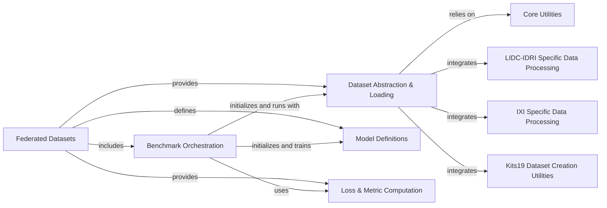

## Component Details

This graph illustrates the architecture of the `Federated Datasets` subsystem within FLamby. The core purpose of this subsystem is to provide a standardized and comprehensive set of federated learning datasets, each equipped with its specific data handling, model definitions, loss functions, metrics, and benchmark entry points. The `Federated Datasets` component acts as the overarching container, encompassing all individual dataset implementations. The `Benchmark Orchestration` component is responsible for initiating and managing the training and evaluation processes for these datasets. Data loading and preparation are handled by the `Dataset Abstraction & Loading` component, which leverages `Core Utilities` and dataset-specific processing components like `LIDC-IDRI Specific Data Processing`, `IXI Specific Data Processing`, and `Kits19 Dataset Creation Utilities`. `Model Definitions` and `Loss & Metric Computation` provide the necessary building blocks for the federated learning models and their evaluation.

### Federated Datasets
This component encompasses all the specific datasets adapted for federated learning within FLamby. Each dataset includes its raw data handling, federated dataset class, baseline model, loss function, and metric definitions, along with benchmark entry points.

**Related Classes/Methods**:

- <a href="https://github.com/owkin/FLamby/blob/master/flamby/datasets/fed_tcga_brca/benchmark.py#L27-L126" target="_blank" rel="noopener noreferrer">`FLamby.flamby.datasets.fed_tcga_brca.benchmark.train_model` (27:126)</a>
- <a href="https://github.com/owkin/FLamby/blob/master/flamby/datasets/fed_tcga_brca/benchmark.py#L129-L194" target="_blank" rel="noopener noreferrer">`FLamby.flamby.datasets.fed_tcga_brca.benchmark.main` (129:194)</a>
- <a href="https://github.com/owkin/FLamby/blob/master/flamby/datasets/fed_tcga_brca/dataset.py#L28-L42" target="_blank" rel="noopener noreferrer">`FLamby.flamby.datasets.fed_tcga_brca.dataset.TcgaBrcaRaw.__init__` (28:42)</a>
- <a href="https://github.com/owkin/FLamby/blob/master/flamby/datasets/fed_tcga_brca/dataset.py#L76-L105" target="_blank" rel="noopener noreferrer">`FLamby.flamby.datasets.fed_tcga_brca.dataset.FedTcgaBrca.__init__` (76:105)</a>
- <a href="https://github.com/owkin/FLamby/blob/master/flamby/datasets/fed_tcga_brca/loss.py#L6-L36" target="_blank" rel="noopener noreferrer">`flamby.datasets.fed_tcga_brca.loss.BaselineLoss` (6:36)</a>
- <a href="https://github.com/owkin/FLamby/blob/master/flamby/datasets/fed_tcga_brca/metric.py#L3-L22" target="_blank" rel="noopener noreferrer">`flamby.datasets.fed_tcga_brca.metric.metric` (3:22)</a>
- <a href="https://github.com/owkin/FLamby/blob/master/flamby/datasets/fed_tcga_brca/model.py#L6-L18" target="_blank" rel="noopener noreferrer">`flamby.datasets.fed_tcga_brca.model.Baseline` (6:18)</a>
- <a href="https://github.com/owkin/FLamby/blob/master/flamby/datasets/fed_isic2019/benchmark.py#L23-L130" target="_blank" rel="noopener noreferrer">`FLamby.flamby.datasets.fed_isic2019.benchmark.train_model` (23:130)</a>
- <a href="https://github.com/owkin/FLamby/blob/master/flamby/datasets/fed_isic2019/benchmark.py#L133-L212" target="_blank" rel="noopener noreferrer">`FLamby.flamby.datasets.fed_isic2019.benchmark.main` (133:212)</a>
- <a href="https://github.com/owkin/FLamby/blob/master/flamby/datasets/fed_isic2019/dataset.py#L43-L80" target="_blank" rel="noopener noreferrer">`FLamby.flamby.datasets.fed_isic2019.dataset.Isic2019Raw.__init__` (43:80)</a>
- <a href="https://github.com/owkin/FLamby/blob/master/flamby/datasets/fed_isic2019/dataset.py#L130-L189" target="_blank" rel="noopener noreferrer">`FLamby.flamby.datasets.fed_isic2019.dataset.FedIsic2019.__init__` (130:189)</a>
- <a href="https://github.com/owkin/FLamby/blob/master/flamby/datasets/fed_isic2019/model.py#L10-L35" target="_blank" rel="noopener noreferrer">`flamby.datasets.fed_isic2019.model.Baseline` (10:35)</a>
- <a href="https://github.com/owkin/FLamby/blob/master/flamby/datasets/fed_isic2019/loss.py#L17-L57" target="_blank" rel="noopener noreferrer">`flamby.datasets.fed_isic2019.loss.BaselineLoss` (17:57)</a>
- <a href="https://github.com/owkin/FLamby/blob/master/flamby/datasets/fed_heart_disease/benchmark.py#L21-L120" target="_blank" rel="noopener noreferrer">`FLamby.flamby.datasets.fed_heart_disease.benchmark.main` (21:120)</a>
- <a href="https://github.com/owkin/FLamby/blob/master/flamby/datasets/fed_heart_disease/dataset.py#L54-L187" target="_blank" rel="noopener noreferrer">`FLamby.flamby.datasets.fed_heart_disease.dataset.HeartDiseaseRaw.__init__` (54:187)</a>
- <a href="https://github.com/owkin/FLamby/blob/master/flamby/datasets/fed_heart_disease/dataset.py#L243-L292" target="_blank" rel="noopener noreferrer">`FLamby.flamby.datasets.fed_heart_disease.dataset.FedHeartDisease.__init__` (243:292)</a>
- <a href="https://github.com/owkin/FLamby/blob/master/flamby/datasets/fed_heart_disease/model.py#L4-L10" target="_blank" rel="noopener noreferrer">`flamby.datasets.fed_heart_disease.model.Baseline` (4:10)</a>
- <a href="https://github.com/owkin/FLamby/blob/master/flamby/datasets/fed_heart_disease/loss.py#L4-L10" target="_blank" rel="noopener noreferrer">`flamby.datasets.fed_heart_disease.loss.BaselineLoss` (4:10)</a>
- <a href="https://github.com/owkin/FLamby/blob/master/flamby/datasets/fed_heart_disease/metric.py#L3-L13" target="_blank" rel="noopener noreferrer">`flamby.datasets.fed_heart_disease.metric.metric` (3:13)</a>
- <a href="https://github.com/owkin/FLamby/blob/master/flamby/datasets/fed_camelyon16/benchmark.py#L23-L132" target="_blank" rel="noopener noreferrer">`FLamby.flamby.datasets.fed_camelyon16.benchmark.main` (23:132)</a>
- <a href="https://github.com/owkin/FLamby/blob/master/flamby/datasets/fed_camelyon16/dataset.py#L57-L163" target="_blank" rel="noopener noreferrer">`FLamby.flamby.datasets.fed_camelyon16.dataset.Camelyon16Raw.__init__` (57:163)</a>
- <a href="https://github.com/owkin/FLamby/blob/master/flamby/datasets/fed_camelyon16/dataset.py#L209-L250" target="_blank" rel="noopener noreferrer">`FLamby.flamby.datasets.fed_camelyon16.dataset.FedCamelyon16.__init__` (209:250)</a>
- <a href="https://github.com/owkin/FLamby/blob/master/flamby/datasets/fed_camelyon16/model.py#L8-L52" target="_blank" rel="noopener noreferrer">`flamby.datasets.fed_camelyon16.model.Baseline` (8:52)</a>
- <a href="https://github.com/owkin/FLamby/blob/master/flamby/datasets/fed_camelyon16/loss.py#L4-L10" target="_blank" rel="noopener noreferrer">`flamby.datasets.fed_camelyon16.loss.BaselineLoss` (4:10)</a>
- <a href="https://github.com/owkin/FLamby/blob/master/flamby/datasets/fed_camelyon16/metric.py#L4-L11" target="_blank" rel="noopener noreferrer">`flamby.datasets.fed_camelyon16.metric.metric` (4:11)</a>
- <a href="https://github.com/owkin/FLamby/blob/master/flamby/datasets/fed_synthetic/benchmark.py#L21-L128" target="_blank" rel="noopener noreferrer">`FLamby.flamby.datasets.fed_synthetic.benchmark.main` (21:128)</a>
- <a href="https://github.com/owkin/FLamby/blob/master/flamby/datasets/fed_synthetic/dataset.py#L49-L119" target="_blank" rel="noopener noreferrer">`FLamby.flamby.datasets.fed_synthetic.dataset.SyntheticRaw.__init__` (49:119)</a>
- <a href="https://github.com/owkin/FLamby/blob/master/flamby/datasets/fed_synthetic/dataset.py#L162-L196" target="_blank" rel="noopener noreferrer">`FLamby.flamby.datasets.fed_synthetic.dataset.FedSynthetic.__init__` (162:196)</a>
- <a href="https://github.com/owkin/FLamby/blob/master/flamby/datasets/fed_synthetic/common.py#L14-L23" target="_blank" rel="noopener noreferrer">`FLamby.flamby.datasets.fed_synthetic.common.get_nb_max_rounds` (14:23)</a>
- <a href="https://github.com/owkin/FLamby/blob/master/flamby/datasets/fed_synthetic/model.py#L4-L10" target="_blank" rel="noopener noreferrer">`flamby.datasets.fed_synthetic.model.Baseline` (4:10)</a>
- <a href="https://github.com/owkin/FLamby/blob/master/flamby/datasets/fed_synthetic/loss.py#L4-L10" target="_blank" rel="noopener noreferrer">`flamby.datasets.fed_synthetic.loss.BaselineLoss` (4:10)</a>
- <a href="https://github.com/owkin/FLamby/blob/master/flamby/datasets/fed_synthetic/metric.py#L4-L7" target="_blank" rel="noopener noreferrer">`flamby.datasets.fed_synthetic.metric.metric` (4:7)</a>
- <a href="https://github.com/owkin/FLamby/blob/master/flamby/datasets/fed_lidc_idri/loss.py#L26-L29" target="_blank" rel="noopener noreferrer">`FLamby.flamby.datasets.fed_lidc_idri.loss.BaselineLoss.forward` (26:29)</a>
- <a href="https://github.com/owkin/FLamby/blob/master/flamby/datasets/fed_lidc_idri/loss.py#L53-L54" target="_blank" rel="noopener noreferrer">`FLamby.flamby.datasets.fed_lidc_idri.loss.DiceLoss.forward` (53:54)</a>
- <a href="https://github.com/owkin/FLamby/blob/master/flamby/datasets/fed_lidc_idri/loss.py#L67-L68" target="_blank" rel="noopener noreferrer">`FLamby.flamby.datasets.fed_lidc_idri.loss.FocalLoss.forward` (67:68)</a>
- <a href="https://github.com/owkin/FLamby/blob/master/flamby/datasets/fed_lidc_idri/benchmark.py#L23-L131" target="_blank" rel="noopener noreferrer">`FLamby.flamby.datasets.fed_lidc_idri.benchmark.main` (23:131)</a>
- <a href="https://github.com/owkin/FLamby/blob/master/flamby/datasets/fed_lidc_idri/lidc_heterogeneity_plot.py#L12-L45" target="_blank" rel="noopener noreferrer">`FLamby.flamby.datasets.fed_lidc_idri.lidc_heterogeneity_plot.make_plot` (12:45)</a>
- <a href="https://github.com/owkin/FLamby/blob/master/flamby/datasets/fed_lidc_idri/model.py#L13-L26" target="_blank" rel="noopener noreferrer">`FLamby.flamby.datasets.fed_lidc_idri.model.Baseline.__init__` (13:26)</a>
- <a href="https://github.com/owkin/FLamby/blob/master/flamby/datasets/fed_lidc_idri/model.py#L28-L39" target="_blank" rel="noopener noreferrer">`FLamby.flamby.datasets.fed_lidc_idri.model.Baseline.forward` (28:39)</a>
- <a href="https://github.com/owkin/FLamby/blob/master/flamby/datasets/fed_lidc_idri/model.py#L59-L63" target="_blank" rel="noopener noreferrer">`FLamby.flamby.datasets.fed_lidc_idri.model._make_nConv` (59:63)</a>
- <a href="https://github.com/owkin/FLamby/blob/master/flamby/datasets/fed_lidc_idri/model.py#L88-L99" target="_blank" rel="noopener noreferrer">`FLamby.flamby.datasets.fed_lidc_idri.model.DownTransition.__init__` (88:99)</a>
- <a href="https://github.com/owkin/FLamby/blob/master/flamby/datasets/fed_lidc_idri/model.py#L101-L106" target="_blank" rel="noopener noreferrer">`FLamby.flamby.datasets.fed_lidc_idri.model.DownTransition.forward` (101:106)</a>
- <a href="https://github.com/owkin/FLamby/blob/master/flamby/datasets/fed_lidc_idri/model.py#L110-L123" target="_blank" rel="noopener noreferrer">`FLamby.flamby.datasets.fed_lidc_idri.model.UpTransition.__init__` (110:123)</a>
- <a href="https://github.com/owkin/FLamby/blob/master/flamby/datasets/fed_lidc_idri/model.py#L125-L132" target="_blank" rel="noopener noreferrer">`FLamby.flamby.datasets.fed_lidc_idri.model.UpTransition.forward` (125:132)</a>
- <a href="https://github.com/owkin/FLamby/blob/master/flamby/datasets/fed_lidc_idri/dataset.py#L69-L122" target="_blank" rel="noopener noreferrer">`FLamby.flamby.datasets.fed_lidc_idri.dataset.LidcIdriRaw.__init__` (69:122)</a>
- <a href="https://github.com/owkin/FLamby/blob/master/flamby/datasets/fed_lidc_idri/dataset.py#L127-L140" target="_blank" rel="noopener noreferrer">`FLamby.flamby.datasets.fed_lidc_idri.dataset.LidcIdriRaw.__getitem__` (127:140)</a>
- <a href="https://github.com/owkin/FLamby/blob/master/flamby/datasets/fed_lidc_idri/dataset.py#L175-L230" target="_blank" rel="noopener noreferrer">`FLamby.flamby.datasets.fed_lidc_idri.dataset.FedLidcIdri.__init__` (175:230)</a>
- <a href="https://github.com/owkin/FLamby/blob/master/flamby/datasets/fed_kits19/benchmark.py#L23-L118" target="_blank" rel="noopener noreferrer">`FLamby.flamby.datasets.fed_kits19.benchmark.train_model` (23:118)</a>
- <a href="https://github.com/owkin/FLamby/blob/master/flamby/datasets/fed_kits19/benchmark.py#L121-L184" target="_blank" rel="noopener noreferrer">`FLamby.flamby.datasets.fed_kits19.benchmark.main` (121:184)</a>
- <a href="https://github.com/owkin/FLamby/blob/master/flamby/datasets/fed_kits19/metric.py#L29-L38" target="_blank" rel="noopener noreferrer">`FLamby.flamby.datasets.fed_kits19.metric.metric` (29:38)</a>
- <a href="https://github.com/owkin/FLamby/blob/master/flamby/datasets/fed_kits19/metric.py#L41-L83" target="_blank" rel="noopener noreferrer">`FLamby.flamby.datasets.fed_kits19.metric.evaluate_dice_on_tests` (41:83)</a>
- <a href="https://github.com/owkin/FLamby/blob/master/flamby/datasets/fed_kits19/dataset.py#L65-L145" target="_blank" rel="noopener noreferrer">`FLamby.flamby.datasets.fed_kits19.dataset.Kits19Raw.__init__` (65:145)</a>
- <a href="https://github.com/owkin/FLamby/blob/master/flamby/datasets/fed_kits19/dataset.py#L150-L173" target="_blank" rel="noopener noreferrer">`FLamby.flamby.datasets.fed_kits19.dataset.Kits19Raw.__getitem__` (150:173)</a>
- <a href="https://github.com/owkin/FLamby/blob/master/flamby/datasets/fed_kits19/dataset.py#L336-L375" target="_blank" rel="noopener noreferrer">`FLamby.flamby.datasets.fed_kits19.dataset.FedKits19.__init__` (336:375)</a>
- <a href="https://github.com/owkin/FLamby/blob/master/flamby/datasets/fed_kits19/model.py#L24-L60" target="_blank" rel="noopener noreferrer">`flamby.datasets.fed_kits19.model.Baseline` (24:60)</a>
- <a href="https://github.com/owkin/FLamby/blob/master/flamby/datasets/fed_kits19/loss.py#L3-L24" target="_blank" rel="noopener noreferrer">`flamby.datasets.fed_kits19.loss.BaselineLoss` (3:24)</a>
- <a href="https://github.com/owkin/FLamby/blob/master/flamby/datasets/fed_ixi/loss.py#L8-L26" target="_blank" rel="noopener noreferrer">`FLamby.flamby.datasets.fed_ixi.loss.BaselineLoss.forward` (8:26)</a>
- <a href="https://github.com/owkin/FLamby/blob/master/flamby/datasets/fed_ixi/benchmark.py#L23-L124" target="_blank" rel="noopener noreferrer">`FLamby.flamby.datasets.fed_ixi.benchmark.main` (23:124)</a>
- <a href="https://github.com/owkin/FLamby/blob/master/flamby/datasets/fed_ixi/model.py#L18-L120" target="_blank" rel="noopener noreferrer">`FLamby.flamby.datasets.fed_ixi.model.Baseline.__init__` (18:120)</a>
- <a href="https://github.com/owkin/FLamby/blob/master/flamby/datasets/fed_ixi/model.py#L122-L130" target="_blank" rel="noopener noreferrer">`FLamby.flamby.datasets.fed_ixi.model.Baseline.forward` (122:130)</a>
- <a href="https://github.com/owkin/FLamby/blob/master/flamby/datasets/fed_ixi/model.py#L137-L205" target="_blank" rel="noopener noreferrer">`FLamby.flamby.datasets.fed_ixi.model.ConvolutionalBlock.__init__` (137:205)</a>
- <a href="https://github.com/owkin/FLamby/blob/master/flamby/datasets/fed_ixi/model.py#L223-L259" target="_blank" rel="noopener noreferrer">`FLamby.flamby.datasets.fed_ixi.model.Decoder.__init__` (223:259)</a>
- <a href="https://github.com/owkin/FLamby/blob/master/flamby/datasets/fed_ixi/model.py#L269-L330" target="_blank" rel="noopener noreferrer">`FLamby.flamby.datasets.fed_ixi.model.DecodingBlock.__init__` (269:330)</a>
- <a href="https://github.com/owkin/FLamby/blob/master/flamby/datasets/fed_ixi/model.py#L332-L344" target="_blank" rel="noopener noreferrer">`FLamby.flamby.datasets.fed_ixi.model.DecodingBlock.forward` (332:344)</a>
- <a href="https://github.com/owkin/FLamby/blob/master/flamby/datasets/fed_ixi/model.py#L387-L433" target="_blank" rel="noopener noreferrer">`FLamby.flamby.datasets.fed_ixi.model.Encoder.__init__` (387:433)</a>
- <a href="https://github.com/owkin/FLamby/blob/master/flamby/datasets/fed_ixi/model.py#L448-L519" target="_blank" rel="noopener noreferrer">`FLamby.flamby.datasets.fed_ixi.model.EncodingBlock.__init__` (448:519)</a>
- <a href="https://github.com/owkin/FLamby/blob/master/flamby/datasets/fed_ixi/model.py#L521-L535" target="_blank" rel="noopener noreferrer">`FLamby.flamby.datasets.fed_ixi.model.EncodingBlock.forward` (521:535)</a>
- <a href="https://github.com/owkin/FLamby/blob/master/flamby/datasets/fed_ixi/dataset.py#L45-L105" target="_blank" rel="noopener noreferrer">`FLamby.flamby.datasets.fed_ixi.dataset.IXITinyRaw.__init__` (45:105)</a>
- <a href="https://github.com/owkin/FLamby/blob/master/flamby/datasets/fed_ixi/dataset.py#L136-L163" target="_blank" rel="noopener noreferrer">`FLamby.flamby.datasets.fed_ixi.dataset.IXITinyRaw.__getitem__` (136:163)</a>
- <a href="https://github.com/owkin/FLamby/blob/master/flamby/datasets/fed_ixi/dataset.py#L191-L236" target="_blank" rel="noopener noreferrer">`FLamby.flamby.datasets.fed_ixi.dataset.FedIXITiny.__init__` (191:236)</a>

### Benchmark Orchestration
This component is responsible for orchestrating the training and evaluation process for various federated learning datasets. It initializes datasets, models, and loss functions, then calls training and evaluation routines to simulate federated learning benchmarks.

**Related Classes/Methods**:

- <a href="https://github.com/owkin/FLamby/blob/master/flamby/datasets/fed_tcga_brca/benchmark.py#L27-L126" target="_blank" rel="noopener noreferrer">`FLamby.flamby.datasets.fed_tcga_brca.benchmark.train_model` (27:126)</a>
- <a href="https://github.com/owkin/FLamby/blob/master/flamby/datasets/fed_tcga_brca/benchmark.py#L129-L194" target="_blank" rel="noopener noreferrer">`FLamby.flamby.datasets.fed_tcga_brca.benchmark.main` (129:194)</a>
- <a href="https://github.com/owkin/FLamby/blob/master/flamby/datasets/fed_isic2019/benchmark.py#L23-L130" target="_blank" rel="noopener noreferrer">`FLamby.flamby.datasets.fed_isic2019.benchmark.train_model` (23:130)</a>
- <a href="https://github.com/owkin/FLamby/blob/master/flamby/datasets/fed_isic2019/benchmark.py#L133-L212" target="_blank" rel="noopener noreferrer">`FLamby.flamby.datasets.fed_isic2019.benchmark.main` (133:212)</a>
- <a href="https://github.com/owkin/FLamby/blob/master/flamby/datasets/fed_heart_disease/benchmark.py#L21-L120" target="_blank" rel="noopener noreferrer">`FLamby.flamby.datasets.fed_heart_disease.benchmark.main` (21:120)</a>
- <a href="https://github.com/owkin/FLamby/blob/master/flamby/datasets/fed_camelyon16/benchmark.py#L23-L132" target="_blank" rel="noopener noreferrer">`FLamby.flamby.datasets.fed_camelyon16.benchmark.main` (23:132)</a>
- <a href="https://github.com/owkin/FLamby/blob/master/flamby/datasets/fed_synthetic/benchmark.py#L21-L128" target="_blank" rel="noopener noreferrer">`FLamby.flamby.datasets.fed_synthetic.benchmark.main` (21:128)</a>
- <a href="https://github.com/owkin/FLamby/blob/master/flamby/datasets/fed_lidc_idri/benchmark.py#L23-L131" target="_blank" rel="noopener noreferrer">`FLamby.flamby.datasets.fed_lidc_idri.benchmark.main` (23:131)</a>
- <a href="https://github.com/owkin/FLamby/blob/master/flamby/datasets/fed_kits19/benchmark.py#L23-L118" target="_blank" rel="noopener noreferrer">`FLamby.flamby.datasets.fed_kits19.benchmark.train_model` (23:118)</a>
- <a href="https://github.com/owkin/FLamby/blob/master/flamby/datasets/fed_kits19/benchmark.py#L121-L184" target="_blank" rel="noopener noreferrer">`FLamby.flamby.datasets.fed_kits19.benchmark.main` (121:184)</a>
- <a href="https://github.com/owkin/FLamby/blob/master/flamby/datasets/fed_ixi/benchmark.py#L23-L124" target="_blank" rel="noopener noreferrer">`FLamby.flamby.datasets.fed_ixi.benchmark.main` (23:124)</a>

### Dataset Abstraction & Loading
This component provides a unified interface for loading, initializing, and managing various federated datasets. It includes raw dataset classes for data ingestion and federated dataset wrappers for distributed access, ensuring data is prepared for training across different clients.

**Related Classes/Methods**:

- <a href="https://github.com/owkin/FLamby/blob/master/flamby/datasets/fed_tcga_brca/dataset.py#L28-L42" target="_blank" rel="noopener noreferrer">`FLamby.flamby.datasets.fed_tcga_brca.dataset.TcgaBrcaRaw.__init__` (28:42)</a>
- <a href="https://github.com/owkin/FLamby/blob/master/flamby/datasets/fed_tcga_brca/dataset.py#L76-L105" target="_blank" rel="noopener noreferrer">`FLamby.flamby.datasets.fed_tcga_brca.dataset.FedTcgaBrca.__init__` (76:105)</a>
- <a href="https://github.com/owkin/FLamby/blob/master/flamby/datasets/fed_isic2019/dataset.py#L43-L80" target="_blank" rel="noopener noreferrer">`FLamby.flamby.datasets.fed_isic2019.dataset.Isic2019Raw.__init__` (43:80)</a>
- <a href="https://github.com/owkin/FLamby/blob/master/flamby/datasets/fed_isic2019/dataset.py#L130-L189" target="_blank" rel="noopener noreferrer">`FLamby.flamby.datasets.fed_isic2019.dataset.FedIsic2019.__init__` (130:189)</a>
- <a href="https://github.com/owkin/FLamby/blob/master/flamby/datasets/fed_heart_disease/dataset.py#L54-L187" target="_blank" rel="noopener noreferrer">`FLamby.flamby.datasets.fed_heart_disease.dataset.HeartDiseaseRaw.__init__` (54:187)</a>
- <a href="https://github.com/owkin/FLamby/blob/master/flamby/datasets/fed_heart_disease/dataset.py#L243-L292" target="_blank" rel="noopener noreferrer">`FLamby.flamby.datasets.fed_heart_disease.dataset.FedHeartDisease.__init__` (243:292)</a>
- <a href="https://github.com/owkin/FLamby/blob/master/flamby/datasets/fed_camelyon16/dataset.py#L57-L163" target="_blank" rel="noopener noreferrer">`FLamby.flamby.datasets.fed_camelyon16.dataset.Camelyon16Raw.__init__` (57:163)</a>
- <a href="https://github.com/owkin/FLamby/blob/master/flamby/datasets/fed_camelyon16/dataset.py#L209-L250" target="_blank" rel="noopener noreferrer">`FLamby.flamby.datasets.fed_camelyon16.dataset.FedCamelyon16.__init__` (209:250)</a>
- <a href="https://github.com/owkin/FLamby/blob/master/flamby/datasets/fed_synthetic/dataset.py#L49-L119" target="_blank" rel="noopener noreferrer">`FLamby.flamby.datasets.fed_synthetic.dataset.SyntheticRaw.__init__` (49:119)</a>
- <a href="https://github.com/owkin/FLamby/blob/master/flamby/datasets/fed_synthetic/dataset.py#L162-L196" target="_blank" rel="noopener noreferrer">`FLamby.flamby.datasets.fed_synthetic.dataset.FedSynthetic.__init__` (162:196)</a>
- <a href="https://github.com/owkin/FLamby/blob/master/flamby/datasets/fed_lidc_idri/dataset.py#L69-L122" target="_blank" rel="noopener noreferrer">`FLamby.flamby.datasets.fed_lidc_idri.dataset.LidcIdriRaw.__init__` (69:122)</a>
- <a href="https://github.com/owkin/FLamby/blob/master/flamby/datasets/fed_lidc_idri/dataset.py#L127-L140" target="_blank" rel="noopener noreferrer">`FLamby.flamby.datasets.fed_lidc_idri.dataset.LidcIdriRaw.__getitem__` (127:140)</a>
- <a href="https://github.com/owkin/FLamby/blob/master/flamby/datasets/fed_lidc_idri/dataset.py#L175-L230" target="_blank" rel="noopener noreferrer">`FLamby.flamby.datasets.fed_lidc_idri.dataset.FedLidcIdri.__init__` (175:230)</a>
- <a href="https://github.com/owkin/FLamby/blob/master/flamby/datasets/fed_kits19/dataset.py#L65-L145" target="_blank" rel="noopener noreferrer">`FLamby.flamby.datasets.fed_kits19.dataset.Kits19Raw.__init__` (65:145)</a>
- <a href="https://github.com/owkin/FLamby/blob/master/flamby/datasets/fed_kits19/dataset.py#L150-L173" target="_blank" rel="noopener noreferrer">`FLamby.flamby.datasets.fed_kits19.dataset.Kits19Raw.__getitem__` (150:173)</a>
- <a href="https://github.com/owkin/FLamby/blob/master/flamby/datasets/fed_kits19/dataset.py#L336-L375" target="_blank" rel="noopener noreferrer">`FLamby.flamby.datasets.fed_kits19.dataset.FedKits19.__init__` (336:375)</a>
- <a href="https://github.com/owkin/FLamby/blob/master/flamby/datasets/fed_ixi/dataset.py#L45-L105" target="_blank" rel="noopener noreferrer">`FLamby.flamby.datasets.fed_ixi.dataset.IXITinyRaw.__init__` (45:105)</a>
- <a href="https://github.com/owkin/FLamby/blob/master/flamby/datasets/fed_ixi/dataset.py#L136-L163" target="_blank" rel="noopener noreferrer">`FLamby.flamby.datasets.fed_ixi.dataset.IXITinyRaw.__getitem__` (136:163)</a>
- <a href="https://github.com/owkin/FLamby/blob/master/flamby/datasets/fed_ixi/dataset.py#L191-L236" target="_blank" rel="noopener noreferrer">`FLamby.flamby.datasets.fed_ixi.dataset.FedIXITiny.__init__` (191:236)</a>

### Model Definitions
This component encapsulates the neural network architectures used across different FLamby datasets. It includes baseline models and their internal building blocks, providing a modular approach to defining and using models in a federated setting.

**Related Classes/Methods**:

- <a href="https://github.com/owkin/FLamby/blob/master/flamby/datasets/fed_tcga_brca/model.py#L6-L18" target="_blank" rel="noopener noreferrer">`flamby.datasets.fed_tcga_brca.model.Baseline` (6:18)</a>
- <a href="https://github.com/owkin/FLamby/blob/master/flamby/datasets/fed_isic2019/model.py#L10-L35" target="_blank" rel="noopener noreferrer">`flamby.datasets.fed_isic2019.model.Baseline` (10:35)</a>
- <a href="https://github.com/owkin/FLamby/blob/master/flamby/datasets/fed_heart_disease/model.py#L4-L10" target="_blank" rel="noopener noreferrer">`flamby.datasets.fed_heart_disease.model.Baseline` (4:10)</a>
- <a href="https://github.com/owkin/FLamby/blob/master/flamby/datasets/fed_camelyon16/model.py#L8-L52" target="_blank" rel="noopener noreferrer">`flamby.datasets.fed_camelyon16.model.Baseline` (8:52)</a>
- <a href="https://github.com/owkin/FLamby/blob/master/flamby/datasets/fed_synthetic/model.py#L4-L10" target="_blank" rel="noopener noreferrer">`flamby.datasets.fed_synthetic.model.Baseline` (4:10)</a>
- <a href="https://github.com/owkin/FLamby/blob/master/flamby/datasets/fed_lidc_idri/model.py#L13-L26" target="_blank" rel="noopener noreferrer">`FLamby.flamby.datasets.fed_lidc_idri.model.Baseline.__init__` (13:26)</a>
- <a href="https://github.com/owkin/FLamby/blob/master/flamby/datasets/fed_lidc_idri/model.py#L28-L39" target="_blank" rel="noopener noreferrer">`FLamby.flamby.datasets.fed_lidc_idri.model.Baseline.forward` (28:39)</a>
- <a href="https://github.com/owkin/FLamby/blob/master/flamby/datasets/fed_lidc_idri/model.py#L59-L63" target="_blank" rel="noopener noreferrer">`FLamby.flamby.datasets.fed_lidc_idri.model._make_nConv` (59:63)</a>
- <a href="https://github.com/owkin/FLamby/blob/master/flamby/datasets/fed_lidc_idri/model.py#L88-L99" target="_blank" rel="noopener noreferrer">`FLamby.flamby.datasets.fed_lidc_idri.model.DownTransition.__init__` (88:99)</a>
- <a href="https://github.com/owkin/FLamby/blob/master/flamby/datasets/fed_lidc_idri/model.py#L101-L106" target="_blank" rel="noopener noreferrer">`FLamby.flamby.datasets.fed_lidc_idri.model.DownTransition.forward` (101:106)</a>
- <a href="https://github.com/owkin/FLamby/blob/master/flamby/datasets/fed_lidc_idri/model.py#L110-L123" target="_blank" rel="noopener noreferrer">`FLamby.flamby.datasets.fed_lidc_idri.model.UpTransition.__init__` (110:123)</a>
- <a href="https://github.com/owkin/FLamby/blob/master/flamby/datasets/fed_lidc_idri/model.py#L125-L132" target="_blank" rel="noopener noreferrer">`FLamby.flamby.datasets.fed_lidc_idri.model.UpTransition.forward` (125:132)</a>
- <a href="https://github.com/owkin/FLamby/blob/master/flamby/datasets/fed_kits19/model.py#L24-L60" target="_blank" rel="noopener noreferrer">`flamby.datasets.fed_kits19.model.Baseline` (24:60)</a>
- <a href="https://github.com/owkin/FLamby/blob/master/flamby/datasets/fed_ixi/model.py#L18-L120" target="_blank" rel="noopener noreferrer">`FLamby.flamby.datasets.fed_ixi.model.Baseline.__init__` (18:120)</a>
- <a href="https://github.com/owkin/FLamby/blob/master/flamby/datasets/fed_ixi/model.py#L122-L130" target="_blank" rel="noopener noreferrer">`FLamby.flamby.datasets.fed_ixi.model.Baseline.forward` (122:130)</a>
- <a href="https://github.com/owkin/FLamby/blob/master/flamby/datasets/fed_ixi/model.py#L137-L205" target="_blank" rel="noopener noreferrer">`FLamby.flamby.datasets.fed_ixi.model.ConvolutionalBlock.__init__` (137:205)</a>
- <a href="https://github.com/owkin/FLamby/blob/master/flamby/datasets/fed_ixi/model.py#L223-L259" target="_blank" rel="noopener noreferrer">`FLamby.flamby.datasets.fed_ixi.model.Decoder.__init__` (223:259)</a>
- <a href="https://github.com/owkin/FLamby/blob/master/flamby/datasets/fed_ixi/model.py#L269-L330" target="_blank" rel="noopener noreferrer">`FLamby.flamby.datasets.fed_ixi.model.DecodingBlock.__init__` (269:330)</a>
- <a href="https://github.com/owkin/FLamby/blob/master/flamby/datasets/fed_ixi/model.py#L332-L344" target="_blank" rel="noopener noreferrer">`FLamby.flamby.datasets.fed_ixi.model.DecodingBlock.forward` (332:344)</a>
- <a href="https://github.com/owkin/FLamby/blob/master/flamby/datasets/fed_ixi/model.py#L387-L433" target="_blank" rel="noopener noreferrer">`FLamby.flamby.datasets.fed_ixi.model.Encoder.__init__` (387:433)</a>
- <a href="https://github.com/owkin/FLamby/blob/master/flamby/datasets/fed_ixi/model.py#L448-L519" target="_blank" rel="noopener noreferrer">`FLamby.flamby.datasets.fed_ixi.model.EncodingBlock.__init__` (448:519)</a>
- <a href="https://github.com/owkin/FLamby/blob/master/flamby/datasets/fed_ixi/model.py#L521-L535" target="_blank" rel="noopener noreferrer">`FLamby.flamby.datasets.fed_ixi.model.EncodingBlock.forward` (521:535)</a>

### Loss & Metric Computation
This component provides functions for calculating loss during model training and evaluating model performance using various metrics. It includes both general and dataset-specific loss functions and evaluation metrics.

**Related Classes/Methods**:

- <a href="https://github.com/owkin/FLamby/blob/master/flamby/datasets/fed_tcga_brca/loss.py#L6-L36" target="_blank" rel="noopener noreferrer">`flamby.datasets.fed_tcga_brca.loss.BaselineLoss` (6:36)</a>
- <a href="https://github.com/owkin/FLamby/blob/master/flamby/datasets/fed_isic2019/loss.py#L17-L57" target="_blank" rel="noopener noreferrer">`flamby.datasets.fed_isic2019.loss.BaselineLoss` (17:57)</a>
- <a href="https://github.com/owkin/FLamby/blob/master/flamby/datasets/fed_heart_disease/loss.py#L4-L10" target="_blank" rel="noopener noreferrer">`flamby.datasets.fed_heart_disease.loss.BaselineLoss` (4:10)</a>
- <a href="https://github.com/owkin/FLamby/blob/master/flamby/datasets/fed_camelyon16/loss.py#L4-L10" target="_blank" rel="noopener noreferrer">`flamby.datasets.fed_camelyon16.loss.BaselineLoss` (4:10)</a>
- <a href="https://github.com/owkin/FLamby/blob/master/flamby/datasets/fed_synthetic/loss.py#L4-L10" target="_blank" rel="noopener noreferrer">`flamby.datasets.fed_synthetic.loss.BaselineLoss` (4:10)</a>
- <a href="https://github.com/owkin/FLamby/blob/master/flamby/datasets/fed_lidc_idri/loss.py#L26-L29" target="_blank" rel="noopener noreferrer">`FLamby.flamby.datasets.fed_lidc_idri.loss.BaselineLoss.forward` (26:29)</a>
- <a href="https://github.com/owkin/FLamby/blob/master/flamby/datasets/fed_lidc_idri/loss.py#L53-L54" target="_blank" rel="noopener noreferrer">`FLamby.flamby.datasets.fed_lidc_idri.loss.DiceLoss.forward` (53:54)</a>
- <a href="https://github.com/owkin/FLamby/blob/master/flamby/datasets/fed_lidc_idri/loss.py#L67-L68" target="_blank" rel="noopener noreferrer">`FLamby.flamby.datasets.fed_lidc_idri.loss.FocalLoss.forward` (67:68)</a>
- <a href="https://github.com/owkin/FLamby/blob/master/flamby/datasets/fed_kits19/loss.py#L3-L24" target="_blank" rel="noopener noreferrer">`flamby.datasets.fed_kits19.loss.BaselineLoss` (3:24)</a>
- <a href="https://github.com/owkin/FLamby/blob/master/flamby/datasets/fed_ixi/loss.py#L8-L26" target="_blank" rel="noopener noreferrer">`FLamby.flamby.datasets.fed_ixi.loss.BaselineLoss.forward` (8:26)</a>
- <a href="https://github.com/owkin/FLamby/blob/master/flamby/datasets/fed_tcga_brca/metric.py#L3-L22" target="_blank" rel="noopener noreferrer">`flamby.datasets.fed_tcga_brca.metric.metric` (3:22)</a>
- <a href="https://github.com/owkin/FLamby/blob/master/flamby/datasets/fed_heart_disease/metric.py#L3-L13" target="_blank" rel="noopener noreferrer">`flamby.datasets.fed_heart_disease.metric.metric` (3:13)</a>
- <a href="https://github.com/owkin/FLamby/blob/master/flamby/datasets/fed_camelyon16/metric.py#L4-L11" target="_blank" rel="noopener noreferrer">`flamby.datasets.fed_camelyon16.metric.metric` (4:11)</a>
- <a href="https://github.com/owkin/FLamby/blob/master/flamby/datasets/fed_synthetic/metric.py#L4-L7" target="_blank" rel="noopener noreferrer">`flamby.datasets.fed_synthetic.metric.metric` (4:7)</a>
- <a href="https://github.com/owkin/FLamby/blob/master/flamby/datasets/fed_kits19/metric.py#L29-L38" target="_blank" rel="noopener noreferrer">`FLamby.flamby.datasets.fed_kits19.metric.metric` (29:38)</a>
- <a href="https://github.com/owkin/FLamby/blob/master/flamby/datasets/fed_kits19/metric.py#L41-L83" target="_blank" rel="noopener noreferrer">`FLamby.flamby.datasets.fed_kits19.metric.evaluate_dice_on_tests` (41:83)</a>

### Core Utilities
This component provides general-purpose utility functions used across various parts of the FLamby system. This includes functionalities for evaluating models on test sets, handling license agreements, checking dataset configurations, and reading/managing configuration files.

**Related Classes/Methods**:

- <a href="https://github.com/owkin/FLamby/blob/master/flamby/utils.py#L17-L76" target="_blank" rel="noopener noreferrer">`flamby.utils.evaluate_model_on_tests` (17:76)</a>
- <a href="https://github.com/owkin/FLamby/blob/master/flamby/utils.py#L258-L317" target="_blank" rel="noopener noreferrer">`flamby.utils.accept_license` (258:317)</a>
- <a href="https://github.com/owkin/FLamby/blob/master/flamby/utils.py#L201-L255" target="_blank" rel="noopener noreferrer">`flamby.utils.check_dataset_from_config` (201:255)</a>
- <a href="https://github.com/owkin/FLamby/blob/master/flamby/utils.py#L79-L98" target="_blank" rel="noopener noreferrer">`flamby.utils.read_config` (79:98)</a>
- <a href="https://github.com/owkin/FLamby/blob/master/flamby/utils.py#L101-L131" target="_blank" rel="noopener noreferrer">`flamby.utils.get_config_file_path` (101:131)</a>
- <a href="https://github.com/owkin/FLamby/blob/master/flamby/datasets/fed_synthetic/common.py#L14-L23" target="_blank" rel="noopener noreferrer">`FLamby.flamby.datasets.fed_synthetic.common.get_nb_max_rounds` (14:23)</a>

### LIDC-IDRI Specific Data Processing
This component contains specialized utility functions for processing and sampling data specific to the LIDC-IDRI dataset. It includes functionalities for image resizing, intensity clipping, and extracting patches for training and evaluation.

**Related Classes/Methods**:

- <a href="https://github.com/owkin/FLamby/blob/master/flamby/datasets/fed_lidc_idri/data_utils.py#L5-L83" target="_blank" rel="noopener noreferrer">`flamby.datasets.fed_lidc_idri.data_utils.Sampler` (5:83)</a>
- <a href="https://github.com/owkin/FLamby/blob/master/flamby/datasets/fed_lidc_idri/data_utils.py#L86-L107" target="_blank" rel="noopener noreferrer">`flamby.datasets.fed_lidc_idri.data_utils.ClipNorm` (86:107)</a>
- <a href="https://github.com/owkin/FLamby/blob/master/flamby/datasets/fed_lidc_idri/data_utils.py#L110-L152" target="_blank" rel="noopener noreferrer">`flamby.datasets.fed_lidc_idri.data_utils.resize_by_crop_or_pad` (110:152)</a>
- <a href="https://github.com/owkin/FLamby/blob/master/flamby/datasets/fed_lidc_idri/data_utils.py#L229-L297" target="_blank" rel="noopener noreferrer">`FLamby.flamby.datasets.fed_lidc_idri.data_utils.fast_sampler` (229:297)</a>
- <a href="https://github.com/owkin/FLamby/blob/master/flamby/datasets/fed_lidc_idri/data_utils.py#L155-L192" target="_blank" rel="noopener noreferrer">`FLamby.flamby.datasets.fed_lidc_idri.data_utils.random_sampler` (155:192)</a>
- <a href="https://github.com/owkin/FLamby/blob/master/flamby/datasets/fed_lidc_idri/data_utils.py#L195-L226" target="_blank" rel="noopener noreferrer">`FLamby.flamby.datasets.fed_lidc_idri.data_utils.all_sampler` (195:226)</a>
- <a href="https://github.com/owkin/FLamby/blob/master/flamby/datasets/fed_lidc_idri/data_utils.py#L328-L352" target="_blank" rel="noopener noreferrer">`FLamby.flamby.datasets.fed_lidc_idri.data_utils.sample_centroids` (328:352)</a>
- <a href="https://github.com/owkin/FLamby/blob/master/flamby/datasets/fed_lidc_idri/data_utils.py#L300-L325" target="_blank" rel="noopener noreferrer">`FLamby.flamby.datasets.fed_lidc_idri.data_utils.extract_patches` (300:325)</a>

### IXI Specific Data Processing
This component provides utility functions specifically for handling the IXI dataset. It includes functionalities for extracting metadata from filenames, loading NIfTI images and labels, and managing file paths within compressed archives.

**Related Classes/Methods**:

- `flamby.datasets.fed_ixi.utils._extract_center_name_from_filename` (full file reference)
- `flamby.datasets.fed_ixi.utils._get_id_from_filename` (full file reference)
- `flamby.datasets.fed_ixi.utils._load_nifti_image_and_label_by_id` (full file reference)
- `flamby.datasets.fed_ixi.utils._get_center_name_from_center_id` (full file reference)
- `FLamby.flamby.datasets.fed_ixi.utils._find_files_in_zip` (full file reference)
- `FLamby.flamby.datasets.fed_ixi.utils._assembly_nifti_img_and_label_regex` (full file reference)

### Kits19 Dataset Creation Utilities
This component contains utilities specifically for the creation and preprocessing of the Kits19 dataset. It includes functions for setting up environment variables and applying data augmentations necessary for the dataset.

**Related Classes/Methods**:

- <a href="https://github.com/owkin/FLamby/blob/master/flamby/datasets/fed_kits19/dataset_creation_scripts/utils/set_environment_variables.py#L5-L19" target="_blank" rel="noopener noreferrer">`flamby.datasets.fed_kits19.dataset_creation_scripts.utils.set_environment_variables.set_environment_variables` (5:19)</a>
- <a href="https://github.com/owkin/FLamby/blob/master/flamby/datasets/fed_kits19/dataset_creation_scripts/utils/data_augmentations.py#L54-L211" target="_blank" rel="noopener noreferrer">`flamby.datasets.fed_kits19.dataset_creation_scripts.utils.data_augmentations.transformations` (54:211)</a>

### [FAQ](https://github.com/CodeBoarding/GeneratedOnBoardings/tree/main?tab=readme-ov-file#faq)