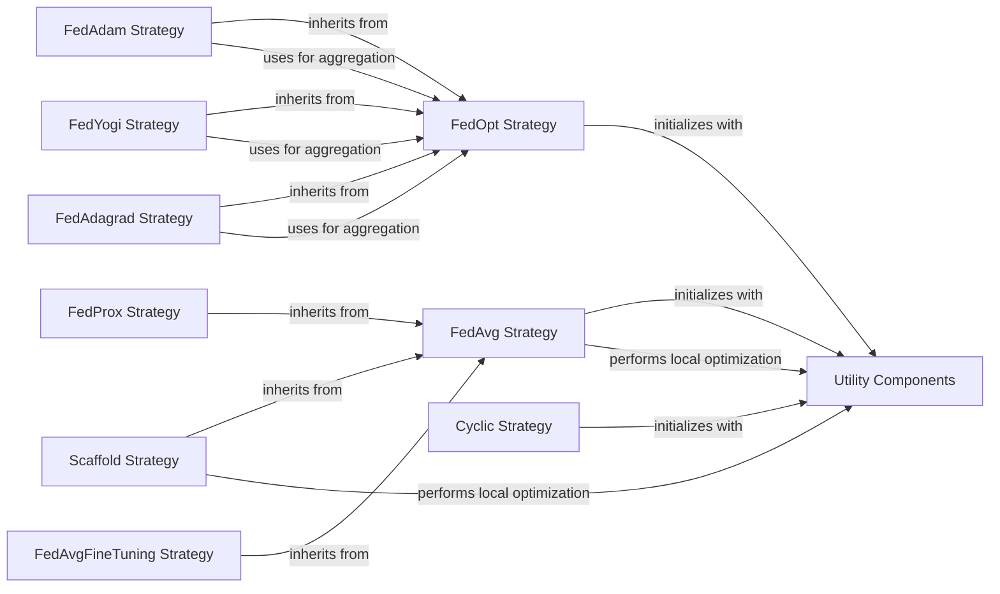

## Component Details

This component defines and implements various federated learning strategies, including base functionalities for data loading and model interfaces, as well as specific algorithms like FedAvg, FedOpt, and Cyclic. It handles the core logic for distributed model training and aggregation.

### FedOpt Strategy
The FedOpt Strategy component implements the core logic for federated optimization algorithms, including initialization, managing data loaders and models, and orchestrating the aggregation of model updates from clients. It serves as a base for other FedOpt-based strategies like FedAdam, FedYogi, and FedAdagrad.

**Related Classes/Methods**:

- <a href="https://github.com/owkin/FLamby/blob/master/flamby/strategies/fed_opt.py#L9-L205" target="_blank" rel="noopener noreferrer">`flamby.strategies.fed_opt.FedOpt` (9:205)</a>
- <a href="https://github.com/owkin/FLamby/blob/master/flamby/strategies/fed_opt.py#L18-L157" target="_blank" rel="noopener noreferrer">`flamby.strategies.fed_opt.FedOpt.__init__` (18:157)</a>
- <a href="https://github.com/owkin/FLamby/blob/master/flamby/strategies/fed_opt.py#L9-L205" target="_blank" rel="noopener noreferrer">`flamby.strategies.fed_opt.FedOpt.perform_round` (9:205)</a>
- <a href="https://github.com/owkin/FLamby/blob/master/flamby/strategies/fed_opt.py#L159-L165" target="_blank" rel="noopener noreferrer">`flamby.strategies.fed_opt.FedOpt.run` (159:165)</a>
- <a href="https://github.com/owkin/FLamby/blob/master/flamby/strategies/fed_opt.py#L167-L205" target="_blank" rel="noopener noreferrer">`flamby.strategies.fed_opt.FedOpt.calc_aggregated_delta_weights` (167:205)</a>

### FedAvg Strategy
The FedAvg Strategy component implements the Federated Averaging algorithm, a fundamental federated learning strategy. It handles the initialization of models and data loaders, performs local optimization on clients, and aggregates the model updates to maintain a global model. This component also serves as a base for FedProx, Scaffold, and FedAvgFineTuning.

**Related Classes/Methods**:

- <a href="https://github.com/owkin/FLamby/blob/master/flamby/strategies/fed_avg.py#L9-L197" target="_blank" rel="noopener noreferrer">`flamby.strategies.fed_avg.FedAvg` (9:197)</a>
- <a href="https://github.com/owkin/FLamby/blob/master/flamby/strategies/fed_avg.py#L63-L126" target="_blank" rel="noopener noreferrer">`flamby.strategies.fed_avg.FedAvg.__init__` (63:126)</a>
- <a href="https://github.com/owkin/FLamby/blob/master/flamby/strategies/fed_avg.py#L141-L189" target="_blank" rel="noopener noreferrer">`flamby.strategies.fed_avg.FedAvg.perform_round` (141:189)</a>
- <a href="https://github.com/owkin/FLamby/blob/master/flamby/strategies/fed_avg.py#L191-L197" target="_blank" rel="noopener noreferrer">`flamby.strategies.fed_avg.FedAvg.run` (191:197)</a>
- <a href="https://github.com/owkin/FLamby/blob/master/flamby/strategies/fed_avg.py#L128-L139" target="_blank" rel="noopener noreferrer">`flamby.strategies.fed_avg.FedAvg._local_optimization` (128:139)</a>

### Cyclic Strategy
The Cyclic Strategy component implements a federated learning approach where clients are selected in a cyclic manner for training rounds. It manages data loaders, models, and shuffles clients to ensure fair participation in the training process.

**Related Classes/Methods**:

- <a href="https://github.com/owkin/FLamby/blob/master/flamby/strategies/cyclic.py#L10-L186" target="_blank" rel="noopener noreferrer">`flamby.strategies.cyclic.Cyclic` (10:186)</a>
- <a href="https://github.com/owkin/FLamby/blob/master/flamby/strategies/cyclic.py#L79-L150" target="_blank" rel="noopener noreferrer">`flamby.strategies.cyclic.Cyclic.__init__` (79:150)</a>
- <a href="https://github.com/owkin/FLamby/blob/master/flamby/strategies/cyclic.py#L160-L180" target="_blank" rel="noopener noreferrer">`flamby.strategies.cyclic.Cyclic.perform_round` (160:180)</a>
- <a href="https://github.com/owkin/FLamby/blob/master/flamby/strategies/cyclic.py#L182-L186" target="_blank" rel="noopener noreferrer">`flamby.strategies.cyclic.Cyclic.run` (182:186)</a>
- <a href="https://github.com/owkin/FLamby/blob/master/flamby/strategies/cyclic.py#L152-L158" target="_blank" rel="noopener noreferrer">`flamby.strategies.cyclic.Cyclic._shuffle_clients` (152:158)</a>

### Utility Components
This component provides essential utility functions and classes used across various federated learning strategies. It includes functionalities for managing data loaders with memory, handling model operations, and computing metrics like model differences and dot products, which are crucial for different optimization algorithms.

**Related Classes/Methods**:

- <a href="https://github.com/owkin/FLamby/blob/master/flamby/strategies/utils.py#L11-L51" target="_blank" rel="noopener noreferrer">`flamby.strategies.utils.DataLoaderWithMemory` (11:51)</a>
- <a href="https://github.com/owkin/FLamby/blob/master/flamby/strategies/utils.py#L54-L403" target="_blank" rel="noopener noreferrer">`flamby.strategies.utils._Model` (54:403)</a>
- <a href="https://github.com/owkin/FLamby/blob/master/flamby/strategies/utils.py#L37-L51" target="_blank" rel="noopener noreferrer">`flamby.strategies.utils.DataLoaderWithMemory.get_samples` (37:51)</a>
- <a href="https://github.com/owkin/FLamby/blob/master/flamby/strategies/utils.py#L31-L32" target="_blank" rel="noopener noreferrer">`flamby.strategies.utils.DataLoaderWithMemory._reset_iterator` (31:32)</a>
- <a href="https://github.com/owkin/FLamby/blob/master/flamby/strategies/utils.py#L234-L307" target="_blank" rel="noopener noreferrer">`flamby.strategies.utils._Model._prox_local_train` (234:307)</a>
- <a href="https://github.com/owkin/FLamby/blob/master/flamby/strategies/utils.py#L309-L380" target="_blank" rel="noopener noreferrer">`flamby.strategies.utils._Model._local_train_with_correction` (309:380)</a>
- <a href="https://github.com/owkin/FLamby/blob/master/flamby/strategies/utils.py#L406-L418" target="_blank" rel="noopener noreferrer">`flamby.strategies.utils.compute_model_diff_squared_norm` (406:418)</a>
- <a href="https://github.com/owkin/FLamby/blob/master/flamby/strategies/utils.py#L421-L432" target="_blank" rel="noopener noreferrer">`flamby.strategies.utils.compute_dot_product` (421:432)</a>

### FedAdam Strategy
The FedAdam Strategy component is an extension of the FedOpt strategy, incorporating the Adam optimization algorithm for server-side updates in federated learning. It inherits the core functionalities from FedOpt and specializes in applying Adam's adaptive learning rates to the aggregated model updates.

**Related Classes/Methods**:

- <a href="https://github.com/owkin/FLamby/blob/master/flamby/strategies/fed_opt.py#L208-L352" target="_blank" rel="noopener noreferrer">`flamby.strategies.fed_opt.FedAdam` (208:352)</a>
- <a href="https://github.com/owkin/FLamby/blob/master/flamby/strategies/fed_opt.py#L270-L314" target="_blank" rel="noopener noreferrer">`flamby.strategies.fed_opt.FedAdam.__init__` (270:314)</a>
- <a href="https://github.com/owkin/FLamby/blob/master/flamby/strategies/fed_opt.py#L316-L352" target="_blank" rel="noopener noreferrer">`flamby.strategies.fed_opt.FedAdam.perform_round` (316:352)</a>

### FedYogi Strategy
The FedYogi Strategy component is another specialized federated optimization strategy built upon FedOpt. It integrates the Yogi optimizer for server-side aggregation, providing an alternative adaptive learning rate mechanism to improve convergence and performance in federated learning settings.

**Related Classes/Methods**:

- <a href="https://github.com/owkin/FLamby/blob/master/flamby/strategies/fed_opt.py#L355-L506" target="_blank" rel="noopener noreferrer">`flamby.strategies.fed_opt.FedYogi` (355:506)</a>
- <a href="https://github.com/owkin/FLamby/blob/master/flamby/strategies/fed_opt.py#L416-L461" target="_blank" rel="noopener noreferrer">`flamby.strategies.fed_opt.FedYogi.__init__` (416:461)</a>
- <a href="https://github.com/owkin/FLamby/blob/master/flamby/strategies/fed_opt.py#L463-L506" target="_blank" rel="noopener noreferrer">`flamby.strategies.fed_opt.FedYogi.perform_round` (463:506)</a>

### FedAdagrad Strategy
The FedAdagrad Strategy component extends the FedOpt framework by incorporating the Adagrad optimizer for server-side model aggregation. This strategy adapts the learning rates for each parameter based on past gradients, aiming to improve the efficiency and stability of federated learning.

**Related Classes/Methods**:

- <a href="https://github.com/owkin/FLamby/blob/master/flamby/strategies/fed_opt.py#L509-L653" target="_blank" rel="noopener noreferrer">`flamby.strategies.fed_opt.FedAdagrad` (509:653)</a>
- <a href="https://github.com/owkin/FLamby/blob/master/flamby/strategies/fed_opt.py#L570-L615" target="_blank" rel="noopener noreferrer">`flamby.strategies.fed_opt.FedAdagrad.__init__` (570:615)</a>
- <a href="https://github.com/owkin/FLamby/blob/master/flamby/strategies/fed_opt.py#L617-L653" target="_blank" rel="noopener noreferrer">`flamby.strategies.fed_opt.FedAdagrad.perform_round` (617:653)</a>

### FedProx Strategy
The FedProx Strategy component is an extension of the FedAvg strategy, designed to address data heterogeneity in federated learning by adding a proximal term to the client's objective function. This helps to regularize local updates and prevent client models from drifting too far from the global model.

**Related Classes/Methods**:

- <a href="https://github.com/owkin/FLamby/blob/master/flamby/strategies/fed_prox.py#L8-L120" target="_blank" rel="noopener noreferrer">`flamby.strategies.fed_prox.FedProx` (8:120)</a>
- <a href="https://github.com/owkin/FLamby/blob/master/flamby/strategies/fed_prox.py#L68-L107" target="_blank" rel="noopener noreferrer">`flamby.strategies.fed_prox.FedProx.__init__` (68:107)</a>

### Scaffold Strategy
The Scaffold Strategy component builds upon the FedAvg framework, introducing control variates to correct for client drift and improve convergence in heterogeneous federated learning environments. It aims to reduce the variance of client updates and ensure more stable training.

**Related Classes/Methods**:

- <a href="https://github.com/owkin/FLamby/blob/master/flamby/strategies/scaffold.py#L9-L238" target="_blank" rel="noopener noreferrer">`flamby.strategies.scaffold.Scaffold` (9:238)</a>
- <a href="https://github.com/owkin/FLamby/blob/master/flamby/strategies/scaffold.py#L73-L130" target="_blank" rel="noopener noreferrer">`flamby.strategies.scaffold.Scaffold.__init__` (73:130)</a>
- <a href="https://github.com/owkin/FLamby/blob/master/flamby/strategies/scaffold.py#L151-L238" target="_blank" rel="noopener noreferrer">`flamby.strategies.scaffold.Scaffold.perform_round` (151:238)</a>

### FedAvgFineTuning Strategy
The FedAvgFineTuning Strategy component extends the FedAvg approach by incorporating a fine-tuning phase after the federated averaging process. This allows clients to further adapt the global model to their local data, potentially improving performance on individual client tasks.

**Related Classes/Methods**:

- <a href="https://github.com/owkin/FLamby/blob/master/flamby/strategies/fed_avg_fine_tuning.py#L8-L101" target="_blank" rel="noopener noreferrer">`flamby.strategies.fed_avg_fine_tuning.FedAvgFineTuning` (8:101)</a>
- <a href="https://github.com/owkin/FLamby/blob/master/flamby/strategies/fed_avg_fine_tuning.py#L56-L87" target="_blank" rel="noopener noreferrer">`flamby.strategies.fed_avg_fine_tuning.FedAvgFineTuning.__init__` (56:87)</a>
- <a href="https://github.com/owkin/FLamby/blob/master/flamby/strategies/fed_avg_fine_tuning.py#L89-L101" target="_blank" rel="noopener noreferrer">`flamby.strategies.fed_avg_fine_tuning.FedAvgFineTuning.run` (89:101)</a>

### [FAQ](https://github.com/CodeBoarding/GeneratedOnBoardings/tree/main?tab=readme-ov-file#faq)