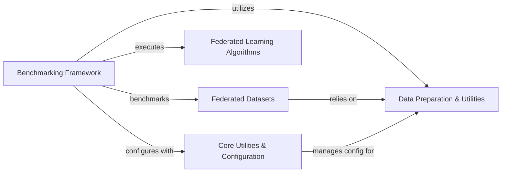

## Component Details

The FLamby project provides a comprehensive framework for benchmarking federated learning algorithms across various medical and synthetic datasets. Its core functionality revolves around orchestrating federated experiments, managing dataset preparation and access, and implementing diverse federated learning strategies. The main flow involves the Benchmarking Framework utilizing Core Utilities for configuration, executing Federated Learning Algorithms, and evaluating them on Federated Datasets, which are prepared and managed by the Data Preparation & Utilities component.

### Core Utilities & Configuration
This component provides fundamental utility functions for managing application configurations, handling GPU device selection, and general helper functions. It ensures consistent setup and operation across the FLamby framework.

**Related Classes/Methods**:

- <a href="https://github.com/owkin/FLamby/blob/master/flamby/utils.py#L134-L172" target="_blank" rel="noopener noreferrer">`FLamby.flamby.utils.create_config` (134:172)</a>
- <a href="https://github.com/owkin/FLamby/blob/master/flamby/utils.py#L79-L98" target="_blank" rel="noopener noreferrer">`FLamby.flamby.utils.read_config` (79:98)</a>
- <a href="https://github.com/owkin/FLamby/blob/master/flamby/utils.py#L175-L198" target="_blank" rel="noopener noreferrer">`FLamby.flamby.utils.write_value_in_config` (175:198)</a>
- <a href="https://github.com/owkin/FLamby/blob/master/flamby/utils.py#L201-L255" target="_blank" rel="noopener noreferrer">`FLamby.flamby.utils.check_dataset_from_config` (201:255)</a>
- <a href="https://github.com/owkin/FLamby/blob/master/flamby/utils.py#L101-L131" target="_blank" rel="noopener noreferrer">`FLamby.flamby.utils.get_config_file_path` (101:131)</a>
- <a href="https://github.com/owkin/FLamby/blob/master/flamby/utils.py#L258-L317" target="_blank" rel="noopener noreferrer">`flamby.utils.accept_license` (258:317)</a>
- <a href="https://github.com/owkin/FLamby/blob/master/flamby/gpu_utils.py#L5-L30" target="_blank" rel="noopener noreferrer">`flamby.gpu_utils.use_gpu_idx` (5:30)</a>
- <a href="https://github.com/owkin/FLamby/blob/master/flamby/utils.py#L17-L76" target="_blank" rel="noopener noreferrer">`flamby.utils.evaluate_model_on_tests` (17:76)</a>
- <a href="https://github.com/owkin/FLamby/blob/master/flamby/benchmarks/benchmark_utils.py#L14-L25" target="_blank" rel="noopener noreferrer">`flamby.benchmarks.benchmark_utils.set_seed` (14:25)</a>

### Federated Learning Algorithms
This component defines and implements various federated learning strategies, including base functionalities for data loading and model interfaces, as well as specific algorithms like FedAvg, FedOpt, and Cyclic. It handles the core logic for distributed model training and aggregation.

**Related Classes/Methods**:

- <a href="https://github.com/owkin/FLamby/blob/master/flamby/strategies/utils.py#L11-L51" target="_blank" rel="noopener noreferrer">`flamby.strategies.utils.DataLoaderWithMemory` (11:51)</a>
- <a href="https://github.com/owkin/FLamby/blob/master/flamby/strategies/utils.py#L54-L403" target="_blank" rel="noopener noreferrer">`flamby.strategies.utils._Model` (54:403)</a>
- <a href="https://github.com/owkin/FLamby/blob/master/flamby/strategies/utils.py#L406-L418" target="_blank" rel="noopener noreferrer">`FLamby.flamby.strategies.utils.compute_model_diff_squared_norm` (406:418)</a>
- <a href="https://github.com/owkin/FLamby/blob/master/flamby/strategies/utils.py#L421-L432" target="_blank" rel="noopener noreferrer">`FLamby.flamby.strategies.utils.compute_dot_product` (421:432)</a>
- <a href="https://github.com/owkin/FLamby/blob/master/flamby/strategies/fed_opt.py#L9-L205" target="_blank" rel="noopener noreferrer">`FLamby.flamby.strategies.fed_opt.FedOpt` (9:205)</a>
- <a href="https://github.com/owkin/FLamby/blob/master/flamby/strategies/fed_opt.py#L208-L352" target="_blank" rel="noopener noreferrer">`FLamby.flamby.strategies.fed_opt.FedAdam` (208:352)</a>
- <a href="https://github.com/owkin/FLamby/blob/master/flamby/strategies/fed_opt.py#L355-L506" target="_blank" rel="noopener noreferrer">`FLamby.flamby.strategies.fed_opt.FedYogi` (355:506)</a>
- <a href="https://github.com/owkin/FLamby/blob/master/flamby/strategies/fed_opt.py#L509-L653" target="_blank" rel="noopener noreferrer">`FLamby.flamby.strategies.fed_opt.FedAdagrad` (509:653)</a>
- <a href="https://github.com/owkin/FLamby/blob/master/flamby/strategies/fed_avg.py#L9-L197" target="_blank" rel="noopener noreferrer">`FLamby.flamby.strategies.fed_avg.FedAvg` (9:197)</a>
- <a href="https://github.com/owkin/FLamby/blob/master/flamby/strategies/fed_prox.py#L8-L120" target="_blank" rel="noopener noreferrer">`FLamby.flamby.strategies.fed_prox.FedProx` (8:120)</a>
- <a href="https://github.com/owkin/FLamby/blob/master/flamby/strategies/scaffold.py#L9-L238" target="_blank" rel="noopener noreferrer">`FLamby.flamby.strategies.scaffold.Scaffold` (9:238)</a>
- <a href="https://github.com/owkin/FLamby/blob/master/flamby/strategies/fed_avg_fine_tuning.py#L8-L101" target="_blank" rel="noopener noreferrer">`FLamby.flamby.strategies.fed_avg_fine_tuning.FedAvgFineTuning` (8:101)</a>
- <a href="https://github.com/owkin/FLamby/blob/master/flamby/strategies/cyclic.py#L10-L186" target="_blank" rel="noopener noreferrer">`FLamby.flamby.strategies.cyclic.Cyclic` (10:186)</a>

### Benchmarking Framework
This component serves as the central orchestrator for running federated learning experiments. It manages the entire benchmark lifecycle, from parsing command-line arguments and loading configurations to initializing data loaders, executing training routines (both pooled and federated), evaluating models, and logging results.

**Related Classes/Methods**:

- <a href="https://github.com/owkin/FLamby/blob/master/flamby/benchmarks/fed_benchmark.py#L29-L462" target="_blank" rel="noopener noreferrer">`FLamby.flamby.benchmarks.fed_benchmark.main` (29:462)</a>
- <a href="https://github.com/owkin/FLamby/blob/master/flamby/benchmarks/benchmark_utils.py#L14-L25" target="_blank" rel="noopener noreferrer">`flamby.benchmarks.benchmark_utils.set_seed` (14:25)</a>
- <a href="https://github.com/owkin/FLamby/blob/master/flamby/benchmarks/conf.py#L9-L47" target="_blank" rel="noopener noreferrer">`flamby.benchmarks.conf.check_config` (9:47)</a>
- <a href="https://github.com/owkin/FLamby/blob/master/flamby/benchmarks/conf.py#L50-L103" target="_blank" rel="noopener noreferrer">`flamby.benchmarks.conf.get_dataset_args` (50:103)</a>
- <a href="https://github.com/owkin/FLamby/blob/master/flamby/benchmarks/conf.py#L106-L196" target="_blank" rel="noopener noreferrer">`flamby.benchmarks.conf.get_strategies` (106:196)</a>
- <a href="https://github.com/owkin/FLamby/blob/master/flamby/benchmarks/benchmark_utils.py#L581-L633" target="_blank" rel="noopener noreferrer">`flamby.benchmarks.benchmark_utils.set_dataset_specific_config` (581:633)</a>
- <a href="https://github.com/owkin/FLamby/blob/master/flamby/benchmarks/benchmark_utils.py#L183-L245" target="_blank" rel="noopener noreferrer">`flamby.benchmarks.benchmark_utils.init_data_loaders` (183:245)</a>
- <a href="https://github.com/owkin/FLamby/blob/master/flamby/benchmarks/conf.py#L199-L203" target="_blank" rel="noopener noreferrer">`flamby.benchmarks.conf.get_results_file` (199:203)</a>
- <a href="https://github.com/owkin/FLamby/blob/master/flamby/benchmarks/benchmark_utils.py#L457-L526" target="_blank" rel="noopener noreferrer">`flamby.benchmarks.benchmark_utils.init_xp_plan` (457:526)</a>
- <a href="https://github.com/owkin/FLamby/blob/master/flamby/benchmarks/benchmark_utils.py#L347-L454" target="_blank" rel="noopener noreferrer">`flamby.benchmarks.benchmark_utils.train_single_centric` (347:454)</a>
- <a href="https://github.com/owkin/FLamby/blob/master/flamby/benchmarks/benchmark_utils.py#L289-L344" target="_blank" rel="noopener noreferrer">`flamby.benchmarks.benchmark_utils.evaluate_model_on_local_and_pooled_tests` (289:344)</a>
- <a href="https://github.com/owkin/FLamby/blob/master/flamby/benchmarks/benchmark_utils.py#L28-L84" target="_blank" rel="noopener noreferrer">`FLamby.flamby.benchmarks.benchmark_utils.fill_df_with_xp_results` (28:84)</a>
- <a href="https://github.com/owkin/FLamby/blob/master/flamby/benchmarks/benchmark_utils.py#L248-L263" target="_blank" rel="noopener noreferrer">`FLamby.flamby.benchmarks.benchmark_utils.prepare_dict` (248:263)</a>
- <a href="https://github.com/owkin/FLamby/blob/master/flamby/benchmarks/benchmark_utils.py#L529-L578" target="_blank" rel="noopener noreferrer">`FLamby.flamby.benchmarks.benchmark_utils.ensemble_perf_from_predictions` (529:578)</a>
- <a href="https://github.com/owkin/FLamby/blob/master/flamby/benchmarks/benchmark_utils.py#L87-L180" target="_blank" rel="noopener noreferrer">`FLamby.flamby.benchmarks.benchmark_utils.find_xps_in_df` (87:180)</a>
- <a href="https://github.com/owkin/FLamby/blob/master/flamby/benchmarks/benchmark_utils.py#L266-L286" target="_blank" rel="noopener noreferrer">`FLamby.flamby.benchmarks.benchmark_utils.get_logfile_name_from_strategy` (266:286)</a>

### Federated Datasets
This component encompasses all the specific datasets adapted for federated learning within FLamby. Each dataset includes its raw data handling, federated dataset class, baseline model, loss function, and metric definitions, along with benchmark entry points.

**Related Classes/Methods**:

- <a href="https://github.com/owkin/FLamby/blob/master/flamby/datasets/fed_tcga_brca/benchmark.py#L27-L126" target="_blank" rel="noopener noreferrer">`FLamby.flamby.datasets.fed_tcga_brca.benchmark.train_model` (27:126)</a>
- <a href="https://github.com/owkin/FLamby/blob/master/flamby/datasets/fed_tcga_brca/benchmark.py#L129-L194" target="_blank" rel="noopener noreferrer">`FLamby.flamby.datasets.fed_tcga_brca.benchmark.main` (129:194)</a>
- <a href="https://github.com/owkin/FLamby/blob/master/flamby/datasets/fed_tcga_brca/dataset.py#L28-L42" target="_blank" rel="noopener noreferrer">`FLamby.flamby.datasets.fed_tcga_brca.dataset.TcgaBrcaRaw.__init__` (28:42)</a>
- <a href="https://github.com/owkin/FLamby/blob/master/flamby/datasets/fed_tcga_brca/dataset.py#L76-L105" target="_blank" rel="noopener noreferrer">`FLamby.flamby.datasets.fed_tcga_brca.dataset.FedTcgaBrca.__init__` (76:105)</a>
- <a href="https://github.com/owkin/FLamby/blob/master/flamby/datasets/fed_tcga_brca/loss.py#L6-L36" target="_blank" rel="noopener noreferrer">`flamby.datasets.fed_tcga_brca.loss.BaselineLoss` (6:36)</a>
- <a href="https://github.com/owkin/FLamby/blob/master/flamby/datasets/fed_tcga_brca/metric.py#L3-L22" target="_blank" rel="noopener noreferrer">`flamby.datasets.fed_tcga_brca.metric.metric` (3:22)</a>
- <a href="https://github.com/owkin/FLamby/blob/master/flamby/datasets/fed_tcga_brca/model.py#L6-L18" target="_blank" rel="noopener noreferrer">`flamby.datasets.fed_tcga_brca.model.Baseline` (6:18)</a>
- <a href="https://github.com/owkin/FLamby/blob/master/flamby/datasets/fed_isic2019/benchmark.py#L23-L130" target="_blank" rel="noopener noreferrer">`FLamby.flamby.datasets.fed_isic2019.benchmark.train_model` (23:130)</a>
- <a href="https://github.com/owkin/FLamby/blob/master/flamby/datasets/fed_isic2019/benchmark.py#L133-L212" target="_blank" rel="noopener noreferrer">`FLamby.flamby.datasets.fed_isic2019.benchmark.main` (133:212)</a>
- <a href="https://github.com/owkin/FLamby/blob/master/flamby/datasets/fed_isic2019/dataset.py#L43-L80" target="_blank" rel="noopener noreferrer">`FLamby.flamby.datasets.fed_isic2019.dataset.Isic2019Raw.__init__` (43:80)</a>
- <a href="https://github.com/owkin/FLamby/blob/master/flamby/datasets/fed_isic2019/dataset.py#L130-L189" target="_blank" rel="noopener noreferrer">`FLamby.flamby.datasets.fed_isic2019.dataset.FedIsic2019.__init__` (130:189)</a>
- <a href="https://github.com/owkin/FLamby/blob/master/flamby/datasets/fed_isic2019/model.py#L10-L35" target="_blank" rel="noopener noreferrer">`flamby.datasets.fed_isic2019.model.Baseline` (10:35)</a>
- <a href="https://github.com/owkin/FLamby/blob/master/flamby/datasets/fed_isic2019/loss.py#L17-L57" target="_blank" rel="noopener noreferrer">`flamby.datasets.fed_isic2019.loss.BaselineLoss` (17:57)</a>
- <a href="https://github.com/owkin/FLamby/blob/master/flamby/datasets/fed_heart_disease/benchmark.py#L21-L120" target="_blank" rel="noopener noreferrer">`FLamby.flamby.datasets.fed_heart_disease.benchmark.main` (21:120)</a>
- <a href="https://github.com/owkin/FLamby/blob/master/flamby/datasets/fed_heart_disease/dataset.py#L54-L187" target="_blank" rel="noopener noreferrer">`FLamby.flamby.datasets.fed_heart_disease.dataset.HeartDiseaseRaw.__init__` (54:187)</a>
- <a href="https://github.com/owkin/FLamby/blob/master/flamby/datasets/fed_heart_disease/dataset.py#L243-L292" target="_blank" rel="noopener noreferrer">`FLamby.flamby.datasets.fed_heart_disease.dataset.FedHeartDisease.__init__` (243:292)</a>
- <a href="https://github.com/owkin/FLamby/blob/master/flamby/datasets/fed_heart_disease/model.py#L4-L10" target="_blank" rel="noopener noreferrer">`flamby.datasets.fed_heart_disease.model.Baseline` (4:10)</a>
- <a href="https://github.com/owkin/FLamby/blob/master/flamby/datasets/fed_heart_disease/loss.py#L4-L10" target="_blank" rel="noopener noreferrer">`flamby.datasets.fed_heart_disease.loss.BaselineLoss` (4:10)</a>
- <a href="https://github.com/owkin/FLamby/blob/master/flamby/datasets/fed_heart_disease/metric.py#L3-L13" target="_blank" rel="noopener noreferrer">`flamby.datasets.fed_heart_disease.metric.metric` (3:13)</a>
- <a href="https://github.com/owkin/FLamby/blob/master/flamby/datasets/fed_camelyon16/benchmark.py#L23-L132" target="_blank" rel="noopener noreferrer">`FLamby.flamby.datasets.fed_camelyon16.benchmark.main` (23:132)</a>
- <a href="https://github.com/owkin/FLamby/blob/master/flamby/datasets/fed_camelyon16/dataset.py#L57-L163" target="_blank" rel="noopener noreferrer">`FLamby.flamby.datasets.fed_camelyon16.dataset.Camelyon16Raw.__init__` (57:163)</a>
- <a href="https://github.com/owkin/FLamby/blob/master/flamby/datasets/fed_camelyon16/dataset.py#L209-L250" target="_blank" rel="noopener noreferrer">`FLamby.flamby.datasets.fed_camelyon16.dataset.FedCamelyon16.__init__` (209:250)</a>
- <a href="https://github.com/owkin/FLamby/blob/master/flamby/datasets/fed_camelyon16/model.py#L8-L52" target="_blank" rel="noopener noreferrer">`flamby.datasets.fed_camelyon16.model.Baseline` (8:52)</a>
- <a href="https://github.com/owkin/FLamby/blob/master/flamby/datasets/fed_camelyon16/loss.py#L4-L10" target="_blank" rel="noopener noreferrer">`flamby.datasets.fed_camelyon16.loss.BaselineLoss` (4:10)</a>
- <a href="https://github.com/owkin/FLamby/blob/master/flamby/datasets/fed_camelyon16/metric.py#L4-L11" target="_blank" rel="noopener noreferrer">`flamby.datasets.fed_camelyon16.metric.metric` (4:11)</a>
- <a href="https://github.com/owkin/FLamby/blob/master/flamby/datasets/fed_synthetic/benchmark.py#L21-L128" target="_blank" rel="noopener noreferrer">`FLamby.flamby.datasets.fed_synthetic.benchmark.main` (21:128)</a>
- <a href="https://github.com/owkin/FLamby/blob/master/flamby/datasets/fed_synthetic/dataset.py#L49-L119" target="_blank" rel="noopener noreferrer">`FLamby.flamby.datasets.fed_synthetic.dataset.SyntheticRaw.__init__` (49:119)</a>
- <a href="https://github.com/owkin/FLamby/blob/master/flamby/datasets/fed_synthetic/dataset.py#L162-L196" target="_blank" rel="noopener noreferrer">`FLamby.flamby.datasets.fed_synthetic.dataset.FedSynthetic.__init__` (162:196)</a>
- <a href="https://github.com/owkin/FLamby/blob/master/flamby/datasets/fed_synthetic/common.py#L14-L23" target="_blank" rel="noopener noreferrer">`FLamby.flamby.datasets.fed_synthetic.common.get_nb_max_rounds` (14:23)</a>
- <a href="https://github.com/owkin/FLamby/blob/master/flamby/datasets/fed_synthetic/model.py#L4-L10" target="_blank" rel="noopener noreferrer">`flamby.datasets.fed_synthetic.model.Baseline` (4:10)</a>
- <a href="https://github.com/owkin/FLamby/blob/master/flamby/datasets/fed_synthetic/loss.py#L4-L10" target="_blank" rel="noopener noreferrer">`flamby.datasets.fed_synthetic.loss.BaselineLoss` (4:10)</a>
- <a href="https://github.com/owkin/FLamby/blob/master/flamby/datasets/fed_synthetic/metric.py#L4-L7" target="_blank" rel="noopener noreferrer">`flamby.datasets.fed_synthetic.metric.metric` (4:7)</a>
- <a href="https://github.com/owkin/FLamby/blob/master/flamby/datasets/fed_lidc_idri/loss.py#L26-L29" target="_blank" rel="noopener noreferrer">`FLamby.flamby.datasets.fed_lidc_idri.loss.BaselineLoss.forward` (26:29)</a>
- <a href="https://github.com/owkin/FLamby/blob/master/flamby/datasets/fed_lidc_idri/loss.py#L53-L54" target="_blank" rel="noopener noreferrer">`FLamby.flamby.datasets.fed_lidc_idri.loss.DiceLoss.forward` (53:54)</a>
- <a href="https://github.com/owkin/FLamby/blob/master/flamby/datasets/fed_lidc_idri/loss.py#L67-L68" target="_blank" rel="noopener noreferrer">`FLamby.flamby.datasets.fed_lidc_idri.loss.FocalLoss.forward` (67:68)</a>
- <a href="https://github.com/owkin/FLamby/blob/master/flamby/datasets/fed_lidc_idri/benchmark.py#L23-L131" target="_blank" rel="noopener noreferrer">`FLamby.flamby.datasets.fed_lidc_idri.benchmark.main` (23:131)</a>
- <a href="https://github.com/owkin/FLamby/blob/master/flamby/datasets/fed_lidc_idri/lidc_heterogeneity_plot.py#L12-L45" target="_blank" rel="noopener noreferrer">`FLamby.flamby.datasets.fed_lidc_idri.lidc_heterogeneity_plot.make_plot` (12:45)</a>
- <a href="https://github.com/owkin/FLamby/blob/master/flamby/datasets/fed_lidc_idri/model.py#L13-L26" target="_blank" rel="noopener noreferrer">`FLamby.flamby.datasets.fed_lidc_idri.model.Baseline.__init__` (13:26)</a>
- <a href="https://github.com/owkin/FLamby/blob/master/flamby/datasets/fed_lidc_idri/model.py#L28-L39" target="_blank" rel="noopener noreferrer">`FLamby.flamby.datasets.fed_lidc_idri.model.Baseline.forward` (28:39)</a>
- <a href="https://github.com/owkin/FLamby/blob/master/flamby/datasets/fed_lidc_idri/model.py#L59-L63" target="_blank" rel="noopener noreferrer">`FLamby.flamby.datasets.fed_lidc_idri.model._make_nConv` (59:63)</a>
- <a href="https://github.com/owkin/FLamby/blob/master/flamby/datasets/fed_lidc_idri/model.py#L88-L99" target="_blank" rel="noopener noreferrer">`FLamby.flamby.datasets.fed_lidc_idri.model.DownTransition.__init__` (88:99)</a>
- <a href="https://github.com/owkin/FLamby/blob/master/flamby/datasets/fed_lidc_idri/model.py#L101-L106" target="_blank" rel="noopener noreferrer">`FLamby.flamby.datasets.fed_lidc_idri.model.DownTransition.forward` (101:106)</a>
- <a href="https://github.com/owkin/FLamby/blob/master/flamby/datasets/fed_lidc_idri/model.py#L110-L123" target="_blank" rel="noopener noreferrer">`FLamby.flamby.datasets.fed_lidc_idri.model.UpTransition.__init__` (110:123)</a>
- <a href="https://github.com/owkin/FLamby/blob/master/flamby/datasets/fed_lidc_idri/model.py#L125-L132" target="_blank" rel="noopener noreferrer">`FLamby.flamby.datasets.fed_lidc_idri.model.UpTransition.forward` (125:132)</a>
- <a href="https://github.com/owkin/FLamby/blob/master/flamby/datasets/fed_lidc_idri/dataset.py#L69-L122" target="_blank" rel="noopener noreferrer">`FLamby.flamby.datasets.fed_lidc_idri.dataset.LidcIdriRaw.__init__` (69:122)</a>
- <a href="https://github.com/owkin/FLamby/blob/master/flamby/datasets/fed_lidc_idri/dataset.py#L127-L140" target="_blank" rel="noopener noreferrer">`FLamby.flamby.datasets.fed_lidc_idri.dataset.LidcIdriRaw.__getitem__` (127:140)</a>
- <a href="https://github.com/owkin/FLamby/blob/master/flamby/datasets/fed_lidc_idri/dataset.py#L175-L230" target="_blank" rel="noopener noreferrer">`FLamby.flamby.datasets.fed_lidc_idri.dataset.FedLidcIdri.__init__` (175:230)</a>
- <a href="https://github.com/owkin/FLamby/blob/master/flamby/datasets/fed_kits19/benchmark.py#L23-L118" target="_blank" rel="noopener noreferrer">`FLamby.flamby.datasets.fed_kits19.benchmark.train_model` (23:118)</a>
- <a href="https://github.com/owkin/FLamby/blob/master/flamby/datasets/fed_kits19/benchmark.py#L121-L184" target="_blank" rel="noopener noreferrer">`FLamby.flamby.datasets.fed_kits19.benchmark.main` (121:184)</a>
- <a href="https://github.com/owkin/FLamby/blob/master/flamby/datasets/fed_kits19/metric.py#L29-L38" target="_blank" rel="noopener noreferrer">`FLamby.flamby.datasets.fed_kits19.metric.metric` (29:38)</a>
- <a href="https://github.com/owkin/FLamby/blob/master/flamby/datasets/fed_kits19/metric.py#L41-L83" target="_blank" rel="noopener noreferrer">`FLamby.flamby.datasets.fed_kits19.metric.evaluate_dice_on_tests` (41:83)</a>
- <a href="https://github.com/owkin/FLamby/blob/master/flamby/datasets/fed_kits19/dataset.py#L65-L145" target="_blank" rel="noopener noreferrer">`FLamby.flamby.datasets.fed_kits19.dataset.Kits19Raw.__init__` (65:145)</a>
- <a href="https://github.com/owkin/FLamby/blob/master/flamby/datasets/fed_kits19/dataset.py#L150-L173" target="_blank" rel="noopener noreferrer">`FLamby.flamby.datasets.fed_kits19.dataset.Kits19Raw.__getitem__` (150:173)</a>
- <a href="https://github.com/owkin/FLamby/blob/master/flamby/datasets/fed_kits19/dataset.py#L336-L375" target="_blank" rel="noopener noreferrer">`FLamby.flamby.datasets.fed_kits19.dataset.FedKits19.__init__` (336:375)</a>
- <a href="https://github.com/owkin/FLamby/blob/master/flamby/datasets/fed_kits19/model.py#L24-L60" target="_blank" rel="noopener noreferrer">`flamby.datasets.fed_kits19.model.Baseline` (24:60)</a>
- <a href="https://github.com/owkin/FLamby/blob/master/flamby/datasets/fed_kits19/loss.py#L3-L24" target="_blank" rel="noopener noreferrer">`flamby.datasets.fed_kits19.loss.BaselineLoss` (3:24)</a>
- <a href="https://github.com/owkin/FLamby/blob/master/flamby/datasets/fed_ixi/loss.py#L8-L26" target="_blank" rel="noopener noreferrer">`FLamby.flamby.datasets.fed_ixi.loss.BaselineLoss.forward` (8:26)</a>
- <a href="https://github.com/owkin/FLamby/blob/master/flamby/datasets/fed_ixi/benchmark.py#L23-L124" target="_blank" rel="noopener noreferrer">`FLamby.flamby.datasets.fed_ixi.benchmark.main` (23:124)</a>
- <a href="https://github.com/owkin/FLamby/blob/master/flamby/datasets/fed_ixi/model.py#L18-L120" target="_blank" rel="noopener noreferrer">`FLamby.flamby.datasets.fed_ixi.model.Baseline.__init__` (18:120)</a>
- <a href="https://github.com/owkin/FLamby/blob/master/flamby/datasets/fed_ixi/model.py#L122-L130" target="_blank" rel="noopener noreferrer">`FLamby.flamby.datasets.fed_ixi.model.Baseline.forward` (122:130)</a>
- <a href="https://github.com/owkin/FLamby/blob/master/flamby/datasets/fed_ixi/model.py#L137-L205" target="_blank" rel="noopener noreferrer">`FLamby.flamby.datasets.fed_ixi.model.ConvolutionalBlock.__init__` (137:205)</a>
- <a href="https://github.com/owkin/FLamby/blob/master/flamby/datasets/fed_ixi/model.py#L223-L259" target="_blank" rel="noopener noreferrer">`FLamby.flamby.datasets.fed_ixi.model.Decoder.__init__` (223:259)</a>
- <a href="https://github.com/owkin/FLamby/blob/master/flamby/datasets/fed_ixi/model.py#L269-L330" target="_blank" rel="noopener noreferrer">`FLamby.flamby.datasets.fed_ixi.model.DecodingBlock.__init__` (269:330)</a>
- <a href="https://github.com/owkin/FLamby/blob/master/flamby/datasets/fed_ixi/model.py#L332-L344" target="_blank" rel="noopener noreferrer">`FLamby.flamby.datasets.fed_ixi.model.DecodingBlock.forward` (332:344)</a>
- <a href="https://github.com/owkin/FLamby/blob/master/flamby/datasets/fed_ixi/model.py#L387-L433" target="_blank" rel="noopener noreferrer">`FLamby.flamby.datasets.fed_ixi.model.Encoder.__init__` (387:433)</a>
- <a href="https://github.com/owkin/FLamby/blob/master/flamby/datasets/fed_ixi/model.py#L448-L519" target="_blank" rel="noopener noreferrer">`FLamby.flamby.datasets.fed_ixi.model.EncodingBlock.__init__` (448:519)</a>
- <a href="https://github.com/owkin/FLamby/blob/master/flamby/datasets/fed_ixi/model.py#L521-L535" target="_blank" rel="noopener noreferrer">`FLamby.flamby.datasets.fed_ixi.model.EncodingBlock.forward` (521:535)</a>
- <a href="https://github.com/owkin/FLamby/blob/master/flamby/datasets/fed_ixi/dataset.py#L45-L105" target="_blank" rel="noopener noreferrer">`FLamby.flamby.datasets.fed_ixi.dataset.IXITinyRaw.__init__` (45:105)</a>
- <a href="https://github.com/owkin/FLamby/blob/master/flamby/datasets/fed_ixi/dataset.py#L136-L163" target="_blank" rel="noopener noreferrer">`FLamby.flamby.datasets.fed_ixi.dataset.IXITinyRaw.__getitem__` (136:163)</a>
- <a href="https://github.com/owkin/FLamby/blob/master/flamby/datasets/fed_ixi/dataset.py#L191-L236" target="_blank" rel="noopener noreferrer">`FLamby.flamby.datasets.fed_ixi.dataset.FedIXITiny.__init__` (191:236)</a>

### Data Preparation & Utilities
This component provides a comprehensive set of tools and scripts for preparing and managing datasets for federated learning. This includes functionalities for splitting datasets into client-specific subsets, downloading raw data from various sources, and specialized utilities for processing complex data types like medical images (e.g., tiling, NIfTI conversion, consensus building).

**Related Classes/Methods**:

- <a href="https://github.com/owkin/FLamby/blob/master/flamby/datasets/split_utils.py#L155-L282" target="_blank" rel="noopener noreferrer">`FLamby.flamby.datasets.split_utils.split_dataset` (155:282)</a>
- <a href="https://github.com/owkin/FLamby/blob/master/flamby/datasets/split_utils.py#L126-L152" target="_blank" rel="noopener noreferrer">`FLamby.flamby.datasets.split_utils.get_client_sizes` (126:152)</a>
- <a href="https://github.com/owkin/FLamby/blob/master/flamby/datasets/split_utils.py#L5-L48" target="_blank" rel="noopener noreferrer">`FLamby.flamby.datasets.split_utils.split_indices_linear` (5:48)</a>
- <a href="https://github.com/owkin/FLamby/blob/master/flamby/datasets/split_utils.py#L51-L123" target="_blank" rel="noopener noreferrer">`FLamby.flamby.datasets.split_utils.split_indices_dirichlet` (51:123)</a>
- <a href="https://github.com/owkin/FLamby/blob/master/flamby/datasets/fed_heart_disease/dataset_creation_scripts/download.py#L11-L104" target="_blank" rel="noopener noreferrer">`FLamby.flamby.datasets.fed_heart_disease.dataset_creation_scripts.download.main` (11:104)</a>
- <a href="https://github.com/owkin/FLamby/blob/master/flamby/datasets/fed_camelyon16/dataset_creation_scripts/download.py#L20-L152" target="_blank" rel="noopener noreferrer">`FLamby.flamby.datasets.fed_camelyon16.dataset_creation_scripts.download.main` (20:152)</a>
- <a href="https://github.com/owkin/FLamby/blob/master/flamby/datasets/fed_synthetic/dataset_creation_scripts/download.py#L9-L64" target="_blank" rel="noopener noreferrer">`FLamby.flamby.datasets.fed_synthetic.dataset_creation_scripts.download.main` (9:64)</a>
- <a href="https://github.com/owkin/FLamby/blob/master/flamby/datasets/fed_lidc_idri/dataset_creation_scripts/download_ct_scans.py#L261-L275" target="_blank" rel="noopener noreferrer">`FLamby.flamby.datasets.fed_lidc_idri.dataset_creation_scripts.download_ct_scans.main` (261:275)</a>
- <a href="https://github.com/owkin/FLamby/blob/master/flamby/datasets/fed_ixi/dataset_creation_scripts/download.py#L13-L65" target="_blank" rel="noopener noreferrer">`FLamby.flamby.datasets.fed_ixi.dataset_creation_scripts.download.dl_ixi_tiny` (13:65)</a>
- <a href="https://github.com/owkin/FLamby/blob/master/flamby/datasets/fed_lidc_idri/data_utils.py#L5-L83" target="_blank" rel="noopener noreferrer">`FLamby.flamby.datasets.fed_lidc_idri.data_utils.Sampler` (5:83)</a>
- <a href="https://github.com/owkin/FLamby/blob/master/flamby/datasets/fed_lidc_idri/data_utils.py#L86-L107" target="_blank" rel="noopener noreferrer">`FLamby.flamby.datasets.fed_lidc_idri.data_utils.ClipNorm` (86:107)</a>
- <a href="https://github.com/owkin/FLamby/blob/master/flamby/datasets/fed_lidc_idri/data_utils.py#L62-L83" target="_blank" rel="noopener noreferrer">`FLamby.flamby.datasets.fed_lidc_idri.data_utils.Sampler.__call__` (62:83)</a>
- <a href="https://github.com/owkin/FLamby/blob/master/flamby/datasets/fed_lidc_idri/data_utils.py#L155-L192" target="_blank" rel="noopener noreferrer">`FLamby.flamby.datasets.fed_lidc_idri.data_utils.random_sampler` (155:192)</a>
- <a href="https://github.com/owkin/FLamby/blob/master/flamby/datasets/fed_lidc_idri/data_utils.py#L229-L297" target="_blank" rel="noopener noreferrer">`FLamby.flamby.datasets.fed_lidc_idri.data_utils.fast_sampler` (229:297)</a>
- <a href="https://github.com/owkin/FLamby/blob/master/flamby/datasets/fed_lidc_idri/dataset_creation_scripts/tciaclient.py#L17-L230" target="_blank" rel="noopener noreferrer">`FLamby.flamby.datasets.fed_lidc_idri.dataset_creation_scripts.tciaclient.TCIAClient` (17:230)</a>
- <a href="https://github.com/owkin/FLamby/blob/master/flamby/datasets/fed_lidc_idri/dataset_creation_scripts/tciaclient.py#L57-L72" target="_blank" rel="noopener noreferrer">`FLamby.flamby.datasets.fed_lidc_idri.dataset_creation_scripts.tciaclient.TCIAClient.get_modality_values` (57:72)</a>
- <a href="https://github.com/owkin/FLamby/blob/master/flamby/datasets/fed_lidc_idri/dataset_creation_scripts/tciaclient.py#L74-L85" target="_blank" rel="noopener noreferrer">`FLamby.flamby.datasets.fed_lidc_idri.dataset_creation_scripts.tciaclient.TCIAClient.get_series_size` (74:85)</a>
- <a href="https://github.com/owkin/FLamby/blob/master/flamby/datasets/fed_lidc_idri/dataset_creation_scripts/tciaclient.py#L87-L97" target="_blank" rel="noopener noreferrer">`FLamby.flamby.datasets.fed_lidc_idri.dataset_creation_scripts.tciaclient.TCIAClient.contents_by_name` (87:97)</a>
- <a href="https://github.com/owkin/FLamby/blob/master/flamby/datasets/fed_lidc_idri/dataset_creation_scripts/tciaclient.py#L99-L114" target="_blank" rel="noopener noreferrer">`FLamby.flamby.datasets.fed_lidc_idri.dataset_creation_scripts.tciaclient.TCIAClient.get_manufacturer_values` (99:114)</a>
- <a href="https://github.com/owkin/FLamby/blob/master/flamby/datasets/fed_lidc_idri/dataset_creation_scripts/tciaclient.py#L116-L124" target="_blank" rel="noopener noreferrer">`FLamby.flamby.datasets.fed_lidc_idri.dataset_creation_scripts.tciaclient.TCIAClient.get_collection_values` (116:124)</a>
- <a href="https://github.com/owkin/FLamby/blob/master/flamby/datasets/fed_lidc_idri/dataset_creation_scripts/tciaclient.py#L126-L141" target="_blank" rel="noopener noreferrer">`FLamby.flamby.datasets.fed_lidc_idri.dataset_creation_scripts.tciaclient.TCIAClient.get_body_part_values` (126:141)</a>
- <a href="https://github.com/owkin/FLamby/blob/master/flamby/datasets/fed_lidc_idri/dataset_creation_scripts/tciaclient.py#L143-L158" target="_blank" rel="noopener noreferrer">`FLamby.flamby.datasets.fed_lidc_idri.dataset_creation_scripts.tciaclient.TCIAClient.get_patient_study` (143:158)</a>
- <a href="https://github.com/owkin/FLamby/blob/master/flamby/datasets/fed_lidc_idri/dataset_creation_scripts/tciaclient.py#L160-L175" target="_blank" rel="noopener noreferrer">`FLamby.flamby.datasets.fed_lidc_idri.dataset_creation_scripts.tciaclient.TCIAClient.get_series` (160:175)</a>
- <a href="https://github.com/owkin/FLamby/blob/master/flamby/datasets/fed_lidc_idri/dataset_creation_scripts/tciaclient.py#L177-L185" target="_blank" rel="noopener noreferrer">`FLamby.flamby.datasets.fed_lidc_idri.dataset_creation_scripts.tciaclient.TCIAClient.get_patient` (177:185)</a>
- <a href="https://github.com/owkin/FLamby/blob/master/flamby/datasets/fed_lidc_idri/dataset_creation_scripts/tciaclient.py#L187-L230" target="_blank" rel="noopener noreferrer">`FLamby.flamby.datasets.fed_lidc_idri.dataset_creation_scripts.tciaclient.TCIAClient.get_image` (187:230)</a>
- <a href="https://github.com/owkin/FLamby/blob/master/flamby/datasets/fed_lidc_idri/dataset_creation_scripts/tciaclient.py#L43-L55" target="_blank" rel="noopener noreferrer">`FLamby.flamby.datasets.fed_lidc_idri.dataset_creation_scripts.tciaclient.TCIAClient.execute` (43:55)</a>
- <a href="https://github.com/owkin/FLamby/blob/master/flamby/datasets/fed_lidc_idri/dataset_creation_scripts/process_raw.py#L102-L160" target="_blank" rel="noopener noreferrer">`FLamby.flamby.datasets.fed_lidc_idri.dataset_creation_scripts.process_raw.convert_to_niftis` (102:160)</a>
- <a href="https://github.com/owkin/FLamby/blob/master/flamby/datasets/fed_lidc_idri/dataset_creation_scripts/process_raw.py#L163-L193" target="_blank" rel="noopener noreferrer">`FLamby.flamby.datasets.fed_lidc_idri.dataset_creation_scripts.process_raw.build_consensus` (163:193)</a>
- <a href="https://github.com/owkin/FLamby/blob/master/flamby/datasets/fed_lidc_idri/dataset_creation_scripts/process_raw.py#L244-L335" target="_blank" rel="noopener noreferrer">`FLamby.flamby.datasets.fed_lidc_idri.dataset_creation_scripts.process_raw.build_volumes` (244:335)</a>
- <a href="https://github.com/owkin/FLamby/blob/master/flamby/datasets/fed_lidc_idri/dataset_creation_scripts/process_raw.py#L196-L229" target="_blank" rel="noopener noreferrer">`FLamby.flamby.datasets.fed_lidc_idri.dataset_creation_scripts.process_raw.fuse_points` (196:229)</a>
- <a href="https://github.com/owkin/FLamby/blob/master/flamby/datasets/fed_lidc_idri/dataset_creation_scripts/process_raw.py#L44-L99" target="_blank" rel="noopener noreferrer">`FLamby.flamby.datasets.fed_lidc_idri.dataset_creation_scripts.process_raw.saferesize` (44:99)</a>
- <a href="https://github.com/owkin/FLamby/blob/master/flamby/datasets/fed_lidc_idri/dataset_creation_scripts/process_raw.py#L232-L241" target="_blank" rel="noopener noreferrer">`FLamby.flamby.datasets.fed_lidc_idri.dataset_creation_scripts.process_raw.correct_ct_intensity` (232:241)</a>
- <a href="https://github.com/owkin/FLamby/blob/master/flamby/datasets/fed_lidc_idri/dataset_creation_scripts/process_raw.py#L15-L41" target="_blank" rel="noopener noreferrer">`FLamby.flamby.datasets.fed_lidc_idri.dataset_creation_scripts.process_raw.render_nodule_3D` (15:41)</a>
- <a href="https://github.com/owkin/FLamby/blob/master/flamby/datasets/fed_kits19/dataset_creation_scripts/utils/set_environment_variables.py#L5-L19" target="_blank" rel="noopener noreferrer">`FLamby.flamby.datasets.fed_kits19.dataset_creation_scripts.utils.set_environment_variables.set_environment_variables` (5:19)</a>
- `FLamby.flamby.datasets.fed_ixi.utils._find_file_in_tar` (full file reference)
- `FLamby.flamby.datasets.fed_ixi.utils._find_files_in_zip` (full file reference)
- `FLamby.flamby.datasets.fed_ixi.utils._load_nifti_image_by_id` (full file reference)
- `FLamby.flamby.datasets.fed_ixi.utils._load_nifti_image_and_label_by_id` (full file reference)
- `FLamby.flamby.datasets.fed_ixi.utils._extract_center_name_from_filename` (full file reference)
- `FLamby.flamby.datasets.fed_ixi.utils._get_id_from_filename` (full file reference)
- `FLamby.flamby.datasets.fed_ixi.utils._assembly_nifti_filename_regex` (full file reference)
- `FLamby.flamby.datasets.fed_ixi.utils._assembly_nifti_img_and_label_regex` (full file reference)
- `FLamby.flamby.datasets.fed_ixi.utils._get_center_name_from_center_id` (full file reference)
- <a href="https://github.com/owkin/FLamby/blob/master/flamby/datasets/fed_camelyon16/dataset_creation_scripts/tiling_slides.py#L46-L70" target="_blank" rel="noopener noreferrer">`FLamby.flamby.datasets.fed_camelyon16.dataset_creation_scripts.tiling_slides.SlideDataset` (46:70)</a>
- <a href="https://github.com/owkin/FLamby/blob/master/flamby/datasets/fed_camelyon16/dataset_creation_scripts/tiling_slides.py#L100-L102" target="_blank" rel="noopener noreferrer">`FLamby.flamby.datasets.fed_camelyon16.dataset_creation_scripts.tiling_slides.save_dict_to_csv` (100:102)</a>
- <a href="https://github.com/owkin/FLamby/blob/master/flamby/datasets/fed_camelyon16/dataset_creation_scripts/tiling_slides.py#L105-L335" target="_blank" rel="noopener noreferrer">`FLamby.flamby.datasets.fed_camelyon16.dataset_creation_scripts.tiling_slides.main` (105:335)</a>
- <a href="https://github.com/owkin/FLamby/blob/master/flamby/datasets/fed_camelyon16/dataset_creation_scripts/tiling_slides.py#L26-L43" target="_blank" rel="noopener noreferrer">`FLamby.flamby.datasets.fed_camelyon16.dataset_creation_scripts.tiling_slides.add_borders` (26:43)</a>
- <a href="https://github.com/owkin/FLamby/blob/master/flamby/datasets/fed_camelyon16/dataset_creation_scripts/tiling_slides.py#L96-L97" target="_blank" rel="noopener noreferrer">`FLamby.flamby.datasets.fed_camelyon16.dataset_creation_scripts.tiling_slides.dict_to_df` (96:97)</a>
- <a href="https://github.com/owkin/FLamby/blob/master/flamby/datasets/fed_camelyon16/dataset_creation_scripts/tiling_slides.py#L73-L93" target="_blank" rel="noopener noreferrer">`FLamby.flamby.datasets.fed_camelyon16.dataset_creation_scripts.tiling_slides.DatasetFromCoords` (73:93)</a>

### [FAQ](https://github.com/CodeBoarding/GeneratedOnBoardings/tree/main?tab=readme-ov-file#faq)