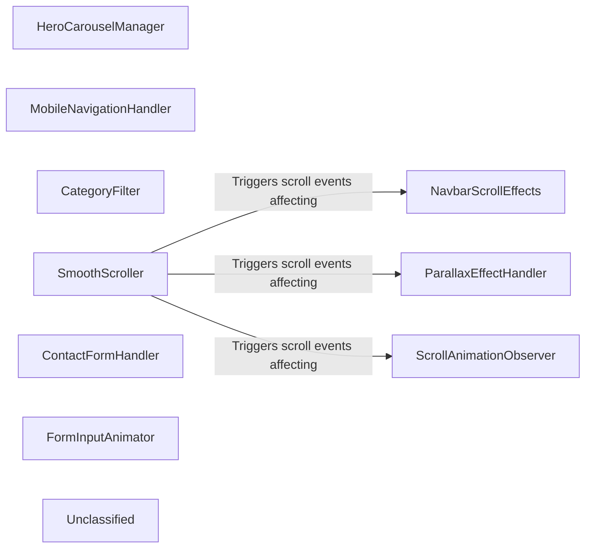

## Details

The client-side architecture of the "Fashion-Brand" website is a monolithic JavaScript application primarily driven by `main.js`. This script directly manipulates the Document Object Model (DOM) to provide dynamic interactivity across various sections of the webpage. Key functional areas, such as the `HeroCarouselManager`, `MobileNavigationHandler`, and `NavbarScrollEffects`, are implemented as distinct logical blocks within `main.js`, each responsible for a specific set of user interactions or visual enhancements. These components interact directly with the HTML structure of the page, responding to user input (e.g., clicks, scrolls) and dynamically updating content or styling. The `ScrollAnimationObserver` further enhances the user experience by introducing animations as elements enter the viewport. This architecture prioritizes direct DOM manipulation for performance and simplicity in a single-page context.

### HeroCarouselManager
Manages the automatic and manual cycling of images within the hero section carousel. It handles slide transitions, indicator updates, and pause/resume functionality on hover.

**Related Classes/Methods**:

- <a href="https://github.com/Saiedagha/Fashion-Brand/blob/mainmain.js#L11-L61" target="_blank" rel="noopener noreferrer">`HeroCarouselManager`:11-61</a>

### MobileNavigationHandler
Controls the visibility and behavior of the mobile navigation menu. It toggles the menu open/closed and ensures the menu closes when a navigation link is clicked.

**Related Classes/Methods**:

- <a href="https://github.com/Saiedagha/Fashion-Brand/blob/mainmain.js#L63-L78" target="_blank" rel="noopener noreferrer">`MobileNavigationHandler`:63-78</a>

### NavbarScrollEffects
Implements dynamic visual effects on the main navigation bar based on scroll position, such as changing its background. It also manages the "scroll spy" functionality, highlighting the active navigation link corresponding to the currently viewed section.

**Related Classes/Methods**:

- <a href="https://github.com/Saiedagha/Fashion-Brand/blob/mainmain.js#L80-L125" target="_blank" rel="noopener noreferrer">`NavbarScrollEffects`:80-125</a>

### CategoryFilter
Manages the filtering of collection cards based on selected categories. It updates the active category button and dynamically shows/hides collection cards with animation.

**Related Classes/Methods**:

- <a href="https://github.com/Saiedagha/Fashion-Brand/blob/mainmain.js#L127-L155" target="_blank" rel="noopener noreferrer">`CategoryFilter`:127-155</a>

### SmoothScroller
Provides smooth scrolling functionality when internal anchor links are clicked, ensuring a better user experience by animating the scroll to the target section. It also accounts for the fixed navbar height.

**Related Classes/Methods**:

- <a href="https://github.com/Saiedagha/Fashion-Brand/blob/mainmain.js#L157-L184" target="_blank" rel="noopener noreferrer">`SmoothScroller`:157-184</a>

### ParallaxEffectHandler
Applies a parallax scrolling effect to the hero content, creating a sense of depth as the user scrolls down the page.

**Related Classes/Methods**:

- <a href="https://github.com/Saiedagha/Fashion-Brand/blob/mainmain.js#L186-L193" target="_blank" rel="noopener noreferrer">`ParallaxEffectHandler`:186-193</a>

### ContactFormHandler
Manages the submission of the contact form, including preventing default submission, collecting form data, animating the submit button, and simulating a submission process.

**Related Classes/Methods**:

- <a href="https://github.com/Saiedagha/Fashion-Brand/blob/mainmain.js#L195-L229" target="_blank" rel="noopener noreferrer">`ContactFormHandler`:195-229</a>

### FormInputAnimator
Provides visual feedback on form input elements by animating their parent containers on focus and blur events.

**Related Classes/Methods**:

- <a href="https://github.com/Saiedagha/Fashion-Brand/blob/mainmain.js#L231-L240" target="_blank" rel="noopener noreferrer">`FormInputAnimator`:231-240</a>

### ScrollAnimationObserver
Utilizes the Intersection Observer API to trigger "fade-in-up" animations on specific elements (e.g., featured containers, contact content) when they become visible in the viewport.

**Related Classes/Methods**:

- <a href="https://github.com/Saiedagha/Fashion-Brand/blob/mainmain.js#L242-L259" target="_blank" rel="noopener noreferrer">`ScrollAnimationObserver`:242-259</a>

### Unclassified
Component for all unclassified files and utility functions (Utility functions/External Libraries/Dependencies)

**Related Classes/Methods**: _None_

### [FAQ](https://github.com/CodeBoarding/GeneratedOnBoardings/tree/main?tab=readme-ov-file#faq)