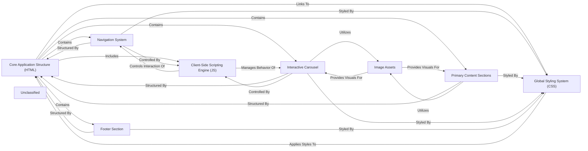

## Details

This graph represents the abstract component architecture of a fashion brand's web application. The main flow involves the foundational HTML structure linking to global styles and client-side scripts to create a dynamic and visually appealing user interface. Its purpose is to illustrate how different parts of the frontend (HTML, CSS, JavaScript, and assets) are organized into logical components and how they interact to deliver the overall user experience, including navigation, content display, and interactive elements like carousels.

### Core Application Structure (HTML)
The foundational HTML document that defines the page's layout and acts as the container for all other visual components. It links to global styles and the main JavaScript logic.

**Related Classes/Methods**:

- <a href="https://github.com/Saiedagha/Fashion-Brand/blob/mainindex.html" target="_blank" rel="noopener noreferrer">`index.html`</a>

### Global Styling System (CSS)
The central stylesheet that defines the application's visual theme, typography, color palette, and responsive design rules, applied universally across the HTML structure.

**Related Classes/Methods**:

- <a href="https://github.com/Saiedagha/Fashion-Brand/blob/mainstyle.css" target="_blank" rel="noopener noreferrer">`style.css`</a>

### Client-Side Scripting Engine (JS) [[Expand]](./Client_Side_Scripting_Engine_JS_.md)
The primary JavaScript file responsible for implementing dynamic behaviors, handling user interactions (e.g., navigation toggles, carousel controls), and manipulating the DOM.

**Related Classes/Methods**:

- <a href="https://github.com/Saiedagha/Fashion-Brand/blob/mainmain.js" target="_blank" rel="noopener noreferrer">`main.js`</a>

### Navigation System
Encompasses both the main desktop navigation and the responsive mobile menu, allowing users to navigate different sections of the site. Its structure is in HTML, styled by CSS, and controlled by JavaScript.

**Related Classes/Methods**:

- <a href="https://github.com/Saiedagha/Fashion-Brand/blob/mainindex.html" target="_blank" rel="noopener noreferrer">`index.html`</a>
- <a href="https://github.com/Saiedagha/Fashion-Brand/blob/mainstyle.css" target="_blank" rel="noopener noreferrer">`style.css`</a>
- <a href="https://github.com/Saiedagha/Fashion-Brand/blob/mainmain.js" target="_blank" rel="noopener noreferrer">`main.js`</a>

### Primary Content Sections
A logical grouping for sections that primarily display static content such as the Hero section, product collections, featured items, and customer testimonials. These sections are visually distinct but share a common purpose of presenting information.

**Related Classes/Methods**:

- <a href="https://github.com/Saiedagha/Fashion-Brand/blob/mainindex.html" target="_blank" rel="noopener noreferrer">`index.html`</a>
- <a href="https://github.com/Saiedagha/Fashion-Brand/blob/mainstyle.css" target="_blank" rel="noopener noreferrer">`style.css`</a>
- <a href="https://github.com/Saiedagha/Fashion-Brand/blob/mainimages" target="_blank" rel="noopener noreferrer">`images/`</a>

### Interactive Carousel
A dynamic component that cycles through a series of images or content blocks, often used for showcasing multiple products or features in a limited space, with its behavior managed by JavaScript.

**Related Classes/Methods**:

- <a href="https://github.com/Saiedagha/Fashion-Brand/blob/mainindex.html" target="_blank" rel="noopener noreferrer">`index.html`</a>
- <a href="https://github.com/Saiedagha/Fashion-Brand/blob/mainstyle.css" target="_blank" rel="noopener noreferrer">`style.css`</a>
- <a href="https://github.com/Saiedagha/Fashion-Brand/blob/mainmain.js" target="_blank" rel="noopener noreferrer">`main.js`</a>
- <a href="https://github.com/Saiedagha/Fashion-Brand/blob/mainimages" target="_blank" rel="noopener noreferrer">`images/`</a>

### Footer Section
The bottom-most section of the web page, typically containing copyright information, sitemap links, contact details, and social media icons.

**Related Classes/Methods**:

- <a href="https://github.com/Saiedagha/Fashion-Brand/blob/mainindex.html" target="_blank" rel="noopener noreferrer">`index.html`</a>
- <a href="https://github.com/Saiedagha/Fashion-Brand/blob/mainstyle.css" target="_blank" rel="noopener noreferrer">`style.css`</a>

### Image Assets
A collection of static image files used across various UI components for visual content, enhancing the brand's presentation.

**Related Classes/Methods**:

- <a href="https://github.com/Saiedagha/Fashion-Brand/blob/mainimages" target="_blank" rel="noopener noreferrer">`images/`</a>

### Unclassified
Component for all unclassified files and utility functions (Utility functions/External Libraries/Dependencies)

**Related Classes/Methods**: _None_

### [FAQ](https://github.com/CodeBoarding/GeneratedOnBoardings/tree/main?tab=readme-ov-file#faq)