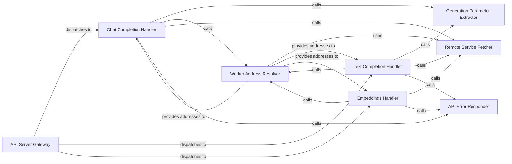

## Details

The `API Server (OpenAI Compatible)` subsystem acts as the primary interface for external applications, translating OpenAI API requests into internal FastChat operations. It is primarily defined within `fastchat/serve/openai_api_server.py` and utilizes data structures from `fastchat/protocol/openai_api_protocol.py`.

### API Server Gateway
The main entry point for all incoming OpenAI-compatible API requests (e.g., chat completions, text completions, embeddings). It dispatches requests to the appropriate internal handlers.

**Related Classes/Methods**:

- <a href="https://github.com/lm-sys/FastChat/blob/main/fastchat/serve/openai_api_server.py#L878-L924" target="_blank" rel="noopener noreferrer">`openai_api_server`:878-924</a>

### Chat Completion Handler
Processes requests specifically for chat-based text generation. It handles parameter parsing, validates input, discovers available model workers, and orchestrates the generation request to a worker.

**Related Classes/Methods**:

- <a href="https://github.com/lm-sys/FastChat/blob/main/fastchat/serve/openai_api_server.py#L801-L872" target="_blank" rel="noopener noreferrer">`create_chat_completion`:801-872</a>

### Text Completion Handler
Manages requests for traditional text completion. Its workflow mirrors the chat completion handler, focusing on simpler, single-turn prompts.

**Related Classes/Methods**:

- <a href="https://github.com/lm-sys/FastChat/blob/main/fastchat/serve/openai_api_server.py#L542-L618" target="_blank" rel="noopener noreferrer">`create_completion`:542-618</a>

### Embeddings Handler
Processes requests to generate numerical embeddings from input text. It handles model selection, worker discovery, and dispatches the embedding request.

**Related Classes/Methods**:

- <a href="https://github.com/lm-sys/FastChat/blob/main/fastchat/serve/openai_api_server.py#L706-L751" target="_blank" rel="noopener noreferrer">`create_embeddings`:706-751</a>

### Remote Service Fetcher
Provides a generic mechanism for asynchronous communication with other FastChat services (e.g., Controller, Model Workers). It abstracts the underlying network communication details.

**Related Classes/Methods**:

- <a href="https://github.com/lm-sys/FastChat/blob/main/fastchat/serve/openai_api_server.py#L73-L94" target="_blank" rel="noopener noreferrer">`fetch_remote`:73-94</a>

### Worker Address Resolver
Queries the FastChat Controller service to obtain the network address of an available model worker that can handle a specific model.

**Related Classes/Methods**:

- <a href="https://github.com/lm-sys/FastChat/blob/main/fastchat/serve/controller.py#L322-L326" target="_blank" rel="noopener noreferrer">`get_worker_address`:322-326</a>

### Generation Parameter Extractor
Extracts and validates generation-specific parameters (e.g., temperature, max tokens) from incoming API requests, ensuring they conform to expected types and constraints.

**Related Classes/Methods**:

- <a href="https://github.com/lm-sys/FastChat/blob/main/fastchat/serve/openai_api_server.py#L266-L364" target="_blank" rel="noopener noreferrer">`get_gen_params`:266-364</a>

### API Error Responder
Generates consistent and standardized error responses for API clients, ensuring a uniform error format across the API.

**Related Classes/Methods**:

- <a href="https://github.com/lm-sys/FastChat/blob/main/fastchat/serve/openai_api_server.py#L131-L134" target="_blank" rel="noopener noreferrer">`create_error_response`:131-134</a>

### [FAQ](https://github.com/CodeBoarding/GeneratedOnBoardings/tree/main?tab=readme-ov-file#faq)