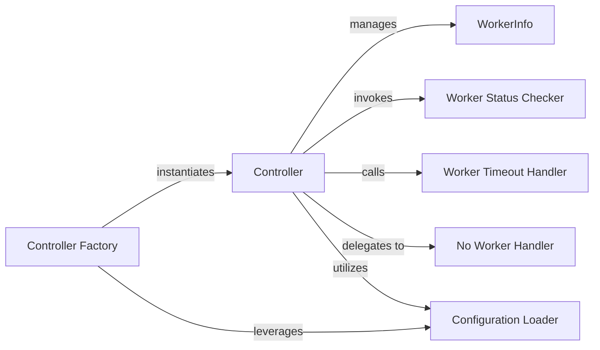

## Details

The fastchat.serve subsystem is designed around a central Controller that orchestrates the management and interaction with distributed model workers. The Controller maintains a registry of WorkerInfo objects, representing the state and capabilities of each worker. To ensure robust operation, the Controller integrates with specialized handlers like the Worker Status Checker, Worker Timeout Handler, and No Worker Handler to manage worker health and availability. The system's initialization is streamlined through a Controller Factory, which encapsulates the setup logic, including the loading of configurations via the Configuration Loader. This architecture ensures efficient request routing, fault tolerance, and scalable management of model serving infrastructure.

### Controller
The primary orchestrator managing model worker registration, deregistration, and request routing. It maintains the overall health and availability of the distributed model serving infrastructure.

**Related Classes/Methods**:

- <a href="https://github.com/lm-sys/FastChat/blob/main/fastchat/serve/base_model_worker.py#L89-L100" target="_blank" rel="noopener noreferrer">`Controller`:89-100</a>

### WorkerInfo
A data structure used by the Controller to store essential metadata for each registered model worker, including address, model capabilities, and last heartbeat.

**Related Classes/Methods**:

- <a href="https://github.com/lm-sys/FastChat/blob/main/fastchat/serve/controller.py#L48-L55" target="_blank" rel="noopener noreferrer">`WorkerInfo`:48-55</a>

### Controller Factory
A factory function responsible for instantiating and initializing the Controller class, encapsulating setup logic.

**Related Classes/Methods**:

- <a href="https://github.com/lm-sys/FastChat/blob/main/fastchat/serve/controller.py#L1-L10" target="_blank" rel="noopener noreferrer">`ControllerFactory`:1-10</a>

### Worker Status Checker
Actively queries the operational status and health of individual model workers, providing up-to-date information to the Controller.

**Related Classes/Methods**:

- <a href="https://github.com/lm-sys/FastChat/blob/main/fastchat/serve/controller.py#L1-L10" target="_blank" rel="noopener noreferrer">`WorkerStatusChecker`:1-10</a>

### Worker Timeout Handler
Manages scenarios where a model worker fails to respond within an expected timeframe, defining system behavior in such failure cases.

**Related Classes/Methods**:

- <a href="https://github.com/lm-sys/FastChat/blob/main/fastchat/serve/controller.py#L1-L10" target="_blank" rel="noopener noreferrer">`WorkerTimeoutHandler`:1-10</a>

### No Worker Handler
Addresses situations where the Controller cannot find any suitable or available model worker to fulfill a client request.

**Related Classes/Methods**:

- <a href="https://github.com/lm-sys/FastChat/blob/main/fastchat/serve/controller.py#L1-L10" target="_blank" rel="noopener noreferrer">`NoWorkerHandler`:1-10</a>

### Configuration Loader
Parses and loads configuration settings, ensuring the Controller operates with the correct parameters.

**Related Classes/Methods**:

- <a href="https://github.com/lm-sys/FastChat/blob/main/fastchat/serve/controller.py#L1-L10" target="_blank" rel="noopener noreferrer">`ConfigurationLoader`:1-10</a>

### [FAQ](https://github.com/CodeBoarding/GeneratedOnBoardings/tree/main?tab=readme-ov-file#faq)