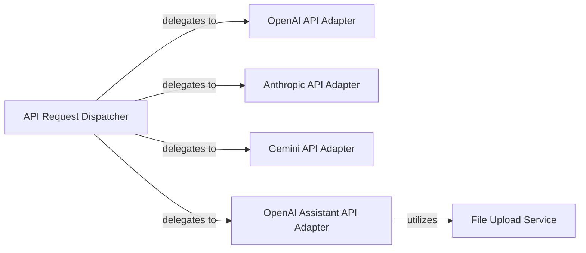

## Details

The External API Integration subsystem, primarily encapsulated within fastchat.serve.api_provider, provides a unified and extensible interface for interacting with various third-party Large Language Model (LLM) APIs. It acts as an API Gateway within the ML Toolkit/Platform, abstracting the complexities of different provider-specific interactions.

### API Request Dispatcher
Acts as the central entry point and dispatcher for all incoming LLM API requests. It dynamically determines the correct LLM provider based on request parameters and delegates the processing to the appropriate adapter. This component is crucial for routing and extensibility, aligning with the API Gateway pattern.

**Related Classes/Methods**:

- <a href="https://github.com/lm-sys/FastChat/blob/main/fastchat/serve/api_provider.py" target="_blank" rel="noopener noreferrer">`fastchat.serve.api_provider:get_api_provider_stream_iter`</a>

### OpenAI API Adapter
Handles all interactions with the standard OpenAI LLM API. This includes constructing API-specific requests, managing authentication, sending requests, and parsing streamed responses. It encapsulates the specifics of OpenAI's API.

**Related Classes/Methods**:

- <a href="https://github.com/lm-sys/FastChat/blob/main/fastchat/serve/api_provider.py" target="_blank" rel="noopener noreferrer">`fastchat.serve.api_provider:openai_api_stream_iter`</a>

### Anthropic API Adapter
Manages interactions with the Anthropic LLM API, performing similar functions to the OpenAI adapter but tailored to Anthropic's specific API requirements. This ensures modularity for different LLM providers.

**Related Classes/Methods**:

- <a href="https://github.com/lm-sys/FastChat/blob/main/fastchat/serve/api_provider.py" target="_blank" rel="noopener noreferrer">`fastchat.serve.api_provider:anthropic_api_stream_iter`</a>

### Gemini API Adapter
Facilitates communication with the Gemini LLM API, handling request/response translation and streaming for the Gemini platform. This component is vital for supporting Google's LLM offerings.

**Related Classes/Methods**:

- <a href="https://github.com/lm-sys/FastChat/blob/main/fastchat/serve/api_provider.py" target="_blank" rel="noopener noreferrer">`fastchat.serve.api_provider:gemini_api_stream_iter`</a>

### OpenAI Assistant API Adapter
A dedicated adapter for the more complex OpenAI Assistant API, addressing its unique features and requirements, including file handling. Its distinct nature warrants a separate component due to its advanced capabilities.

**Related Classes/Methods**:

- <a href="https://github.com/lm-sys/FastChat/blob/main/fastchat/serve/api_provider.py" target="_blank" rel="noopener noreferrer">`fastchat.serve.api_provider:openai_assistant_api_stream_iter`</a>

### File Upload Service
Provides file upload capabilities specifically for supporting the OpenAI Assistant API's file handling, by uploading files to Google Cloud Storage. This is a utility component that supports specific API features.

**Related Classes/Methods**:

- <a href="https://github.com/lm-sys/FastChat/blob/main/fastchat/serve/api_provider.py" target="_blank" rel="noopener noreferrer">`fastchat.serve.api_provider:upload_openai_file_to_gcs`</a>

### [FAQ](https://github.com/CodeBoarding/GeneratedOnBoardings/tree/main?tab=readme-ov-file#faq)