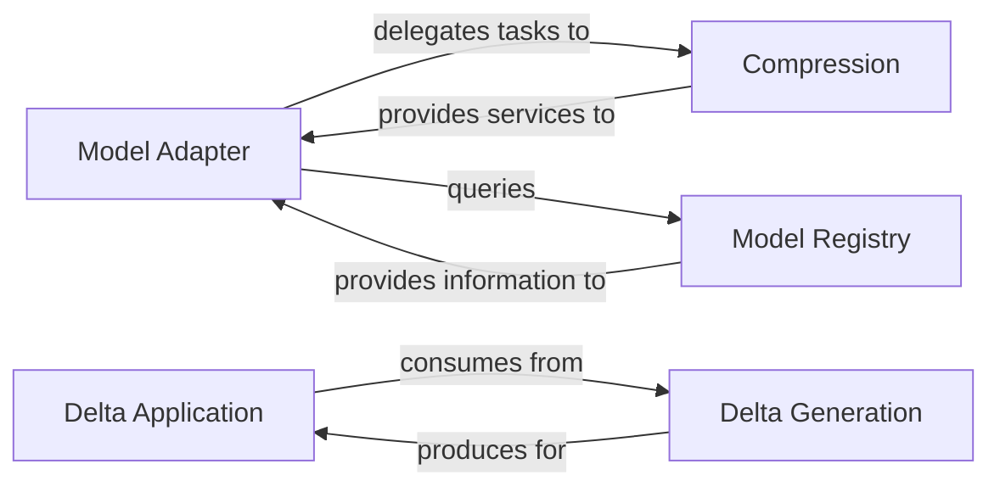

## Details

The `Model Management & Adapters` subsystem is responsible for the lifecycle and interaction of Large Language Models (LLMs) within the FastChat project. Its boundaries encompass all functionalities related to loading, adapting, managing, and updating various LLMs, ensuring efficient model utilization and dynamic configuration. This includes model registration, compression, and the application/generation of model delta weights.

### Model Adapter
Serves as the primary orchestrator for loading and managing diverse Large Language Models (LLMs). It identifies the correct model adapter based on the model type, handles the actual model loading (including integration with compression mechanisms), and retrieves the appropriate conversation template for the loaded model. It also performs pre-loading validation checks to ensure model compatibility and readiness.

**Related Classes/Methods**:

- <a href="https://github.com/lm-sys/FastChat/blob/main/fastchat/model/model_adapter.py" target="_blank" rel="noopener noreferrer">`fastchat.model.model_adapter`</a>

### Model Registry
Acts as a centralized repository or lookup service for registered models and their associated metadata. It provides essential information for model identification, configuration, and capabilities, enabling the `Model Adapter` to correctly initialize and manage different LLMs.

**Related Classes/Methods**:

- <a href="https://github.com/lm-sys/FastChat/blob/main/fastchat/model/model_registry.py" target="_blank" rel="noopener noreferrer">`fastchat.model.model_registry`</a>

### Compression
Manages the compression and decompression of model weights. This component is crucial for optimizing memory usage and accelerating the loading times of large language models, directly impacting the overall performance and resource efficiency of the system. It provides services to the `Model Adapter` for handling compressed models.

**Related Classes/Methods**:

- <a href="https://github.com/lm-sys/FastChat/blob/main/fastchat/model/compression.py" target="_blank" rel="noopener noreferrer">`fastchat.model.compression`</a>

### Delta Application
Responsible for applying delta weights to existing models. This functionality is vital for dynamic model updates, such as fine-tuning, merging different model versions, or applying patches, allowing for flexible and efficient model evolution without full reloads.

**Related Classes/Methods**:

- <a href="https://github.com/lm-sys/FastChat/blob/main/fastchat/model/apply_delta.py" target="_blank" rel="noopener noreferrer">`fastchat.model.apply_delta`</a>

### Delta Generation
Handles the creation and generation of delta weights. This component works in conjunction with `Delta Application`, producing the necessary weight differences that can then be applied to base models, forming the creation side of the model update pipeline.

**Related Classes/Methods**:

- <a href="https://github.com/lm-sys/FastChat/blob/main/fastchat/model/make_delta.py" target="_blank" rel="noopener noreferrer">`fastchat.model.make_delta`</a>

### [FAQ](https://github.com/CodeBoarding/GeneratedOnBoardings/tree/main?tab=readme-ov-file#faq)