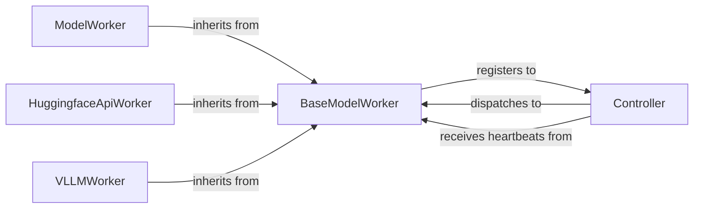

## Details

The `fastchat.serve` subsystem is designed for distributed LLM serving, with the `Controller` acting as the central orchestrator. Various `BaseModelWorker` implementations (e.g., `ModelWorker`, `HuggingfaceApiWorker`, `VLLMWorker`) register themselves with the `Controller`. The `Controller` maintains a registry of available workers, their capabilities (model names, speed), and their current load (queue length). It uses dispatch methods like "lottery" or "shortest queue" to select a worker when a client requests model inference. Heartbeat mechanisms ensure that the `Controller` has up-to-date information on worker availability and removes stale workers.

The `fastchat.serve` subsystem provides a robust and scalable architecture for serving large language models. At its core, the `Controller` acts as a central registry and dispatcher, managing a dynamic pool of `BaseModelWorker` instances. These workers, which can be specialized for different model types or serving optimizations (e.g., `ModelWorker`, `HuggingfaceApiWorker`, `VLLMWorker`), register with the `Controller` and periodically send heartbeats to maintain their active status. When a client requests model inference, the `Controller` intelligently routes the request to an available and suitable worker, ensuring efficient utilization of resources and high-throughput serving. This design allows for flexible scaling and integration of various LLM serving backends.

### BaseModelWorker
This is the foundational abstract class for all model workers. It establishes the common interface and core functionalities required for any worker, including registration with the Controller, heartbeat mechanisms, and abstract methods for model inference (text generation and embeddings). It also manages worker concurrency and basic worker state.

**Related Classes/Methods**:

- <a href="https://github.com/lm-sys/FastChat/blob/main/fastchat/serve/base_model_worker.py#L27-L177" target="_blank" rel="noopener noreferrer">`fastchat.serve.base_model_worker.BaseModelWorker`:27-177</a>

### ModelWorker
A concrete implementation of `BaseModelWorker` designed for general-purpose LLM serving. It provides specific implementations for text generation and embedding retrieval, likely interacting with standard Hugging Face models or similar, without specialized optimizations.

**Related Classes/Methods**:

- <a href="https://github.com/lm-sys/FastChat/blob/main/fastchat/serve/model_worker.py#L38-L300" target="_blank" rel="noopener noreferrer">`fastchat.serve.model_worker.ModelWorker`:38-300</a>

### HuggingfaceApiWorker
A specialized `BaseModelWorker` implementation tailored for serving models compatible with the Hugging Face API. It adapts the common inference APIs to interact with Hugging Face-specific model loading and generation patterns, potentially leveraging Hugging Face's transformers library directly.

**Related Classes/Methods**:

- <a href="https://github.com/lm-sys/FastChat/blob/main/fastchat/serve/huggingface_api_worker.py#L90-L202" target="_blank" rel="noopener noreferrer">`fastchat.serve.huggingface_api_worker.HuggingfaceApiWorker`:90-202</a>

### VLLMWorker
Another specialized `BaseModelWorker` implementation, specifically optimized for high-throughput LLM inference using the vLLM library. It provides its own highly optimized implementations for text generation, leveraging vLLM's advanced serving capabilities.

**Related Classes/Methods**:

- <a href="https://github.com/lm-sys/FastChat/blob/main/fastchat/serve/vllm_worker.py#L31-L175" target="_blank" rel="noopener noreferrer">`fastchat.serve.vllm_worker.VLLMWorker`:31-175</a>

### Controller
A central component that manages and dispatches requests to registered model workers. It handles worker registration, maintains worker status (including heartbeats and queue lengths), and selects appropriate workers based on dispatch methods (e.g., lottery or shortest queue). It also acts as an API endpoint for clients to interact with the distributed model serving system.

**Related Classes/Methods**:

- <a href="https://github.com/lm-sys/FastChat/blob/main/fastchat/serve/controller.py" target="_blank" rel="noopener noreferrer">`fastchat.serve.controller.Controller`</a>

### [FAQ](https://github.com/CodeBoarding/GeneratedOnBoardings/tree/main?tab=readme-ov-file#faq)