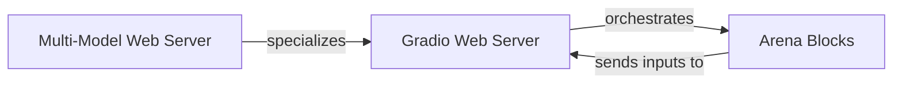

## Details

The core of the system is the Gradio Web Server, which acts as the central orchestrator for the interactive chat interface, managing user interactions and conversation flow. It leverages Arena Blocks to construct and present various model comparison UIs, receiving user inputs back from these blocks. The Multi-Model Web Server extends the base Gradio Web Server functionality, providing specialized capabilities for multi-model demonstrations.

### Gradio Web Server
The foundational component of the Gradio-based web UI. It orchestrates the overall conversation flow, manages user input and output, handles streaming of model responses, and logs user activities. It acts as the primary entry point and central hub for the interactive chat interface.

**Related Classes/Methods**:

- <a href="https://github.com/lm-sys/FastChat/blob/main/fastchat/serve/gradio_web_server.py" target="_blank" rel="noopener noreferrer">`fastchat.serve.gradio_web_server`</a>

### Arena Blocks
A collection of modular Gradio UI components designed to facilitate various types of model comparison arenas (e.g., anonymous, named, vision-specific). These blocks encapsulate the presentation logic and interactive elements required for comparing different models within the Gradio interface.

**Related Classes/Methods**:

- <a href="https://github.com/lm-sys/FastChat/blob/main/fastchat/serve/gradio_block_arena_anony.py" target="_blank" rel="noopener noreferrer">`fastchat.serve.gradio_block_arena_anony`</a>
- <a href="https://github.com/lm-sys/FastChat/blob/main/fastchat/serve/gradio_block_arena_named.py" target="_blank" rel="noopener noreferrer">`fastchat.serve.gradio_block_arena_named`</a>
- <a href="https://github.com/lm-sys/FastChat/blob/main/fastchat/serve/gradio_block_arena_vision.py" target="_blank" rel="noopener noreferrer">`fastchat.serve.gradio_block_arena_vision`</a>
- <a href="https://github.com/lm-sys/FastChat/blob/main/fastchat/serve/gradio_block_arena_vision_anony.py" target="_blank" rel="noopener noreferrer">`fastchat.serve.gradio_block_arena_vision_anony`</a>
- <a href="https://github.com/lm-sys/FastChat/blob/main/fastchat/serve/gradio_block_arena_vision_named.py" target="_blank" rel="noopener noreferrer">`fastchat.serve.gradio_block_arena_vision_named`</a>

### Multi-Model Web Server
A specialized extension or alternative entry point for the Gradio web server, specifically tailored for building and presenting multi-model demonstrations and visualizers. It provides functionalities that cater to scenarios involving multiple models or modalities.

**Related Classes/Methods**:

- <a href="https://github.com/lm-sys/FastChat/blob/main/fastchat/serve/gradio_web_server_multi.py" target="_blank" rel="noopener noreferrer">`fastchat.serve.gradio_web_server_multi`</a>

### [FAQ](https://github.com/CodeBoarding/GeneratedOnBoardings/tree/main?tab=readme-ov-file#faq)