```mermaid
graph LR
    Web_UI_Gradio_["Web UI (Gradio)"]
    CLI_Interface["CLI Interface"]
    API_Server_OpenAI_Compatible_["API Server (OpenAI Compatible)"]
    Controller_Service["Controller Service"]
    Model_Worker_Service_s_["Model Worker Service(s)"]
    Model_Management_Adapters["Model Management & Adapters"]
    External_API_Integration["External API Integration"]
    Web_UI_Gradio_ -- "sends requests to" --> API_Server_OpenAI_Compatible_
    API_Server_OpenAI_Compatible_ -- "returns responses to" --> Web_UI_Gradio_
    CLI_Interface -- "sends requests to" --> API_Server_OpenAI_Compatible_
    API_Server_OpenAI_Compatible_ -- "returns responses to" --> CLI_Interface
    API_Server_OpenAI_Compatible_ -- "queries for workers" --> Controller_Service
    Controller_Service -- "provides worker info" --> API_Server_OpenAI_Compatible_
    Model_Worker_Service_s_ -- "registers with and sends heartbeats to" --> Controller_Service
    Controller_Service -- "routes requests to" --> Model_Worker_Service_s_
    Model_Worker_Service_s_ -- "utilizes" --> Model_Management_Adapters
    Model_Worker_Service_s_ -- "delegates requests to" --> External_API_Integration
    External_API_Integration -- "returns responses to" --> Model_Worker_Service_s_
    API_Server_OpenAI_Compatible_ -- "proxies requests to" --> External_API_Integration
    click Web_UI_Gradio_ href "https://github.com/CodeBoarding/GeneratedOnBoardings/blob/main/FastChat/Web_UI_Gradio_.md" "Details"
    click API_Server_OpenAI_Compatible_ href "https://github.com/CodeBoarding/GeneratedOnBoardings/blob/main/FastChat/API_Server_OpenAI_Compatible_.md" "Details"
    click Controller_Service href "https://github.com/CodeBoarding/GeneratedOnBoardings/blob/main/FastChat/Controller_Service.md" "Details"
    click Model_Worker_Service_s_ href "https://github.com/CodeBoarding/GeneratedOnBoardings/blob/main/FastChat/Model_Worker_Service_s_.md" "Details"
    click Model_Management_Adapters href "https://github.com/CodeBoarding/GeneratedOnBoardings/blob/main/FastChat/Model_Management_Adapters.md" "Details"
    click External_API_Integration href "https://github.com/CodeBoarding/GeneratedOnBoardings/blob/main/FastChat/External_API_Integration.md" "Details"
```

## Details

FastChat implements a distributed, service-oriented architecture designed for scalable LLM serving. At its core, user interactions, whether via the Web UI (Gradio) or CLI Interface, are funneled through the API Server (OpenAI Compatible), which acts as a unified gateway. This server dynamically interacts with the Controller Service to discover and route requests to available Model Worker Service(s). Each Model Worker is responsible for hosting and performing inference on specific LLMs, leveraging the Model Management & Adapters for efficient model handling. The system also supports seamless integration with external LLM providers through the External API Integration component, allowing FastChat to serve as a versatile proxy. This modular design ensures high availability, load balancing, and extensibility, making FastChat a robust platform for deploying and managing diverse large language models. Beyond serving, FastChat includes dedicated Training Module and Evaluation & Judging System components, supported by Data Processing & Utilities, which operate somewhat independently but contribute to the overall model lifecycle and quality improvement.

### Web UI (Gradio) [[Expand]](./Web_UI_Gradio_.md)
User-facing web application for interactive chat and model comparison.

**Related Classes/Methods**:

- <a href="https://github.com/lm-sys/FastChat/blob/main/fastchat/serve/gradio_web_server.py" target="_blank" rel="noopener noreferrer">`fastchat.serve.gradio_web_server`</a>
- <a href="https://github.com/lm-sys/FastChat/blob/main/fastchat/serve/gradio_block_arena_anony.py" target="_blank" rel="noopener noreferrer">`fastchat.serve.gradio_block_arena_anony`</a>

### CLI Interface
Command-line tools for direct interaction with FastChat services.

**Related Classes/Methods**:

- <a href="https://github.com/lm-sys/FastChat/blob/main/fastchat/serve/cli.py" target="_blank" rel="noopener noreferrer">`fastchat.serve.cli`</a>

### API Server (OpenAI Compatible) [[Expand]](./API_Server_OpenAI_Compatible_.md)
RESTful API gateway for external applications, compatible with OpenAI's API.

**Related Classes/Methods**:

- <a href="https://github.com/lm-sys/FastChat/blob/main/fastchat/serve/openai_api_server.py" target="_blank" rel="noopener noreferrer">`fastchat.serve.openai_api_server`</a>
- <a href="https://github.com/lm-sys/FastChat/blob/main/fastchat/protocol/openai_api_protocol.py" target="_blank" rel="noopener noreferrer">`fastchat.protocol.openai_api_protocol`</a>

### Controller Service [[Expand]](./Controller_Service.md)
Central orchestrator managing model workers and routing requests.

**Related Classes/Methods**:

- <a href="https://github.com/lm-sys/FastChat/blob/main/fastchat/serve/controller.py" target="_blank" rel="noopener noreferrer">`fastchat.serve.controller`</a>

### Model Worker Service(s) [[Expand]](./Model_Worker_Service_s_.md)
Distributed services hosting and serving LLMs for inference.

**Related Classes/Methods**:

- <a href="https://github.com/lm-sys/FastChat/blob/main/fastchat/serve/model_worker.py" target="_blank" rel="noopener noreferrer">`fastchat.serve.model_worker`</a>
- <a href="https://github.com/lm-sys/FastChat/blob/main/fastchat/serve/base_model_worker.py" target="_blank" rel="noopener noreferrer">`fastchat.serve.base_model_worker`</a>
- <a href="https://github.com/lm-sys/FastChat/blob/main/fastchat/serve/huggingface_api_worker.py" target="_blank" rel="noopener noreferrer">`fastchat.serve.huggingface_api_worker`</a>
- <a href="https://github.com/lm-sys/FastChat/blob/main/fastchat/serve/vllm_worker.py" target="_blank" rel="noopener noreferrer">`fastchat.serve.vllm_worker`</a>

### Model Management & Adapters [[Expand]](./Model_Management_Adapters.md)
Handles loading, adapting, and managing various LLMs.

**Related Classes/Methods**:

- <a href="https://github.com/lm-sys/FastChat/blob/main/fastchat/model/model_adapter.py" target="_blank" rel="noopener noreferrer">`fastchat.model.model_adapter`</a>
- <a href="https://github.com/lm-sys/FastChat/blob/main/fastchat/model/apply_delta.py" target="_blank" rel="noopener noreferrer">`fastchat.model.apply_delta`</a>
- <a href="https://github.com/lm-sys/FastChat/blob/main/fastchat/model/make_delta.py" target="_blank" rel="noopener noreferrer">`fastchat.model.make_delta`</a>
- <a href="https://github.com/lm-sys/FastChat/blob/main/fastchat/model/model_registry.py" target="_blank" rel="noopener noreferrer">`fastchat.model.model_registry`</a>

### External API Integration [[Expand]](./External_API_Integration.md)
Provides a unified interface for interacting with third-party LLM APIs.

**Related Classes/Methods**:

- <a href="https://github.com/lm-sys/FastChat/blob/main/fastchat/serve/api_provider.py" target="_blank" rel="noopener noreferrer">`fastchat.serve.api_provider`</a>

### [FAQ](https://github.com/CodeBoarding/GeneratedOnBoardings/tree/main?tab=readme-ov-file#faq)