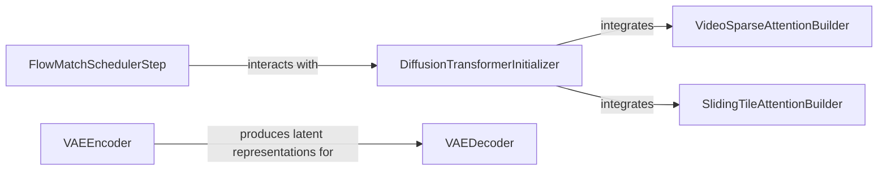

## Details

The `Core ML Components (Models & Optimizations)` subsystem is central to `fastvideo`, encapsulating the core deep learning models and critical optimization mechanisms for video generation.

### DiffusionTransformerInitializer
Initializes and configures the Diffusion Transformer model, serving as the primary generative model. It acts as an integration point for various attention backends, aligning with the "Extensibility" and "Clear Functional Separation" patterns.

**Related Classes/Methods**:

- <a href="https://github.com/hao-ai-lab/FastVideo/blob/main/fastvideo/models/dits/base.py#L92-L114" target="_blank" rel="noopener noreferrer">`fastvideo.models.dits.base.__init__`:92-114</a>

### VAEEncoder
Compresses raw video data into a compact latent representation. This is a critical data preprocessing step within the VAE pipeline, emphasizing "Flow-based Representation" and preparing data for the core models.

**Related Classes/Methods**:

- <a href="https://github.com/hao-ai-lab/FastVideo/blob/main/fastvideo/models/vaes/common.py#L65-L77" target="_blank" rel="noopener noreferrer">`fastvideo.models.vaes.common.encode`:65-77</a>

### VAEDecoder
Reconstructs video frames from the latent space, completing the VAE's generative process. It works in conjunction with the VAEEncoder to form a complete autoencoding pipeline.

**Related Classes/Methods**:

- <a href="https://github.com/hao-ai-lab/FastVideo/blob/main/fastvideo/models/vaes/common.py#L79-L97" target="_blank" rel="noopener noreferrer">`fastvideo.models.vaes.common.decode`:79-97</a>

### VideoSparseAttentionBuilder
Configures and initializes the Video Sparse Attention (VSA) mechanism. This component is a specialized optimization for efficient attention computations in video models, directly supporting the "Optimization Integration Points" and "GPU-Centric Design" principles.

**Related Classes/Methods**:

- <a href="https://github.com/hao-ai-lab/FastVideo/blob/main/fastvideo/attention/backends/video_sparse_attn.py#L160-L197" target="_blank" rel="noopener noreferrer">`fastvideo.attention.backends.video_sparse_attn.build`:160-197</a>

### SlidingTileAttentionBuilder
Sets up the Sliding Tile Attention (STA) mechanism, another crucial optimization technique for efficiently handling large video resolutions. Like VSA, it highlights the "Optimization Integration Points" and "GPU-Centric Design."

**Related Classes/Methods**:

- <a href="https://github.com/hao-ai-lab/FastVideo/blob/main/fastvideo/attention/backends/sliding_tile_attn.py#L77-L88" target="_blank" rel="noopener noreferrer">`fastvideo.attention.backends.sliding_tile_attn.build`:77-88</a>

### FlowMatchSchedulerStep
Manages a single iterative step in the flow-matching diffusion process, guiding the video generation. This component is a key part of the "Flow-based Representation" within the overall video generation pipeline.

**Related Classes/Methods**:

- <a href="https://github.com/hao-ai-lab/FastVideo/blob/main/fastvideo/models/schedulers/scheduling_flow_match_euler_discrete.py#L440-L534" target="_blank" rel="noopener noreferrer">`fastvideo.models.schedulers.scheduling_flow_match_euler_discrete.step`:440-534</a>

### [FAQ](https://github.com/CodeBoarding/GeneratedOnBoardings/tree/main?tab=readme-ov-file#faq)