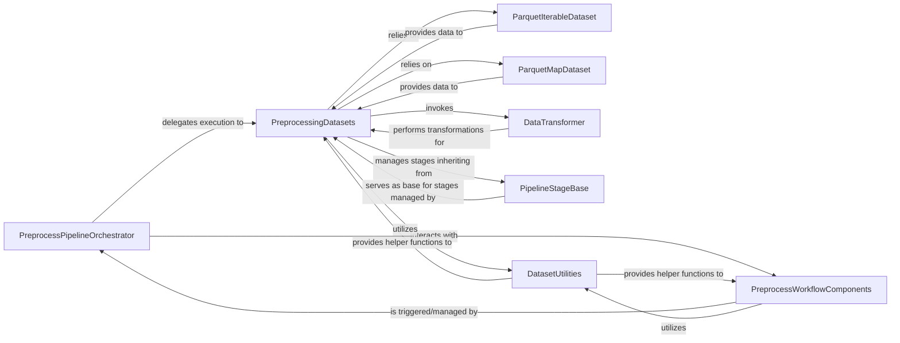

## Details

The Data Pipeline subsystem is responsible for the ingestion, transformation, and batching of video and text data, preparing raw data into a format suitable for model consumption in both training and inference.

### PreprocessPipelineOrchestrator
Orchestrates the high-level flow of the entire video and text data preprocessing workflow. It initiates and manages the overall data transformation and preparation process. This component is crucial as the entry point and coordinator for the entire data pipeline.

**Related Classes/Methods**:

- <a href="https://github.com/hao-ai-lab/FastVideo/blob/main/fastvideo/pipelines/preprocess/preprocess_pipeline_base.py" target="_blank" rel="noopener noreferrer">`PreprocessPipelineOrchestrator`</a>

### PreprocessingDatasets
Defines and executes the sequence of individual preprocessing stages. It handles the coordination of data loading, application of transformations, and stage-specific processing to prepare raw data. This is a core component for executing the actual data transformations.

**Related Classes/Methods**:

- <a href="https://github.com/hao-ai-lab/FastVideo/blob/main/fastvideo/dataset/preprocessing_datasets.py" target="_blank" rel="noopener noreferrer">`PreprocessingDatasets`</a>

### ParquetIterableDataset
Manages the ingestion of video and text data from Parquet files in an iterable format. It facilitates efficient sequential access, batching, and sharding, particularly for distributed processing. Essential for handling large-scale data ingestion.

**Related Classes/Methods**:

- <a href="https://github.com/hao-ai-lab/FastVideo/blob/main/fastvideo/dataset/parquet_dataset_iterable_style.py" target="_blank" rel="noopener noreferrer">`ParquetIterableDataset`</a>

### ParquetMapDataset
Provides a map-style interface for accessing and sampling data from Parquet files. This allows for random access and flexible batching strategies, complementing the iterable approach. Important for diverse data access patterns.

**Related Classes/Methods**:

- <a href="https://github.com/hao-ai-lab/FastVideo/blob/main/fastvideo/dataset/parquet_dataset_map_style.py" target="_blank" rel="noopener noreferrer">`ParquetMapDataset`</a>

### DataTransformer
Encapsulates various atomic data transformation operations, such as cropping, resizing, normalization, and other tensor manipulations applied to video frames and image data. This component holds the fundamental data manipulation logic.

**Related Classes/Methods**:

- <a href="https://github.com/hao-ai-lab/FastVideo/blob/main/fastvideo/dataset/transform.py" target="_blank" rel="noopener noreferrer">`DataTransformer`</a>

### PipelineStageBase
Serves as the foundational abstract class for all individual processing stages within the data pipeline. It provides a common interface and mechanisms for input/output validation, ensuring consistency across stages. This component ensures the extensibility and modularity of the pipeline stages.

**Related Classes/Methods**:

- <a href="https://github.com/hao-ai-lab/FastVideo/blob/main/fastvideo/pipelines/stages/base.py" target="_blank" rel="noopener noreferrer">`PipelineStageBase`</a>

### PreprocessWorkflowComponents
Handles the final steps of the preprocessing workflow. This includes registering data validation rules and managing the persistence of the processed data into Parquet files, completing the pipeline's output. Critical for finalizing and storing processed data.

**Related Classes/Methods**:

- <a href="https://github.com/hao-ai-lab/FastVideo/blob/main/fastvideo/workflow/preprocess/components.py" target="_blank" rel="noopener noreferrer">`PreprocessWorkflowComponents`</a>

### DatasetUtilities
Offers utility functions for common data manipulation tasks within the pipeline. This includes collating processed latents, embeddings, and masks, and padding data to ensure consistent shapes for model consumption. Provides essential helper functions across the data handling process.

**Related Classes/Methods**:

- <a href="https://github.com/hao-ai-lab/FastVideo/blob/main/fastvideo/dataset/utils.py" target="_blank" rel="noopener noreferrer">`DatasetUtilities`</a>

### [FAQ](https://github.com/CodeBoarding/GeneratedOnBoardings/tree/main?tab=readme-ov-file#faq)