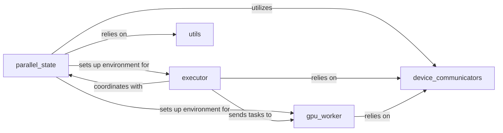

## Details

The `fastvideo` distributed system is built upon a core set of components designed for efficient parallel processing on GPUs. The `parallel_state` component is foundational, responsible for initializing and managing the distributed environment, including various parallel groups (e.g., model, tensor, data parallelism). It provides the context for all distributed operations. The `executor` acts as the central control plane, orchestrating tasks and managing distributed forward passes across multiple `gpu_worker` instances. Each `gpu_worker` represents an individual compute node, executing tasks within its dedicated event loop and performing computations on its assigned GPU. Low-level, hardware-specific communication between devices is handled by `device_communicators`, which abstract the complexities of underlying communication libraries like NCCL. Finally, the `utils` component provides essential helper functions for distributed operations, such as tensor manipulation and process group management, supporting the overall framework. This architecture ensures synchronized execution and efficient data movement across the distributed system.

### parallel_state
Manages the global distributed environment, including the initialization and management of various parallel groups (world, model, tensor, sequence, data parallelism). It provides high-level collective communication operations and defines the distributed context. This component is central as it establishes the foundation for all distributed operations.

**Related Classes/Methods**:

- <a href="https://github.com/hao-ai-lab/FastVideo/blob/main/fastvideo/distributed/parallel_state.py" target="_blank" rel="noopener noreferrer">`parallel_state`</a>

### executor
Acts as the control plane for orchestrating tasks across multiple `gpu_worker` processes. It primarily manages distributed forward passes and LoRA adapter management using collective RPCs, ensuring synchronized execution. This component is vital for coordinating distributed workloads.

**Related Classes/Methods**:

- <a href="https://github.com/hao-ai-lab/FastVideo/blob/main/fastvideo/entrypoints/video_generator.py" target="_blank" rel="noopener noreferrer">`executor`</a>

### gpu_worker
Represents an individual GPU compute node. It manages its lifecycle, executes tasks within a dedicated event loop (`event_loop`), and performs computations on its assigned GPU. This component is the execution unit of the distributed system.

**Related Classes/Methods**:

- <a href="https://github.com/hao-ai-lab/FastVideo/blob/main/fastvideo/worker/gpu_worker.py" target="_blank" rel="noopener noreferrer">`gpu_worker`</a>

### device_communicators
Provides the low-level, hardware-specific communication primitives (e.g., NCCL via `pynccl`, `cpu_communicator`) for efficient inter-device data transfer. It abstracts the complexities of underlying communication libraries. This component is critical for efficient data movement between devices.

**Related Classes/Methods**:

- <a href="https://github.com/hao-ai-lab/FastVideo/blob/main/fastvideo/distributed/device_communicators/base_device_communicator.py" target="_blank" rel="noopener noreferrer">`device_communicators`</a>

### utils
Offers general utility functions essential for distributed operations. This includes tensor manipulation, object serialization/deserialization for network transfer, and process group creation, supporting the overall distributed framework. This component provides foundational helper functions for distributed tasks.

**Related Classes/Methods**:

- <a href="https://github.com/hao-ai-lab/FastVideo/blob/main/fastvideo/distributed/utils.py" target="_blank" rel="noopener noreferrer">`utils`</a>

### [FAQ](https://github.com/CodeBoarding/GeneratedOnBoardings/tree/main?tab=readme-ov-file#faq)