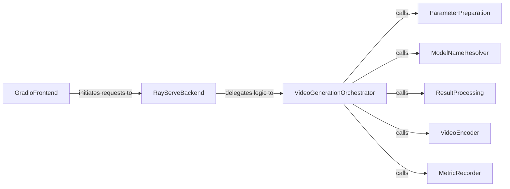

## Details

The `External Service Interface` subsystem provides the necessary components for users and external applications to interact with the video generation capabilities of the system. It primarily focuses on handling requests, orchestrating the video generation process, and delivering results.

### GradioFrontend
Provides the user interface for interacting with the video generation service, collecting user inputs, and initiating requests. It acts as the primary user-facing component.

**Related Classes/Methods**:

- <a href="https://github.com/hao-ai-lab/FastVideo/blob/main/examples/inference/gradio/gradio_frontend.py" target="_blank" rel="noopener noreferrer">`examples.inference.gradio.gradio_frontend`</a>

### RayServeBackend
Acts as the service layer, receiving video generation requests from the GradioFrontend and orchestrating the backend processing. It serves as the entry point for external requests into the video generation pipeline.

**Related Classes/Methods**:

- <a href="https://github.com/hao-ai-lab/FastVideo/blob/main/examples/inference/gradio/ray_serve_backend.py" target="_blank" rel="noopener noreferrer">`examples.inference.gradio.ray_serve_backend`</a>

### VideoGenerationOrchestrator
Manages the end-to-end video generation workflow, including parameter handling, model invocation, result processing, and output encoding. This is a core component of the Inference Engine.

**Related Classes/Methods**:

- <a href="https://github.com/hao-ai-lab/FastVideo/blob/main/examples/inference/gradio/ray_serve_backend.py" target="_blank" rel="noopener noreferrer">`examples.inference.gradio.ray_serve_backend:generate_video`</a>

### ParameterPreparation
Validates and formats input parameters required for the video generation model, ensuring data integrity and correctness before model invocation.

**Related Classes/Methods**:

- <a href="https://github.com/hao-ai-lab/FastVideo/blob/main/examples/inference/gradio/ray_serve_backend.py" target="_blank" rel="noopener noreferrer">`examples.inference.gradio.ray_serve_backend:prepare_sampling_params`</a>

### ModelNameResolver
Retrieves the specific model name to be used for video generation, implying interaction with a model selection or registry mechanism.

**Related Classes/Methods**:

- <a href="https://github.com/hao-ai-lab/FastVideo/blob/main/examples/inference/gradio/ray_serve_backend.py" target="_blank" rel="noopener noreferrer">`examples.inference.gradio.ray_serve_backend:_get_model_name`</a>

### ResultProcessing
Handles post-processing of the raw output generated by the video model, preparing it for encoding or further use.

**Related Classes/Methods**:

- <a href="https://github.com/hao-ai-lab/FastVideo/blob/main/examples/inference/gradio/ray_serve_backend.py" target="_blank" rel="noopener noreferrer">`examples.inference.gradio.ray_serve_backend:process_generation_result`</a>

### VideoEncoder
Converts the processed video data into a base64 string suitable for transmission back to the frontend, ensuring efficient data transfer.

**Related Classes/Methods**:

- <a href="https://github.com/hao-ai-lab/FastVideo/blob/main/examples/inference/gradio/ray_serve_backend.py" target="_blank" rel="noopener noreferrer">`examples.inference.gradio.ray_serve_backend:encode_video_to_base64`</a>

### MetricRecorder
Records internal performance and usage metrics for the video generation process, crucial for monitoring and optimization.

**Related Classes/Methods**:

- <a href="https://github.com/hao-ai-lab/FastVideo/blob/main/examples/inference/gradio/ray_serve_backend.py" target="_blank" rel="noopener noreferrer">`examples.inference.gradio.ray_serve_backend:_record_metrics`</a>

### [FAQ](https://github.com/CodeBoarding/GeneratedOnBoardings/tree/main?tab=readme-ov-file#faq)