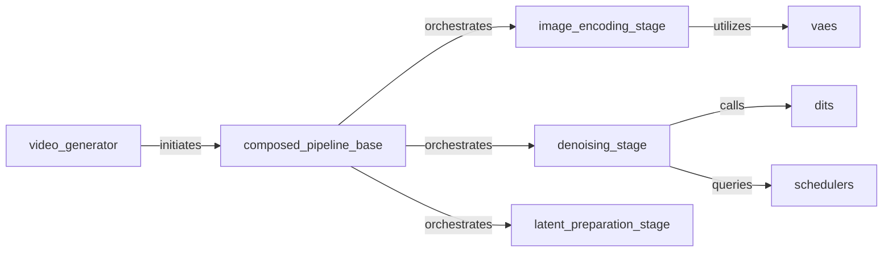

## Details

The fastvideo project is designed to generate videos from various inputs, primarily leveraging diffusion models. The core of the system is a ComposedPipelineBase that orchestrates a sequence of stages to transform initial inputs into a final video. This pipeline integrates specialized components for image encoding, latent preparation, and iterative denoising, which are fundamental to the diffusion process. The denoising stage, in particular, relies on DiTs (Diffusion Transformers) for core transformations and Schedulers to manage the denoising steps. VAEs (Variational Autoencoders) are crucial for converting between pixel and latent representations, enabling the diffusion process to operate in a more efficient latent space.

### video_generator
Acts as the public API and primary entry point for initiating the video generation process. It handles initial setup and delegates the pipeline execution.

**Related Classes/Methods**:

- <a href="https://github.com/hao-ai-lab/FastVideo/blob/main/fastvideo/entrypoints/video_generator.py" target="_blank" rel="noopener noreferrer">`video_generator`</a>

### composed_pipeline_base
The core orchestrator of the video generation pipeline. It defines and executes the sequential stages required to transform input prompts and parameters into a video.

**Related Classes/Methods**:

- <a href="https://github.com/hao-ai-lab/FastVideo/blob/main/fastvideo/pipelines/composed_pipeline_base.py" target="_blank" rel="noopener noreferrer">`composed_pipeline_base`</a>

### denoising_stage
Implements the iterative core denoising process, refining latent representations over multiple steps.

**Related Classes/Methods**:

- <a href="https://github.com/hao-ai-lab/FastVideo/blob/main/fastvideo/pipelines/stages/denoising.py" target="_blank" rel="noopener noreferrer">`denoising_stage`</a>

### image_encoding_stage
Encodes initial image inputs into the latent space, preparing them for the subsequent denoising process.

**Related Classes/Methods**:

- <a href="https://github.com/hao-ai-lab/FastVideo/blob/main/fastvideo/pipelines/stages/image_encoding.py" target="_blank" rel="noopener noreferrer">`image_encoding_stage`</a>

### latent_preparation_stage
Adjusts and prepares latent representations before the main denoising stage, ensuring they are in the correct format or state.

**Related Classes/Methods**:

- <a href="https://github.com/hao-ai-lab/FastVideo/blob/main/fastvideo/pipelines/stages/latent_preparation.py" target="_blank" rel="noopener noreferrer">`latent_preparation_stage`</a>

### dits
Performs core diffusion transformations, fundamental to the denoising process.

**Related Classes/Methods**:

- <a href="https://github.com/hao-ai-lab/FastVideo/blob/main/fastvideo/models/dits/base.py#L13-L70" target="_blank" rel="noopener noreferrer">`BaseDiT`:13-70</a>

### schedulers
Controls timestep progression and noise schedules, crucial for the quality and stability of the denoising process.

**Related Classes/Methods**:

- <a href="https://github.com/hao-ai-lab/FastVideo/blob/main/fastvideo/models/schedulers/base.py#L8-L35" target="_blank" rel="noopener noreferrer">`BaseScheduler`:8-35</a>

### vaes
Provides encoding and decoding functionality, transforming between pixel and latent spaces.

**Related Classes/Methods**:

- <a href="https://github.com/hao-ai-lab/FastVideo/blob/main/fastvideo/models/vaes/common.py" target="_blank" rel="noopener noreferrer">`BaseVAE`</a>

### [FAQ](https://github.com/CodeBoarding/GeneratedOnBoardings/tree/main?tab=readme-ov-file#faq)