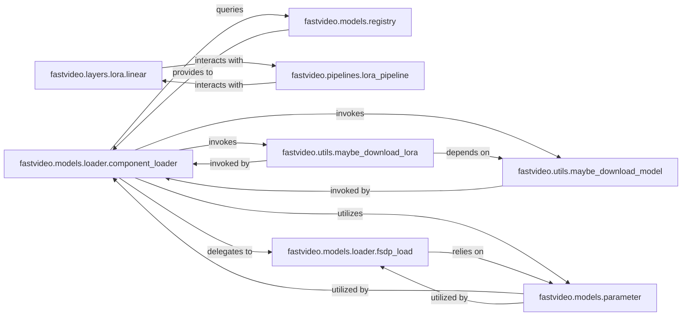

## Details

The Model Management subsystem is responsible for the dynamic loading of pre-trained model weights, maintaining a registry of available model architectures, and handling fine-tuning techniques like LoRA. Its boundaries encompass components that facilitate model instantiation, weight retrieval, architectural lookup, and the application of fine-tuning.

### fastvideo.models.loader.component_loader
Primary orchestrator for dynamic model and weight loading, abstracting complexities of model instantiation and weight retrieval.

**Related Classes/Methods**:

- <a href="https://github.com/hao-ai-lab/FastVideo/blob/main/fastvideo/models/loader/component_loader.py" target="_blank" rel="noopener noreferrer">`fastvideo.models.loader.component_loader`</a>

### fastvideo.models.registry
Centralized, searchable registry of available model architectures, enabling their lookup and resolution by name.

**Related Classes/Methods**:

- <a href="https://github.com/hao-ai-lab/FastVideo/blob/main/fastvideo/models/registry.py" target="_blank" rel="noopener noreferrer">`fastvideo.models.registry`</a>

### fastvideo.layers.lora.linear
Implements the core mathematical operations for LoRA, including application, slicing, and merging of LoRA weights.

**Related Classes/Methods**:

- <a href="https://github.com/hao-ai-lab/FastVideo/blob/main/fastvideo/layers/lora/linear.py" target="_blank" rel="noopener noreferrer">`fastvideo.layers.lora.linear`</a>

### fastvideo.pipelines.lora_pipeline
Orchestrates the integration and application of LoRA fine-tuning within the video generation workflow.

**Related Classes/Methods**:

- <a href="https://github.com/hao-ai-lab/FastVideo/blob/main/fastvideo/pipelines/lora_pipeline.py" target="_blank" rel="noopener noreferrer">`fastvideo.pipelines.lora_pipeline`</a>

### fastvideo.models.loader.fsdp_load
Manages specialized loading and sharding of models for Fully Sharded Data Parallel (FSDP) contexts.

**Related Classes/Methods**:

- <a href="https://github.com/hao-ai-lab/FastVideo/blob/main/fastvideo/models/loader/fsdp_load.py" target="_blank" rel="noopener noreferrer">`fastvideo.models.loader.fsdp_load`</a>

### fastvideo.models.parameter
Provides low-level utilities for loading various types of model parameters, especially for parallel processing.

**Related Classes/Methods**:

- <a href="https://github.com/hao-ai-lab/FastVideo/blob/main/fastvideo/models/parameter.py" target="_blank" rel="noopener noreferrer">`fastvideo.models.parameter`</a>

### fastvideo.utils.maybe_download_model
Generic, secure utility for downloading pre-trained model weights from remote sources.

**Related Classes/Methods**:

- <a href="https://github.com/hao-ai-lab/FastVideo/blob/main/fastvideo/utils.py#L464-L498" target="_blank" rel="noopener noreferrer">`fastvideo.utils.maybe_download_model`:464-498</a>

### fastvideo.utils.maybe_download_lora
Specifically handles the secure downloading of LoRA fine-tuning weights.

**Related Classes/Methods**:

- <a href="https://github.com/hao-ai-lab/FastVideo/blob/main/fastvideo/utils.py#L501-L518" target="_blank" rel="noopener noreferrer">`fastvideo.utils.maybe_download_lora`:501-518</a>

### [FAQ](https://github.com/CodeBoarding/GeneratedOnBoardings/tree/main?tab=readme-ov-file#faq)