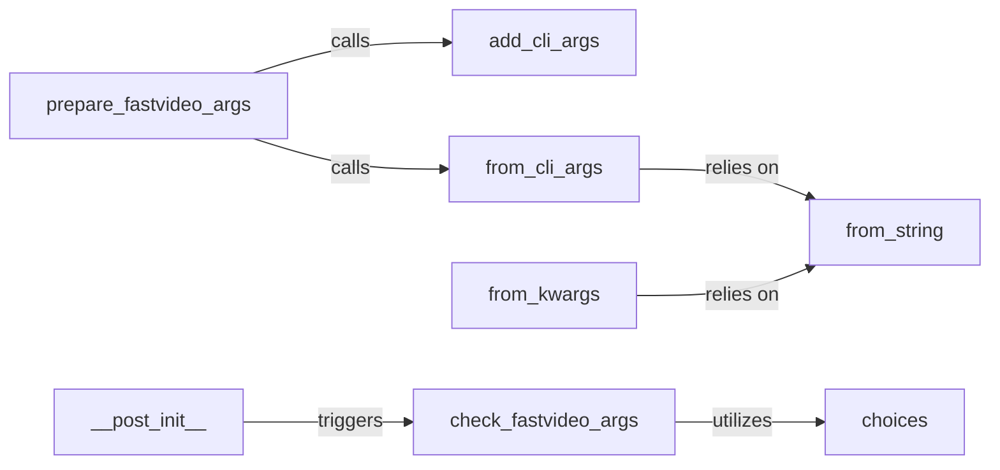

## Details

The `fastvideo.fastvideo_args` subsystem is responsible for the robust parsing, validation, and management of application arguments. Its core function is to transform raw command-line inputs or programmatic configurations into a structured and validated `FastVideoArgs` object, which serves as the central configuration for the FastVideo application. The process begins with `prepare_fastvideo_args` acting as the primary entry point, orchestrating the definition of expected arguments, their parsing, and subsequent validation. This ensures that the application operates with a consistent and correct set of parameters, crucial for both training and inference workflows.

### prepare_fastvideo_args
The orchestrator and primary entry point for processing all application arguments. It coordinates the definition, parsing, and initial validation of configuration parameters.

**Related Classes/Methods**:

- <a href="https://github.com/hao-ai-lab/FastVideo/blob/main/fastvideo/fastvideo_args.py#L1-L2" target="_blank" rel="noopener noreferrer">`fastvideo.fastvideo_args:prepare_fastvideo_args`:1-2</a>

### add_cli_args
Defines and registers the available command-line arguments, setting up the argument parser with expected parameters, types, and help messages. This method is responsible for adding a comprehensive set of arguments related to data paths, training configurations, model paths, diffusion settings, validation, logging, and output configurations.

**Related Classes/Methods**:

- <a href="https://github.com/hao-ai-lab/FastVideo/blob/main/fastvideo/fastvideo_args.py#L1-L2" target="_blank" rel="noopener noreferrer">`fastvideo.fastvideo_args:add_cli_args`:1-2</a>

### from_cli_args
Parses raw command-line inputs provided by the user and converts them into structured configuration objects, specifically the `TrainingArgs` (which `FastVideoArgs` inherits from or composes). It handles the conversion of string values to appropriate Python types and populates the configuration object.

**Related Classes/Methods**:

- <a href="https://github.com/hao-ai-lab/FastVideo/blob/main/fastvideo/fastvideo_args.py#L1-L2" target="_blank" rel="noopener noreferrer">`fastvideo.fastvideo_args:from_cli_args`:1-2</a>

### from_kwargs
Provides an alternative mechanism to parse configuration parameters supplied as keyword arguments, enabling programmatic configuration of the application. It handles type conversion for `mode` and `workload_type` enums and recursively calls `from_kwargs` for nested configuration objects like `PipelineConfig` and `PreprocessConfig`.

**Related Classes/Methods**:

- <a href="https://github.com/hao-ai-lab/FastVideo/blob/main/fastvideo/fastvideo_args.py#L1-L2" target="_blank" rel="noopener noreferrer">`fastvideo.fastvideo_args:from_kwargs`:1-2</a>

### check_fastvideo_args
Validates the integrity and consistency of the parsed arguments against predefined rules and constraints, ensuring that the configuration is valid and robust. This includes validating `mode`, `workload_type`, and consistency checks related to GPU usage and pipeline configurations.

**Related Classes/Methods**:

- <a href="https://github.com/hao-ai-lab/FastVideo/blob/main/fastvideo/fastvideo_args.py#L1-L2" target="_blank" rel="noopener noreferrer">`fastvideo.fastvideo_args:check_fastvideo_args`:1-2</a>

### __post_init__
A post-initialization hook (likely within a dataclass or similar structure) that is intended to trigger argument validation upon the creation of a configuration object. While the provided source code shows an empty `__post_init__`, its conceptual role in a dataclass context is to perform post-creation setup or validation.

**Related Classes/Methods**:

- <a href="https://github.com/hao-ai-lab/FastVideo/blob/main/fastvideo/fastvideo_args.py#L1-L2" target="_blank" rel="noopener noreferrer">`fastvideo.fastvideo_args:__post_init__`:1-2</a>

### choices
A utility method (likely a class method of an Enum) that defines and stores valid options or enumerations for specific arguments, used during argument definition and validation.

**Related Classes/Methods**:

- <a href="https://github.com/hao-ai-lab/FastVideo/blob/main/fastvideo/fastvideo_args.py#L1-L2" target="_blank" rel="noopener noreferrer">`fastvideo.fastvideo_args:choices`:1-2</a>

### from_string
A utility component for generic type conversion, transforming string values (e.g., from CLI inputs) into appropriate Python data types, specifically for enum conversions like `ExecutionMode` and `WorkloadType`.

**Related Classes/Methods**:

- <a href="https://github.com/hao-ai-lab/FastVideo/blob/main/fastvideo/fastvideo_args.py#L1-L2" target="_blank" rel="noopener noreferrer">`fastvideo.fastvideo_args:from_string`:1-2</a>

### [FAQ](https://github.com/CodeBoarding/GeneratedOnBoardings/tree/main?tab=readme-ov-file#faq)