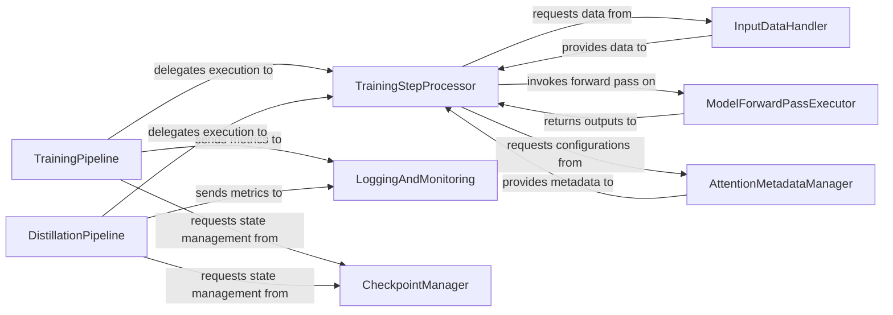

## Details

The `fastvideo.training` subsystem is responsible for the core training and distillation processes of the video generation models. It is primarily driven by two main orchestration components: `TrainingPipeline` and `DistillationPipeline`. Both pipelines delegate the execution of individual training steps to the `TrainingStepProcessor`. The `TrainingStepProcessor` in turn relies on the `InputDataHandler` to prepare data, the `ModelForwardPassExecutor` to perform model inference and loss calculation, and the `AttentionMetadataManager` for attention-related optimizations. Throughout the training process, `LoggingAndMonitoring` collects and visualizes metrics, while the `CheckpointManager` ensures the persistence and reproducibility of training states and model weights. This structured interaction allows for modularity and clear separation of concerns within the training subsystem.

### TrainingPipeline
Orchestrates the complete model training workflow. This includes initializing the training environment, managing training iterations, coordinating data loading, executing forward and backward passes, applying optimizations, and handling logging and checkpointing. It ensures the sequential flow and proper execution of all stages required for model learning.

**Related Classes/Methods**:

- <a href="https://github.com/hao-ai-lab/FastVideo/blob/main/fastvideo/training/training_pipeline.py#L412-L522" target="_blank" rel="noopener noreferrer">`fastvideo.training.training_pipeline.train`:412-522</a>

### DistillationPipeline
Manages the end-to-end knowledge distillation process. This involves coordinating the teacher and student models, computing distillation-specific losses, managing iterations, and handling specialized monitoring and evaluation relevant to the distillation process. It ensures efficient transfer of knowledge from a larger model to a smaller one.

**Related Classes/Methods**:

- <a href="https://github.com/hao-ai-lab/FastVideo/blob/main/fastvideo/training/distillation_pipeline.py#L882-L1065" target="_blank" rel="noopener noreferrer">`fastvideo.training.distillation_pipeline.train`:882-1065</a>

### TrainingStepProcessor
Executes a single forward and backward pass (or distillation equivalent) within an iteration. It acts as the central coordinator for the actual computation within each training or distillation step, handling the core logic for model updates.

**Related Classes/Methods**:

- <a href="https://github.com/hao-ai-lab/FastVideo/blob/main/fastvideo/training/training_pipeline.py#L359-L395" target="_blank" rel="noopener noreferrer">`fastvideo.training.training_pipeline.TrainingPipeline.train_one_step`:359-395</a>
- <a href="https://github.com/hao-ai-lab/FastVideo/blob/main/fastvideo/training/distillation_pipeline.py#L949-L950" target="_blank" rel="noopener noreferrer">`fastvideo.training.distillation_pipeline.DistillationPipeline.train_one_step`:949-950</a>

### InputDataHandler
Fetches and transforms raw data batches, preparing them for model consumption during training or distillation. It abstracts the data loading and preprocessing logic, ensuring data is in the correct format for the models.

**Related Classes/Methods**:

- <a href="https://github.com/hao-ai-lab/FastVideo/blob/main/fastvideo/training/training_pipeline.py" target="_blank" rel="noopener noreferrer">`fastvideo.training.training_pipeline.TrainingPipeline._get_next_batch`</a>

### ModelForwardPassExecutor
Executes the forward pass of specific models (teacher and student) and calculates the primary loss functions. It encapsulates the core model inference and loss computation logic within the training loop.

**Related Classes/Methods**:

- <a href="https://github.com/hao-ai-lab/FastVideo/blob/main/fastvideo/training/training_pipeline.py#L385-L386" target="_blank" rel="noopener noreferrer">`fastvideo.training.training_pipeline.TrainingPipeline._transformer_forward_and_compute_loss`:385-386</a>
- <a href="https://github.com/hao-ai-lab/FastVideo/blob/main/fastvideo/training/distillation_pipeline.py#L949-L950" target="_blank" rel="noopener noreferrer">`fastvideo.training.distillation_pipeline.DistillationPipeline.train_one_step`:949-950</a>

### LoggingAndMonitoring
Collects and outputs training/validation metrics and visualizations. It provides visibility into the training progress and performance, crucial for debugging and evaluation, and logs data to external services like Weights & Biases.

**Related Classes/Methods**:

- <a href="https://github.com/hao-ai-lab/FastVideo/blob/main/fastvideo/training/training_pipeline.py#L524-L555" target="_blank" rel="noopener noreferrer">`fastvideo.training.training_pipeline.TrainingPipeline._log_training_info`:524-555</a>
- <a href="https://github.com/hao-ai-lab/FastVideo/blob/main/fastvideo/training/training_pipeline.py#L587-L600" target="_blank" rel="noopener noreferrer">`fastvideo.training.training_pipeline.TrainingPipeline._log_validation`:587-600</a>
- <a href="https://github.com/hao-ai-lab/FastVideo/blob/main/fastvideo/training/distillation_pipeline.py" target="_blank" rel="noopener noreferrer">`fastvideo.training.distillation_pipeline.DistillationPipeline._log_training_info`</a>
- <a href="https://github.com/hao-ai-lab/FastVideo/blob/main/fastvideo/training/distillation_pipeline.py" target="_blank" rel="noopener noreferrer">`fastvideo.training.distillation_pipeline.DistillationPipeline._log_validation`</a>
- <a href="https://github.com/hao-ai-lab/FastVideo/blob/main/fastvideo/training/distillation_pipeline.py#L809-L877" target="_blank" rel="noopener noreferrer">`fastvideo.training.distillation_pipeline.DistillationPipeline.visualize_intermediate_latents`:809-877</a>

### CheckpointManager
Manages saving and loading model weights and training states. It ensures persistence and reproducibility of training runs, enabling recovery or continuation from a previous state.

**Related Classes/Methods**:

- <a href="https://github.com/hao-ai-lab/FastVideo/blob/main/fastvideo/training/training_pipeline.py#L397-L410" target="_blank" rel="noopener noreferrer">`fastvideo.training.training_pipeline.TrainingPipeline._resume_from_checkpoint`:397-410</a>
- <a href="https://github.com/hao-ai-lab/FastVideo/blob/main/fastvideo/training/training_pipeline.py#L499-L502" target="_blank" rel="noopener noreferrer">`fastvideo.training.training_pipeline.save_checkpoint`:499-502</a>
- <a href="https://github.com/hao-ai-lab/FastVideo/blob/main/fastvideo/training/distillation_pipeline.py#L907-L909" target="_blank" rel="noopener noreferrer">`fastvideo.training.distillation_pipeline.DistillationPipeline._resume_from_checkpoint`:907-909</a>
- <a href="https://github.com/hao-ai-lab/FastVideo/blob/main/fastvideo/training/distillation_pipeline.py#L1020-L1025" target="_blank" rel="noopener noreferrer">`fastvideo.training.distillation_pipeline.save_distillation_checkpoint`:1020-1025</a>

### AttentionMetadataManager
Constructs and provides metadata specifically for optimizing attention mechanisms within the models. This component is key to integrating performance optimizations related to the project's focus on video generation by preparing attention-related configurations.

**Related Classes/Methods**:

- <a href="https://github.com/hao-ai-lab/FastVideo/blob/main/fastvideo/training/training_pipeline.py" target="_blank" rel="noopener noreferrer">`fastvideo.training.training_pipeline.TrainingPipeline._build_attention_metadata`</a>

### [FAQ](https://github.com/CodeBoarding/GeneratedOnBoardings/tree/main?tab=readme-ov-file#faq)