```mermaid
graph LR
    System_Configuration["System Configuration"]
    Data_Pipeline["Data Pipeline"]
    Core_ML_Components_Models_Optimizations_["Core ML Components (Models & Optimizations)"]
    Model_Management["Model Management"]
    Distributed_Execution["Distributed Execution"]
    Training_Orchestration["Training Orchestration"]
    Inference_Orchestration["Inference Orchestration"]
    External_Service_Interface["External Service Interface"]
    System_Configuration -- "Provides dataset paths and preprocessing parameters" --> Data_Pipeline
    System_Configuration -- "Specifies model architectures and checkpoint paths" --> Model_Management
    Data_Pipeline -- "Supplies preprocessed data batches for training" --> Training_Orchestration
    Data_Pipeline -- "Provides input data" --> Inference_Orchestration
    Model_Management -- "Loads model weights, VAE weights, and attention configurations" --> Core_ML_Components_Models_Optimizations_
    Training_Orchestration -- "Utilizes models for forward/backward passes and latent operations" --> Core_ML_Components_Models_Optimizations_
    Core_ML_Components_Models_Optimizations_ -- "Performs passes and latent operations" --> Training_Orchestration
    Inference_Orchestration -- "Utilizes models for core generation logic, latent encoding/decoding, and denoising steps" --> Core_ML_Components_Models_Optimizations_
    Core_ML_Components_Models_Optimizations_ -- "Executes generation logic and handles latent transformations" --> Inference_Orchestration
    Distributed_Execution -- "Facilitates parallel training and data synchronization" --> Training_Orchestration
    Training_Orchestration -- "Leverages for scaling and distributed execution" --> Distributed_Execution
    Distributed_Execution -- "Enables distributed inference execution" --> Inference_Orchestration
    Inference_Orchestration -- "Leverages for scaling and distributed execution" --> Distributed_Execution
    External_Service_Interface -- "Triggers video generation requests" --> Inference_Orchestration
    Inference_Orchestration -- "Returns generated video data" --> External_Service_Interface
    click System_Configuration href "https://github.com/CodeBoarding/GeneratedOnBoardings/blob/main/FastVideo/System_Configuration.md" "Details"
    click Data_Pipeline href "https://github.com/CodeBoarding/GeneratedOnBoardings/blob/main/FastVideo/Data_Pipeline.md" "Details"
    click Core_ML_Components_Models_Optimizations_ href "https://github.com/CodeBoarding/GeneratedOnBoardings/blob/main/FastVideo/Core_ML_Components_Models_Optimizations_.md" "Details"
    click Model_Management href "https://github.com/CodeBoarding/GeneratedOnBoardings/blob/main/FastVideo/Model_Management.md" "Details"
    click Distributed_Execution href "https://github.com/CodeBoarding/GeneratedOnBoardings/blob/main/FastVideo/Distributed_Execution.md" "Details"
    click Training_Orchestration href "https://github.com/CodeBoarding/GeneratedOnBoardings/blob/main/FastVideo/Training_Orchestration.md" "Details"
    click Inference_Orchestration href "https://github.com/CodeBoarding/GeneratedOnBoardings/blob/main/FastVideo/Inference_Orchestration.md" "Details"
    click External_Service_Interface href "https://github.com/CodeBoarding/GeneratedOnBoardings/blob/main/FastVideo/External_Service_Interface.md" "Details"
```

## Details

The `FastVideo` architecture is designed as a high-performance, modular ML toolkit for video generation, structured around a clear pipeline flow. It starts with **System Configuration** to define operational parameters, which then guides the **Data Pipeline** in preparing input for either **Training Orchestration** or **Inference Orchestration**. Central to both workflows are the **Core ML Components (Models & Optimizations)**, which include specialized attention kernels for accelerated processing. **Model Management** handles the loading and fine-tuning of these core models. For scalability, both training and inference leverage a **Distributed Execution** system. The generated videos are finally exposed via an **External Service Interface**. This architecture emphasizes distinct functional boundaries, optimized data flow, and extensibility, making it suitable for complex deep learning tasks on GPU hardware.

### System Configuration [[Expand]](./System_Configuration.md)
Manages application-wide settings, command-line arguments, and model configurations, acting as the initial entry point for defining operational parameters.

**Related Classes/Methods**:

- <a href="https://github.com/hao-ai-lab/FastVideo/blob/main/fastvideo/fastvideo_args.py#L524-L541" target="_blank" rel="noopener noreferrer">`fastvideo.fastvideo_args.prepare_fastvideo_args`:524-541</a>

### Data Pipeline [[Expand]](./Data_Pipeline.md)
Handles the ingestion, transformation, and batching of video and text data, preparing raw data into a format suitable for model consumption in both training and inference.

**Related Classes/Methods**:

- <a href="https://github.com/hao-ai-lab/FastVideo/blob/main/fastvideo/dataset/parquet_dataset_iterable_style.py#L113-L132" target="_blank" rel="noopener noreferrer">`fastvideo.dataset.parquet_dataset_iterable_style.__iter__`:113-132</a>
- <a href="https://github.com/hao-ai-lab/FastVideo/blob/main/fastvideo/pipelines/preprocess/preprocess_pipeline_base.py#L266-L446" target="_blank" rel="noopener noreferrer">`fastvideo.pipelines.preprocess.preprocess_pipeline_base.preprocess_video_and_text`:266-446</a>

### Core ML Components (Models & Optimizations) [[Expand]](./Core_ML_Components_Models_Optimizations_.md)
Encapsulates the primary deep learning models (Diffusion Transformers, Encoders, VAE) central to video generation, along with specialized attention mechanisms (STA, VSA) critical for performance and memory optimization.

**Related Classes/Methods**:

- <a href="https://github.com/hao-ai-lab/FastVideo/blob/main/fastvideo/models/dits/base.py#L92-L114" target="_blank" rel="noopener noreferrer">`fastvideo.models.dits.base.__init__`:92-114</a>
- <a href="https://github.com/hao-ai-lab/FastVideo/blob/main/fastvideo/models/vaes/common.py#L65-L77" target="_blank" rel="noopener noreferrer">`fastvideo.models.vaes.common.encode`:65-77</a>
- <a href="https://github.com/hao-ai-lab/FastVideo/blob/main/fastvideo/models/vaes/common.py#L79-L97" target="_blank" rel="noopener noreferrer">`fastvideo.models.vaes.common.decode`:79-97</a>
- <a href="https://github.com/hao-ai-lab/FastVideo/blob/main/fastvideo/attention/backends/video_sparse_attn.py#L160-L197" target="_blank" rel="noopener noreferrer">`fastvideo.attention.backends.video_sparse_attn.build`:160-197</a>
- <a href="https://github.com/hao-ai-lab/FastVideo/blob/main/fastvideo/attention/backends/sliding_tile_attn.py#L77-L88" target="_blank" rel="noopener noreferrer">`fastvideo.attention.backends.sliding_tile_attn.build`:77-88</a>
- <a href="https://github.com/hao-ai-lab/FastVideo/blob/main/fastvideo/models/schedulers/scheduling_flow_match_euler_discrete.py#L440-L534" target="_blank" rel="noopener noreferrer">`fastvideo.models.schedulers.scheduling_flow_match_euler_discrete.step`:440-534</a>

### Model Management [[Expand]](./Model_Management.md)
Manages the dynamic loading of pre-trained model weights, maintains a registry of available model architectures, and handles fine-tuning techniques like LoRA.

**Related Classes/Methods**:

- <a href="https://github.com/hao-ai-lab/FastVideo/blob/main/fastvideo/models/loader/component_loader.py#L245-L304" target="_blank" rel="noopener noreferrer">`fastvideo.models.loader.component_loader.load_model`:245-304</a>

### Distributed Execution [[Expand]](./Distributed_Execution.md)
Provides utilities and state management for distributed training and inference across multiple GPUs or compute nodes, coordinating individual GPU worker processes and inter-device communication.

**Related Classes/Methods**:

- <a href="https://github.com/hao-ai-lab/FastVideo/blob/main/fastvideo/distributed/parallel_state.py#L844-L916" target="_blank" rel="noopener noreferrer">`fastvideo.distributed.parallel_state.initialize_model_parallel`:844-916</a>
- <a href="https://github.com/hao-ai-lab/FastVideo/blob/main/fastvideo/worker/gpu_worker.py#L120-L180" target="_blank" rel="noopener noreferrer">`fastvideo.worker.gpu_worker.event_loop`:120-180</a>

### Training Orchestration [[Expand]](./Training_Orchestration.md)
Orchestrates the complete training and knowledge distillation workflows, managing data iteration, forward/backward passes, and optimization steps for efficient model learning.

**Related Classes/Methods**:

- <a href="https://github.com/hao-ai-lab/FastVideo/blob/main/fastvideo/training/training_pipeline.py#L412-L522" target="_blank" rel="noopener noreferrer">`fastvideo.training.training_pipeline.train`:412-522</a>
- <a href="https://github.com/hao-ai-lab/FastVideo/blob/main/fastvideo/training/distillation_pipeline.py#L882-L1065" target="_blank" rel="noopener noreferrer">`fastvideo.training.distillation_pipeline.train`:882-1065</a>

### Inference Orchestration [[Expand]](./Inference_Orchestration.md)
Defines and executes the sequential stages required to generate a video from input prompts and parameters, including the core denoising process and transforming latent representations into visual outputs.

**Related Classes/Methods**:

- <a href="https://github.com/hao-ai-lab/FastVideo/blob/main/fastvideo/pipelines/composed_pipeline_base.py#L332-L358" target="_blank" rel="noopener noreferrer">`fastvideo.pipelines.composed_pipeline_base.forward`:332-358</a>
- <a href="https://github.com/hao-ai-lab/FastVideo/blob/main/fastvideo/entrypoints/video_generator.py#L100-L185" target="_blank" rel="noopener noreferrer">`fastvideo.entrypoints.video_generator.generate_video`:100-185</a>

### External Service Interface [[Expand]](./External_Service_Interface.md)
Provides user-facing interfaces (e.g., Gradio, Ray Serve) for interacting with the video generation capabilities, exposing core functionality to external applications or users.

**Related Classes/Methods**:

- <a href="https://github.com/hao-ai-lab/FastVideo/blob/main/examples/inference/gradio/ray_serve_backend.py#L252-L281" target="_blank" rel="noopener noreferrer">`examples.inference.gradio.ray_serve_backend.generate_video`:252-281</a>

### [FAQ](https://github.com/CodeBoarding/GeneratedOnBoardings/tree/main?tab=readme-ov-file#faq)