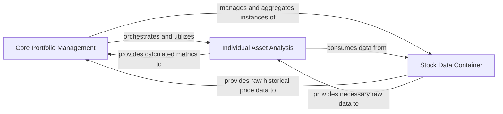

## Details

The `finquant` system is structured around three primary components: `Core Portfolio Management`, `Individual Asset Analysis`, and `Stock Data Container`. The `Core Portfolio Management` component serves as the central hub, responsible for overall portfolio construction, management, and high-level analysis. It orchestrates and utilizes the `Individual Asset Analysis` component to derive specific metrics for individual assets, which are then provided back to the `Core Portfolio Management` for aggregation and comprehensive portfolio insights. Both analytical components critically depend on the `Stock Data Container`, which encapsulates and provides the fundamental raw historical price data necessary for all financial computations. This clear separation of concerns ensures efficient data flow from raw stock data to individual asset analysis, culminating in holistic portfolio management.

### Core Portfolio Management [[Expand]](./Core_Portfolio_Management.md)
This component, embodied by the `finquant.portfolio.Portfolio` class, acts as the central data model and orchestrator for the entire investment portfolio. It is responsible for aggregating and managing financial data, serving as the primary interface for all analytical and optimization operations. It initiates portfolio-level calculations (e.g., expected return, volatility, Sharpe ratio) and handles data ingestion from various sources (e.g., Quandl, yfinance) to construct the portfolio. It also orchestrates calls to underlying asset-specific calculations and optimization routines.

**Related Classes/Methods**:

- <a href="https://github.com/fmilthaler/FinQuant/blob/master/finquant/portfolio.py" target="_blank" rel="noopener noreferrer">`finquant.portfolio.Portfolio`</a>
- <a href="https://github.com/fmilthaler/FinQuant/blob/master/finquant/portfolio.py" target="_blank" rel="noopener noreferrer">`finquant.portfolio.Portfolio:_get_ef`</a>
- <a href="https://github.com/fmilthaler/FinQuant/blob/master/finquant/portfolio.py" target="_blank" rel="noopener noreferrer">`finquant.portfolio.Portfolio:_get_mc`</a>
- <a href="https://github.com/fmilthaler/FinQuant/blob/master/finquant/portfolio.py" target="_blank" rel="noopener noreferrer">`finquant.portfolio.Portfolio:comp_sharpe`</a>
- <a href="https://github.com/fmilthaler/FinQuant/blob/master/finquant/portfolio.py" target="_blank" rel="noopener noreferrer">`finquant.portfolio.Portfolio:_build_portfolio_from_api`</a>
- <a href="https://github.com/fmilthaler/FinQuant/blob/master/finquant/portfolio.py" target="_blank" rel="noopener noreferrer">`finquant.portfolio.Portfolio:_yfinance_request`</a>
- <a href="https://github.com/fmilthaler/FinQuant/blob/master/finquant/portfolio.py" target="_blank" rel="noopener noreferrer">`finquant.portfolio.Portfolio:_quandl_request`</a>

### Individual Asset Analysis
Represented by the `finquant.asset.Asset` class, this component focuses on calculations pertaining to individual financial assets within the portfolio. Its core responsibility is to compute specific metrics for single assets, such as expected return, volatility, skewness, and kurtosis. These individual asset insights are then provided to the `Core Portfolio Management` component for aggregation and portfolio-level analysis.

**Related Classes/Methods**:

- <a href="https://github.com/fmilthaler/FinQuant/blob/master/finquant/asset.py#L24-L132" target="_blank" rel="noopener noreferrer">`finquant.asset.Asset`:24-132</a>
- <a href="https://github.com/fmilthaler/FinQuant/blob/master/finquant/asset.py" target="_blank" rel="noopener noreferrer">`finquant.asset.Asset:comp_expected_return`</a>
- <a href="https://github.com/fmilthaler/FinQuant/blob/master/finquant/asset.py" target="_blank" rel="noopener noreferrer">`finquant.asset.Asset:comp_volatility`</a>
- <a href="https://github.com/fmilthaler/FinQuant/blob/master/finquant/asset.py" target="_blank" rel="noopener noreferrer">`finquant.asset.Asset:_comp_skew`</a>
- <a href="https://github.com/fmilthaler/FinQuant/blob/master/finquant/asset.py" target="_blank" rel="noopener noreferrer">`finquant.asset.Asset:_comp_kurtosis`</a>

### Stock Data Container
This component, primarily the `finquant.stock.Stock` class, serves as a fundamental data structure for holding and managing information related to individual stocks. Its responsibility is to encapsulate historical price data and other relevant attributes for a single stock. It acts as the basic data unit that is consumed by both the `Core Portfolio Management` component for portfolio construction and the `Individual Asset Analysis` component for asset-specific calculations.

**Related Classes/Methods**:

- <a href="https://github.com/fmilthaler/FinQuant/blob/master/finquant/stock.py#L37-L129" target="_blank" rel="noopener noreferrer">`finquant.stock.Stock`:37-129</a>

### [FAQ](https://github.com/CodeBoarding/GeneratedOnBoardings/tree/main?tab=readme-ov-file#faq)