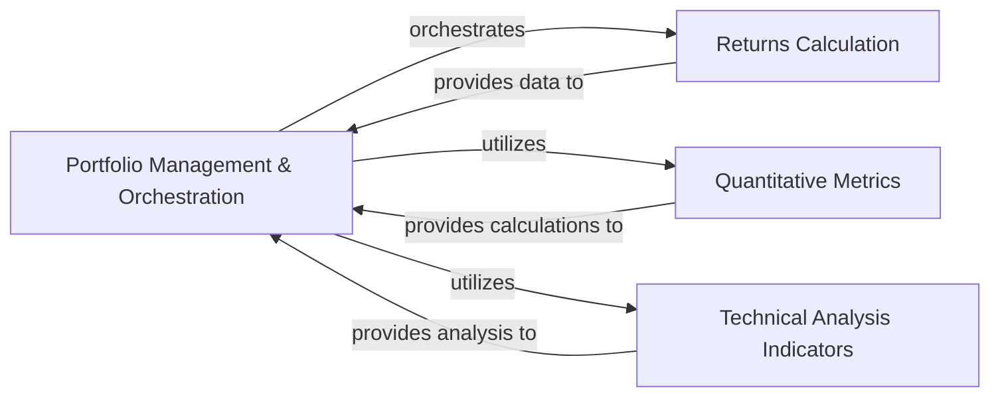

## Details

The `Financial Analysis & Metrics` subsystem is a core part of the `FinQuant` project, responsible for computing various financial metrics for assets and the overall portfolio. It adheres to the project's architectural bias towards a centralized `Portfolio` object, which acts as the primary interface and orchestrator for analytical operations.

### Portfolio Management & Orchestration
This is the central hub of the subsystem. It manages the portfolio's underlying asset data, orchestrates the computation of various financial metrics (expected return, volatility, covariance, weights), and triggers more specialized analyses from other modules. It also includes internal mechanisms for ensuring data consistency and re-calculation (`_update`) and for initiating complex workflows like efficient frontier (`_get_ef`) and Monte Carlo simulations (`_get_mc`).

**Related Classes/Methods**:

- <a href="https://github.com/fmilthaler/FinQuant/blob/master/finquant/portfolio.py" target="_blank" rel="noopener noreferrer">`finquant.portfolio`</a>

### Returns Calculation
Focuses on the fundamental computation of asset and portfolio returns. Its primary responsibility is to derive daily returns from raw price data, which serves as a foundational input for almost all subsequent financial analyses within the subsystem.

**Related Classes/Methods**:

- <a href="https://github.com/fmilthaler/FinQuant/blob/master/finquant/returns.py" target="_blank" rel="noopener noreferrer">`finquant.returns`</a>

### Quantitative Metrics
Provides a collection of general quantitative measures and annualised portfolio quantities. This includes calculations for metrics like the Sharpe Ratio, which are essential for evaluating portfolio performance and risk-adjusted returns.

**Related Classes/Methods**:

- <a href="https://github.com/fmilthaler/FinQuant/blob/master/finquant/quants.py" target="_blank" rel="noopener noreferrer">`finquant.quants`</a>

### Technical Analysis Indicators
Specializes in computing and visualizing technical indicators. Its core functionality includes calculating various types of moving averages and Bollinger Bands, providing tools for technical market analysis.

**Related Classes/Methods**:

- <a href="https://github.com/fmilthaler/FinQuant/blob/master/finquant/moving_average.py" target="_blank" rel="noopener noreferrer">`finquant.moving_average`</a>

### [FAQ](https://github.com/CodeBoarding/GeneratedOnBoardings/tree/main?tab=readme-ov-file#faq)