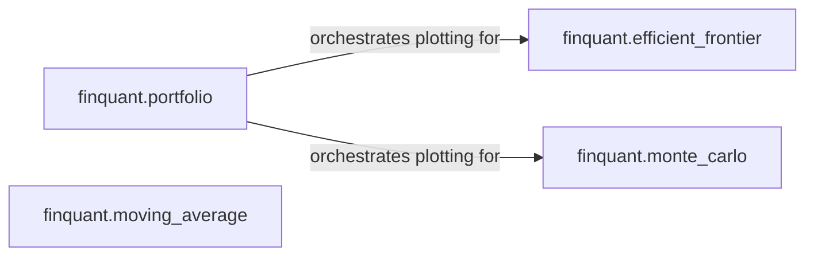

## Details

The Visualization & Reporting subsystem in FinQuant is responsible for presenting financial data, analytical results, and optimization outcomes graphically. It integrates various modules to provide a comprehensive visual understanding of portfolio performance and market trends.

### finquant.portfolio
This component acts as the primary orchestration point for various plotting functionalities. It serves as the user-facing interface for initiating visualizations, delegating complex plotting tasks to specialized modules while potentially handling simpler, direct plots (e.g., individual stock performance). Its importance lies in centralizing access to visualization features, adhering to the architectural bias of the Portfolio object as a hub.

**Related Classes/Methods**:

- <a href="https://github.com/fmilthaler/FinQuant/blob/master/finquant/portfolio.py" target="_blank" rel="noopener noreferrer">`finquant.portfolio`</a>

### finquant.efficient_frontier
This component encapsulates the logic for generating and visualizing the efficient frontier, including the identification and plotting of optimal portfolios (minimum volatility and maximum Sharpe ratio). It performs the necessary calculations and renders these specific plots. Its fundamental importance is in providing a visual representation of portfolio optimization results, a key output of quantitative finance.

**Related Classes/Methods**:

- <a href="https://github.com/fmilthaler/FinQuant/blob/master/finquant/efficient_frontier.py" target="_blank" rel="noopener noreferrer">`finquant.efficient_frontier`</a>

### finquant.monte_carlo
This component provides the functionality to visualize the outcomes of Monte Carlo simulations, typically showing the distribution of simulated portfolio returns. It handles the rendering of simulation results. Its importance stems from its role in presenting the probabilistic outcomes of financial models, crucial for risk assessment and future projections.

**Related Classes/Methods**:

- <a href="https://github.com/fmilthaler/FinQuant/blob/master/finquant/monte_carlo.py" target="_blank" rel="noopener noreferrer">`finquant.monte_carlo`</a>

### finquant.moving_average
This component directly computes and plots technical indicators, specifically Bollinger Bands, for financial time series data. It combines computation and visualization for specific technical analysis. Its importance lies in providing direct visual insights into market trends and volatility, a common requirement in financial analysis.

**Related Classes/Methods**:

- <a href="https://github.com/fmilthaler/FinQuant/blob/master/finquant/moving_average.py" target="_blank" rel="noopener noreferrer">`finquant.moving_average`</a>

### [FAQ](https://github.com/CodeBoarding/GeneratedOnBoardings/tree/main?tab=readme-ov-file#faq)