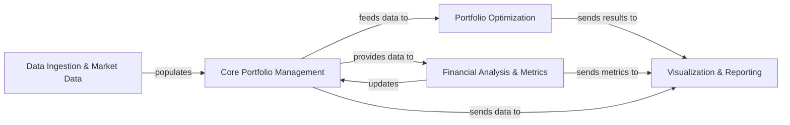

## Details

The FinQuant architecture is designed as a modular data processing pipeline centered around a robust Portfolio object. Data flows from external sources, through Data Ingestion & Market Data, into the Core Portfolio Management component, which encapsulates the investment portfolio. From this central hub, data is dispatched to specialized modules: Financial Analysis & Metrics for calculating key performance indicators and technical insights, and Portfolio Optimization for advanced risk-return analysis and simulation. The results from these analytical and optimization processes are then consumed by the Visualization & Reporting component, which generates comprehensive plots and visual summaries. This clear separation of concerns, with the Portfolio object acting as the primary data conduit, facilitates a logical and extensible design, ideal for representing as a flow graph where components clearly interact with and transform financial data.

### Data Ingestion & Market Data
Acquires and prepares raw financial data from external sources (e.g., Quandl, Yahoo Finance) or local dataframes.

**Related Classes/Methods**:

- <a href="https://github.com/fmilthaler/FinQuant/blob/master/finquant/portfolio.py" target="_blank" rel="noopener noreferrer">`finquant.portfolio`</a>
- <a href="https://github.com/fmilthaler/FinQuant/blob/master/finquant/market.py" target="_blank" rel="noopener noreferrer">`finquant.market`</a>

### Core Portfolio Management [[Expand]](./Core_Portfolio_Management.md)
The central component managing the investment portfolio, holding aggregated financial data, and serving as the primary interface for all analytical and optimization operations.

**Related Classes/Methods**:

- <a href="https://github.com/fmilthaler/FinQuant/blob/master/finquant/portfolio.py" target="_blank" rel="noopener noreferrer">`finquant.portfolio`</a>
- <a href="https://github.com/fmilthaler/FinQuant/blob/master/finquant/asset.py" target="_blank" rel="noopener noreferrer">`finquant.asset`</a>
- <a href="https://github.com/fmilthaler/FinQuant/blob/master/finquant/stock.py" target="_blank" rel="noopener noreferrer">`finquant.stock`</a>

### Financial Analysis & Metrics [[Expand]](./Financial_Analysis_Metrics.md)
Computes various financial metrics for assets and the overall portfolio, including returns, risk measures, and technical indicators.

**Related Classes/Methods**:

- <a href="https://github.com/fmilthaler/FinQuant/blob/master/finquant/returns.py" target="_blank" rel="noopener noreferrer">`finquant.returns`</a>
- <a href="https://github.com/fmilthaler/FinQuant/blob/master/finquant/quants.py" target="_blank" rel="noopener noreferrer">`finquant.quants`</a>
- <a href="https://github.com/fmilthaler/FinQuant/blob/master/finquant/moving_average.py" target="_blank" rel="noopener noreferrer">`finquant.moving_average`</a>
- <a href="https://github.com/fmilthaler/FinQuant/blob/master/finquant/portfolio.py" target="_blank" rel="noopener noreferrer">`finquant.portfolio`</a>

### Portfolio Optimization [[Expand]](./Portfolio_Optimization.md)
Implements algorithms for portfolio optimization (e.g., Efficient Frontier) and Monte Carlo simulations to identify optimal risk-return trade-offs and simulate performance.

**Related Classes/Methods**:

- <a href="https://github.com/fmilthaler/FinQuant/blob/master/finquant/efficient_frontier.py" target="_blank" rel="noopener noreferrer">`finquant.efficient_frontier`</a>
- <a href="https://github.com/fmilthaler/FinQuant/blob/master/finquant/monte_carlo.py" target="_blank" rel="noopener noreferrer">`finquant.monte_carlo`</a>
- <a href="https://github.com/fmilthaler/FinQuant/blob/master/finquant/minimise_fun.py" target="_blank" rel="noopener noreferrer">`finquant.minimise_fun`</a>

### Visualization & Reporting [[Expand]](./Visualization_Reporting.md)
Handles the graphical representation of financial data, analytical results, and optimization outcomes.

**Related Classes/Methods**:

- <a href="https://github.com/fmilthaler/FinQuant/blob/master/finquant/portfolio.py" target="_blank" rel="noopener noreferrer">`finquant.portfolio`</a>
- <a href="https://github.com/fmilthaler/FinQuant/blob/master/finquant/efficient_frontier.py" target="_blank" rel="noopener noreferrer">`finquant.efficient_frontier`</a>
- <a href="https://github.com/fmilthaler/FinQuant/blob/master/finquant/monte_carlo.py" target="_blank" rel="noopener noreferrer">`finquant.monte_carlo`</a>
- <a href="https://github.com/fmilthaler/FinQuant/blob/master/finquant/moving_average.py" target="_blank" rel="noopener noreferrer">`finquant.moving_average`</a>

### [FAQ](https://github.com/CodeBoarding/GeneratedOnBoardings/tree/main?tab=readme-ov-file#faq)