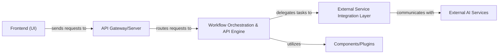

## Details

One paragraph explaining the functionality which is represented by this graph. What the main flow is and what is its purpose.

### Workflow Orchestration & API Engine
This unified component serves as the central backend service, exposing the primary RESTful API for the Frontend (UI) and other consumers. It is responsible for interpreting visual workflow definitions, managing the execution flow of AI agents, handling state transitions within workflows, scheduling tasks, and orchestrating the overall AI workflow. It acts as the core intelligence, ensuring AI tasks are executed in the correct sequence and managing their lifecycle, while also providing the API interface for external interactions.

**Related Classes/Methods**: _None_

### API Gateway/Server
Acts as the entry point for all external requests. Handles incoming RESTful API calls from the Frontend (UI), manages request routing, authentication, and basic validation. It translates external requests into internal commands for the workflow engine.

**Related Classes/Methods**: _None_

### External Service Integration Layer
Provides a unified and standardized interface for connecting to various external AI models, tools, and services (e.g., LLMs, image generation APIs, data processing services). It abstracts away the complexities of different external APIs, allowing the Workflow Orchestration & API Engine to interact with them consistently.

**Related Classes/Methods**: _None_

### Frontend (UI)
User Interface for building and managing workflows, triggering executions, and displaying results, consuming RESTful APIs from the API Gateway/Server.

**Related Classes/Methods**: _None_

### Components/Plugins
Specific components/plugins (e.g., custom AI models, tools) leveraged by the Workflow Orchestration & API Engine to perform specialized tasks within a workflow.

**Related Classes/Methods**: _None_

### External AI Services
Various third-party AI services (e.g., OpenAI, Hugging Face, custom ML models) that the External Service Integration Layer communicates with to execute AI-specific operations.

**Related Classes/Methods**: _None_

### [FAQ](https://github.com/CodeBoarding/GeneratedOnBoardings/tree/main?tab=readme-ov-file#faq)