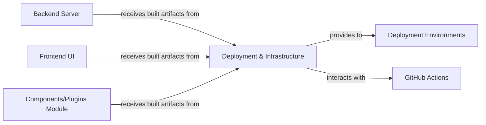

## Details

One paragraph explaining the functionality which is represented by this graph. What the main flow is and what is its purpose.

### Backend Server
This component encapsulates the core application logic, business rules, and data processing. It typically exposes APIs for the Frontend UI and other modules to interact with, and it is responsible for managing persistent data storage.

**Related Classes/Methods**: _None_

### Frontend UI
This component represents the user-facing part of the application. It provides the graphical interface through which users interact with the system, consuming data and services exposed by the Backend Server.

**Related Classes/Methods**: _None_

### Components/Plugins Module
This component is designed for extensibility, providing reusable components or plugins that can be integrated into the main application (e.g., Backend Server or Frontend UI) or deployed as standalone units. It allows for modular development and easy addition of new functionalities.

**Related Classes/Methods**: _None_

### Deployment & Infrastructure [[Expand]](./Deployment_Infrastructure.md)
This component is central to the application's lifecycle, handling the packaging, deployment, and ongoing management across diverse environments. It leverages containerization technologies like Docker for creating portable application images and Docker Compose for defining and orchestrating multi-container applications, particularly for local development and self-hosting. Furthermore, it integrates with CI/CD pipelines (e.g., GitHub Actions) to automate the build, testing, and deployment processes of these containerized applications, ensuring consistency and efficiency.

**Related Classes/Methods**:

- `docker/Dockerfile` (1:1)
- `docker/docker-compose.yml` (1:1)
- `.github/workflows/docker-image.yml` (1:1)
- `.github/workflows/main.yml` (1:1)
- `.github/workflows/test_docker_build.yml` (1:1)

### Deployment Environments
This component represents the various target environments where the application is deployed and run. These environments can include development, staging, production, and local machines, each with specific configurations and resource allocations.

**Related Classes/Methods**: _None_

### GitHub Actions
This component refers to the continuous integration and continuous delivery (CI/CD) platform used to automate the software development workflows. It is responsible for building, testing, and deploying the application artifacts based on predefined workflows.

**Related Classes/Methods**: _None_

### [FAQ](https://github.com/CodeBoarding/GeneratedOnBoardings/tree/main?tab=readme-ov-file#faq)