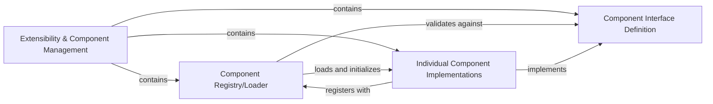

## Details

Abstract Components Overview of Flowise platform's extensibility and component management system.

### Extensibility & Component Management [[Expand]](./Extensibility_Component_Management.md)
This component serves as the core plug-in system for the Flowise platform, enabling dynamic extensibility. It facilitates the seamless integration and management of new AI models, custom tools, and various third-party services. Each component within this module adheres to a standardized interface, ensuring interoperability and ease of integration without requiring modifications to the core server or UI logic.

**Related Classes/Methods**:

- `packages.server` (1:1)
- `packages.components` (1:1)

### Component Registry/Loader
This sub-component is responsible for dynamically discovering, loading, and managing the lifecycle of all pluggable components within the Flowise platform. It acts as the central orchestrator for component registration, instantiation, and making them available to the core system.

**Related Classes/Methods**:

- `packages.server` (1:1)

### Component Interface Definition
This sub-component defines the standardized contract or API that all pluggable components must adhere to. It ensures a uniform interaction model, allowing the Component Registry/Loader and other parts of the system to interact with diverse components consistently.

**Related Classes/Methods**:

- `packages.components` (1:1)

### Individual Component Implementations
This represents the collection of actual pluggable units of functionality, such as specific LLM nodes, data loaders, custom tools, or integrations with third-party services. Each implementation adheres to the Component Interface Definition and encapsulates a distinct piece of AI/ML or integration logic.

**Related Classes/Methods**:

- `packages.components.credentials` (1:1)
- `packages.components.llms` (1:1)
- `packages.components.tools` (1:1)
- `packages.components.chains` (1:1)
- `packages.components.chatmodels` (1:1)
- `packages.components.embeddings` (1:1)
- `packages.components.memory` (1:1)
- `packages.components.vectorstores` (1:1)
- `packages.components.documentloaders` (1:1)
- `packages.components.textsplitters` (1:1)
- `packages.components.outputparsers` (1:1)
- `packages.components.prompts` (1:1)
- `packages.components.agents` (1:1)
- `packages.components.retrievers` (1:1)
- `packages.components.toolkits` (1:1)
- `packages.components.utilities` (1:1)
- `packages.components.custom` (1:1)

### [FAQ](https://github.com/CodeBoarding/GeneratedOnBoardings/tree/main?tab=readme-ov-file#faq)