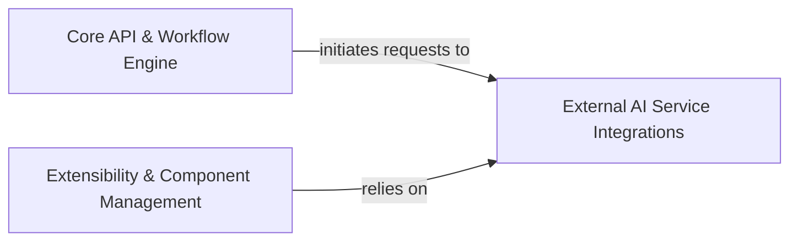

## Details

This analysis identifies and describes key architectural components of a platform, including their responsibilities and interdependencies, focusing on AI service integration, workflow orchestration, and extensibility.

### External AI Service Integrations [[Expand]](./External_AI_Service_Integrations.md)
This component serves as the crucial abstraction layer for interacting with a diverse range of external AI models, tools, and services, including Large Language Models (LLMs), vector databases, and various cloud AI APIs. It standardizes the communication process by handling API calls, authentication, and data formatting, thereby insulating the core platform from the specific implementation details of each external service. Its architectural importance lies in enabling seamless integration of new AI capabilities and ensuring the platform's adaptability to evolving AI technologies without requiring significant changes to the core logic.

**Related Classes/Methods**: _None_

### Core API & Workflow Engine [[Expand]](./Core_API_Workflow_Engine.md)
This component forms the central nervous system of the platform, orchestrating the execution of AI workflows and exposing core functionalities through a well-defined API. It manages the lifecycle of AI tasks, from initiation and data processing to invoking external AI services and handling their responses. Its responsibilities include workflow definition and execution, state management, task scheduling, and providing the primary interface for client applications or other internal components to interact with the AI capabilities.

**Related Classes/Methods**: _None_

### Extensibility & Component Management [[Expand]](./Extensibility_Component_Management.md)
This component is responsible for enabling the platform's adaptability and growth by providing mechanisms for integrating new functionalities and managing existing components. It handles the dynamic loading, configuration, and lifecycle management of various modules, including connectors to external AI services, custom tools, and specialized processing units. Its key responsibilities include plugin management, dependency resolution, component registration, and ensuring that new capabilities can be seamlessly added without disrupting the core system.

**Related Classes/Methods**: _None_

### [FAQ](https://github.com/CodeBoarding/GeneratedOnBoardings/tree/main?tab=readme-ov-file#faq)