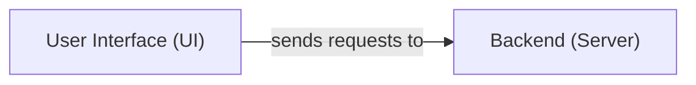

## Details

One paragraph explaining the functionality which is represented by this graph. What the main flow is and what is its purpose.

### User Interface (UI) [[Expand]](./User_Interface_UI_.md)
The interactive web application providing a visual drag-and-drop interface for users to design and manage AI workflows. It handles user input, displays real-time workflow status, and communicates with the Backend API.

**Related Classes/Methods**: _None_

### Backend (Server)
The central server-side application responsible for processing requests from the User Interface, orchestrating and executing AI workflows, managing data persistence, and interacting with external AI models or services. It exposes APIs consumed by the UI and handles the core logic for workflow management.

**Related Classes/Methods**: _None_

### [FAQ](https://github.com/CodeBoarding/GeneratedOnBoardings/tree/main?tab=readme-ov-file#faq)