```mermaid
graph LR
    User_Interface_UI_["User Interface (UI)"]
    Core_API_Workflow_Engine["Core API & Workflow Engine"]
    Extensibility_Component_Management["Extensibility & Component Management"]
    API_Documentation_System["API Documentation System"]
    Deployment_Infrastructure["Deployment & Infrastructure"]
    External_AI_Service_Integrations["External AI Service Integrations"]
    User_Interface_UI_ -- "sends requests to" --> Core_API_Workflow_Engine
    Core_API_Workflow_Engine -- "sends responses to" --> User_Interface_UI_
    Extensibility_Component_Management -- "provides logic to" --> Core_API_Workflow_Engine
    Core_API_Workflow_Engine -- "interacts with" --> External_AI_Service_Integrations
    Extensibility_Component_Management -- "interacts with" --> External_AI_Service_Integrations
    API_Documentation_System -- "describes" --> Core_API_Workflow_Engine
    Deployment_Infrastructure -- "packages" --> User_Interface_UI_
    Deployment_Infrastructure -- "packages" --> Core_API_Workflow_Engine
    Deployment_Infrastructure -- "packages" --> Extensibility_Component_Management
    External_AI_Service_Integrations -- "provides services to" --> Core_API_Workflow_Engine
    External_AI_Service_Integrations -- "provides services to" --> Extensibility_Component_Management
    click User_Interface_UI_ href "https://github.com/CodeBoarding/GeneratedOnBoardings/blob/main/Flowise/User_Interface_UI_.md" "Details"
    click Core_API_Workflow_Engine href "https://github.com/CodeBoarding/GeneratedOnBoardings/blob/main/Flowise/Core_API_Workflow_Engine.md" "Details"
    click Extensibility_Component_Management href "https://github.com/CodeBoarding/GeneratedOnBoardings/blob/main/Flowise/Extensibility_Component_Management.md" "Details"
    click API_Documentation_System href "https://github.com/CodeBoarding/GeneratedOnBoardings/blob/main/Flowise/API_Documentation_System.md" "Details"
    click Deployment_Infrastructure href "https://github.com/CodeBoarding/GeneratedOnBoardings/blob/main/Flowise/Deployment_Infrastructure.md" "Details"
    click External_AI_Service_Integrations href "https://github.com/CodeBoarding/GeneratedOnBoardings/blob/main/Flowise/External_AI_Service_Integrations.md" "Details"
```

## Details

One paragraph explaining the functionality which is represented by this graph. What the main flow is and what is its purpose.

### User Interface (UI) [[Expand]](./User_Interface_UI_.md)
The interactive web application providing a visual drag-and-drop interface for users to design and manage AI workflows. It handles user input, displays real-time workflow status, and communicates with the Backend API.

**Related Classes/Methods**:

- `packages/client` (1:1)

### Core API & Workflow Engine [[Expand]](./Core_API_Workflow_Engine.md)
The central backend service responsible for orchestrating AI workflows, managing the execution of AI agents, integrating with external AI services, and exposing a RESTful API for the User Interface and other potential consumers.

**Related Classes/Methods**:

- `packages/server` (1:1)

### Extensibility & Component Management [[Expand]](./Extensibility_Component_Management.md)
A plug-in system that allows for the dynamic addition and management of new AI models, tools, and custom integrations. Each component defines a specific piece of functionality (e.g., an LLM node, a data loader, a custom tool) with a well-defined interface.

**Related Classes/Methods**:

- `packages/server` (1:1)
- `packages/components` (1:1)

### API Documentation System [[Expand]](./API_Documentation_System.md)
A system (likely Swagger UI/OpenAPI) that provides comprehensive, interactive, and up-to-date documentation for the Core API & Workflow Engine.

**Related Classes/Methods**:

- `packages/server` (1:1)

### Deployment & Infrastructure [[Expand]](./Deployment_Infrastructure.md)
Encompasses the mechanisms and configurations for packaging, deploying, and managing the application across various environments. This includes containerization (Docker, Docker Compose) for portability and potentially orchestration (Kubernetes) for scalability and resilience.

**Related Classes/Methods**:

- `docker` (1:1)
- `.github/workflows` (1:1)

### External AI Service Integrations [[Expand]](./External_AI_Service_Integrations.md)
Represents the various external AI models, tools, and services (e.g., Large Language Models, vector databases, cloud AI APIs) that the Core API & Workflow Engine and Extensibility & Component Management interact with to perform AI-related tasks.

**Related Classes/Methods**:

- `packages/server` (1:1)

### [FAQ](https://github.com/CodeBoarding/GeneratedOnBoardings/tree/main?tab=readme-ov-file#faq)