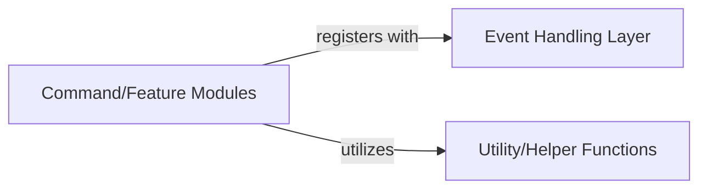

## Details

One paragraph explaining the functionality which is represented by this graph. What the main flow is and what is its purpose.

### Command/Feature Modules [[Expand]](./Command_Feature_Modules.md)
This component is responsible for encapsulating specific bot functionalities. It defines the commands that users can interact with and the core logic for executing these commands. It acts as an orchestrator, often delegating complex business operations and data manipulations to maintain a clean separation of concerns. It also leverages `Utility/Helper Functions` for common, reusable tasks.

**Related Classes/Methods**: _None_

### Event Handling Layer [[Expand]](./Event_Handling_Layer.md)
This layer is responsible for listening to and processing various events within the bot's environment, such as user interactions or messages. It acts as a dispatcher, routing events to the appropriate `Command/Feature Modules` for further processing.

**Related Classes/Methods**: _None_

### Utility/Helper Functions
This component provides a collection of reusable functions and utilities that support various operations across different modules. These functions encapsulate common tasks, promoting code reusability and reducing redundancy.

**Related Classes/Methods**: _None_

### [FAQ](https://github.com/CodeBoarding/GeneratedOnBoardings/tree/main?tab=readme-ov-file#faq)