```mermaid
graph LR
    Event_Handling_Layer["Event Handling Layer"]
    Command_Feature_Modules["Command/Feature Modules"]
    Service_Layer["Service Layer"]
    Data_Access_Caching["Data Access/Caching"]
    Configuration_Management["Configuration Management"]
    Utility_Helper_Functions["Utility/Helper Functions"]
    Event_Handling_Layer -- "dispatches events to" --> Command_Feature_Modules
    Event_Handling_Layer -- "invokes services in" --> Service_Layer
    Command_Feature_Modules -- "invokes methods in" --> Service_Layer
    Command_Feature_Modules -- "utilizes" --> Utility_Helper_Functions
    Service_Layer -- "manages data via" --> Data_Access_Caching
    Service_Layer -- "leverages" --> Utility_Helper_Functions
    Event_Handling_Layer -- "accesses configuration" --> Configuration_Management
    Command_Feature_Modules -- "accesses configuration" --> Configuration_Management
    Service_Layer -- "accesses configuration" --> Configuration_Management
    Data_Access_Caching -- "accesses configuration" --> Configuration_Management
    Utility_Helper_Functions -- "accesses configuration" --> Configuration_Management
    click Event_Handling_Layer href "https://github.com/CodeBoarding/GeneratedOnBoardings/blob/main/Flyerscord-Bot/Event_Handling_Layer.md" "Details"
    click Command_Feature_Modules href "https://github.com/CodeBoarding/GeneratedOnBoardings/blob/main/Flyerscord-Bot/Command_Feature_Modules.md" "Details"
    click Service_Layer href "https://github.com/CodeBoarding/GeneratedOnBoardings/blob/main/Flyerscord-Bot/Service_Layer.md" "Details"
    click Data_Access_Caching href "https://github.com/CodeBoarding/GeneratedOnBoardings/blob/main/Flyerscord-Bot/Data_Access_Caching.md" "Details"
```

## Details

Abstract Components Overview of a TypeScript Discord bot project.

### Event Handling Layer [[Expand]](./Event_Handling_Layer.md)
The primary entry point for all incoming Discord events (messages, interactions, etc.). It is responsible for listening to events, parsing them, and dispatching them to the appropriate command or service modules for processing.

**Related Classes/Methods**:

- `src/common/listeners/onMessageCreate.ts`
- `src/common/listeners/onInteractionCreate.ts`

### Command/Feature Modules [[Expand]](./Command_Feature_Modules.md)
Encapsulates specific bot functionalities and commands. Each module is self-contained, handling the logic for a particular feature, often interacting with the Service Layer to perform business operations.

**Related Classes/Methods**:

- `src/modules/team/TeamModule.ts`
- `src/modules/poll/PollModule.ts`

### Service Layer [[Expand]](./Service_Layer.md)
Abstracts the core business logic of the application. Services are responsible for complex operations, data manipulation, external API interactions, and orchestrating tasks across different data sources.

**Related Classes/Methods**:

- `src/services/TeamService.ts`
- `src/services/UserService.ts`

### Data Access/Caching [[Expand]](./Data_Access_Caching.md)
Manages persistent data storage and caching, abstracting data retrieval and storage operations from the business logic. It ensures efficient and consistent access to data, potentially reducing database load through caching.

**Related Classes/Methods**:

- `src/common/cache/CombinedTeamInfoCache.ts`

### Configuration Management
Handles the loading and management of application settings, environment variables, API keys, and other configurable parameters, ensuring the bot operates correctly in different environments.

**Related Classes/Methods**:

- `src/common/config/Config.ts`
- `src/common/config/ConfigManager.ts`

### Utility/Helper Functions
A collection of reusable functions and classes that provide common, non-domain-specific functionalities such as data formatting, validation, or common algorithms.

**Related Classes/Methods**:

- `src/common/utils/DateUtils.ts`
- `src/common/utils/ValidationUtils.ts`

### [FAQ](https://github.com/CodeBoarding/GeneratedOnBoardings/tree/main?tab=readme-ov-file#faq)