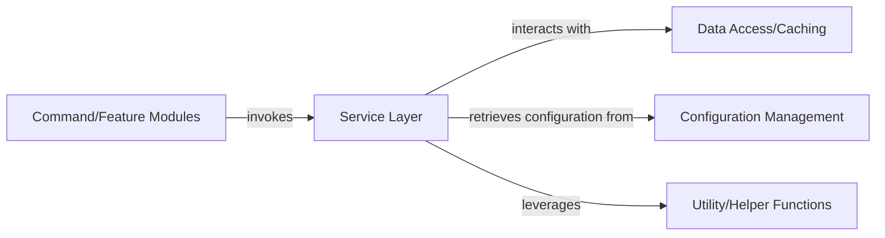

## Details

One paragraph explaining the functionality which is represented by this graph. What the main flow is and what is its purpose.

### Service Layer [[Expand]](./Service_Layer.md)
Contains the core business logic, handling data manipulation, external API interactions, and providing reusable functions for other components. It acts as an intermediary between the event handling/command modules and lower-level concerns like data access or utilities.

**Related Classes/Methods**: _None_

### Command/Feature Modules [[Expand]](./Command_Feature_Modules.md)
These modules encapsulate specific commands or features of the application, often handling user input or external triggers. They orchestrate interactions with the Service Layer to execute business logic.

**Related Classes/Methods**:

- `src/common/commands/Command.ts`

### Data Access/Caching [[Expand]](./Data_Access_Caching.md)
Responsible for abstracting data retrieval and storage operations, including interactions with databases or external APIs, and managing cached data to improve performance.

**Related Classes/Methods**:

- `src/common/cache/CombinedTeamInfoCache.ts`

### Configuration Management
Manages application settings and configurations, providing a centralized way to access various parameters and ensuring consistent behavior across different environments.

**Related Classes/Methods**:

- `src/common/config/ConfigManager.ts`

### Utility/Helper Functions
A collection of reusable, generic functions that provide common functionalities not directly tied to specific business logic, such as data formatting, validation, or common algorithms.

**Related Classes/Methods**:

- `src/common/utils/StringUtils.ts`

### [FAQ](https://github.com/CodeBoarding/GeneratedOnBoardings/tree/main?tab=readme-ov-file#faq)