```mermaid
graph LR
    Event_Handling_Layer["Event Handling Layer"]
    Command_Feature_Modules["Command/Feature Modules"]
    Service_Layer["Service Layer"]
    Data_Access_Caching["Data Access/Caching"]
    Configuration_Management["Configuration Management"]
    Event_Handling_Layer -- "dispatches events to" --> Command_Feature_Modules
    Event_Handling_Layer -- "dispatches events to" --> Service_Layer
    Command_Feature_Modules -- "delegates logic to" --> Service_Layer
    Command_Feature_Modules -- "accesses" --> Data_Access_Caching
    Service_Layer -- "accesses" --> Data_Access_Caching
    Configuration_Management -- "configures" --> Event_Handling_Layer
    Configuration_Management -- "configures" --> Command_Feature_Modules
    Configuration_Management -- "configures" --> Service_Layer
    Configuration_Management -- "configures" --> Data_Access_Caching
    Data_Access_Caching -- "provides data to" --> Service_Layer
    Data_Access_Caching -- "provides data to" --> Command_Feature_Modules
    click Event_Handling_Layer href "https://github.com/CodeBoarding/GeneratedOnBoardings/blob/main/Flyerscord-Bot/Event_Handling_Layer.md" "Details"
    click Command_Feature_Modules href "https://github.com/CodeBoarding/GeneratedOnBoardings/blob/main/Flyerscord-Bot/Command_Feature_Modules.md" "Details"
    click Service_Layer href "https://github.com/CodeBoarding/GeneratedOnBoardings/blob/main/Flyerscord-Bot/Service_Layer.md" "Details"
    click Data_Access_Caching href "https://github.com/CodeBoarding/GeneratedOnBoardings/blob/main/Flyerscord-Bot/Data_Access_Caching.md" "Details"
```

## Details

One paragraph explaining the functionality which is represented by this graph. What the main flow is and what is its purpose.

### Event Handling Layer [[Expand]](./Event_Handling_Layer.md)
The primary entry point for all Discord interactions, responsible for listening to events and dispatching them to the appropriate modules or services.

**Related Classes/Methods**:

- `src/bot.ts`
- `src/common/listeners/onInteractionCreate.ts`
- `src/common/listeners/onMessageCreate.ts`

### Command/Feature Modules [[Expand]](./Command_Feature_Modules.md)
Encapsulates specific bot functionalities, defining commands and their execution logic, often delegating complex tasks to the Service Layer.

**Related Classes/Methods**: _None_

### Service Layer [[Expand]](./Service_Layer.md)
Contains the core business logic, handling data manipulation, external API interactions, and providing reusable functions for other components.

**Related Classes/Methods**: _None_

### Data Access/Caching [[Expand]](./Data_Access_Caching.md)
Manages persistent data storage and caching, abstracting data retrieval and storage operations from the business logic.

**Related Classes/Methods**:

- `src/common/cache/CombinedTeamInfoCache.ts`

### Configuration Management
Centralizes and provides access to environment-specific settings, API keys, and bot parameters for all other components.

**Related Classes/Methods**:

- `src/common/config/Config.ts`
- `src/common/config/ConfigManager.ts`
- `src/common/config/defaults.config.ts`

### [FAQ](https://github.com/CodeBoarding/GeneratedOnBoardings/tree/main?tab=readme-ov-file#faq)