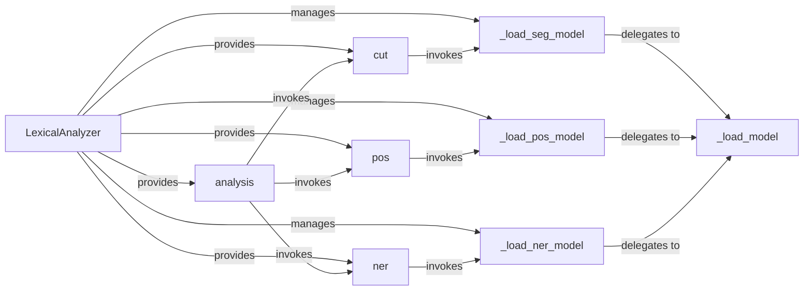

## Details

The `Lexical Analysis Core` subsystem is a fundamental part of the `FoolNLTK` project, focusing on the initial stages of Natural Language Processing for Chinese text. It embodies a pipeline-driven design, characteristic of NLP toolkits, by providing distinct yet interconnected functionalities for text processing at the lexical level.

### LexicalAnalyzer
The primary orchestrator and public interface for all lexical analysis tasks. It manages the lifecycle and invocation of underlying segmentation, POS tagging, and NER models.

**Related Classes/Methods**:

- <a href="https://github.com/rockyzhengwu/FoolNLTK/blob/master/fool/lexical.py#L24-L134" target="_blank" rel="noopener noreferrer">`fool.lexical.LexicalAnalyzer`:24-134</a>

### cut
Implements the word segmentation functionality, breaking down raw input text into individual words or tokens.

**Related Classes/Methods**:

- <a href="https://github.com/rockyzhengwu/FoolNLTK/blob/master/fool/lexical.py#L24-L134" target="_blank" rel="noopener noreferrer">`fool.lexical.LexicalAnalyzer:cut`:24-134</a>

### pos
Performs Part-of-Speech (POS) tagging, assigning grammatical categories to each word in the segmented text.

**Related Classes/Methods**:

- <a href="https://github.com/rockyzhengwu/FoolNLTK/blob/master/fool/lexical.py#L24-L134" target="_blank" rel="noopener noreferrer">`fool.lexical.LexicalAnalyzer:pos`:24-134</a>

### ner
Identifies and classifies named entities (e.g., persons, organizations, locations) within the processed text.

**Related Classes/Methods**:

- <a href="https://github.com/rockyzhengwu/FoolNLTK/blob/master/fool/lexical.py#L24-L134" target="_blank" rel="noopener noreferrer">`fool.lexical.LexicalAnalyzer:ner`:24-134</a>

### analysis [[Expand]](./analysis.md)
Provides a comprehensive lexical analysis by sequentially invoking the `cut`, `pos`, and `ner` methods, representing a complete processing pipeline.

**Related Classes/Methods**:

- <a href="https://github.com/rockyzhengwu/FoolNLTK/blob/master/fool/lexical.py#L24-L134" target="_blank" rel="noopener noreferrer">`fool.lexical.LexicalAnalyzer:analysis`:24-134</a>

### _load_model
A private, generic helper method responsible for the common logic of loading any `Predictor` model, including path resolution and map file loading.

**Related Classes/Methods**:

- <a href="https://github.com/rockyzhengwu/FoolNLTK/blob/master/fool/lexical.py#L24-L134" target="_blank" rel="noopener noreferrer">`fool.lexical.LexicalAnalyzer:_load_model`:24-134</a>

### _load_seg_model
Specifically handles the loading of the model required for word segmentation.

**Related Classes/Methods**:

- <a href="https://github.com/rockyzhengwu/FoolNLTK/blob/master/fool/lexical.py#L24-L134" target="_blank" rel="noopener noreferrer">`fool.lexical.LexicalAnalyzer:_load_seg_model`:24-134</a>

### _load_pos_model
Specifically handles the loading of the model required for Part-of-Speech tagging.

**Related Classes/Methods**:

- <a href="https://github.com/rockyzhengwu/FoolNLTK/blob/master/fool/lexical.py#L24-L134" target="_blank" rel="noopener noreferrer">`fool.lexical.LexicalAnalyzer:_load_pos_model`:24-134</a>

### _load_ner_model
Specifically handles the loading of the model required for Named Entity Recognition.

**Related Classes/Methods**:

- <a href="https://github.com/rockyzhengwu/FoolNLTK/blob/master/fool/lexical.py#L24-L134" target="_blank" rel="noopener noreferrer">`fool.lexical.LexicalAnalyzer:_load_ner_model`:24-134</a>

### [FAQ](https://github.com/CodeBoarding/GeneratedOnBoardings/tree/main?tab=readme-ov-file#faq)