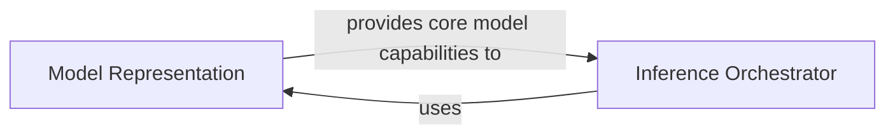

## Details

The `Model Inference & Management` subsystem is central to the `FoolNLTK` project, handling the loading, execution, and lifecycle of pre-trained NLP models.

### Model Representation
This component, embodied by `fool.model.Model`, serves as the foundational representation of a loaded pre-trained model. It encapsulates the model's graph, weights, and any necessary mapping information (e.g., vocabulary maps). It provides the core capabilities for loading these model assets and performing the low-level decoding of model outputs.

**Related Classes/Methods**:

- <a href="https://github.com/rockyzhengwu/FoolNLTK/blob/master/fool/model.py#L40-L77" target="_blank" rel="noopener noreferrer">`fool.model.Model`:40-77</a>

### Inference Orchestrator
This component, represented by `fool.predictor.Predictor`, acts as the orchestrator for the model inference process. It is responsible for managing the overall prediction workflow, including loading the necessary model components (specifically the graph for inference) and utilizing the `Model Representation` component to execute predictions based on input data.

**Related Classes/Methods**:

- <a href="https://github.com/rockyzhengwu/FoolNLTK/blob/master/fool/predictor.py#L40-L78" target="_blank" rel="noopener noreferrer">`fool.predictor.Predictor`:40-78</a>

### [FAQ](https://github.com/CodeBoarding/GeneratedOnBoardings/tree/main?tab=readme-ov-file#faq)