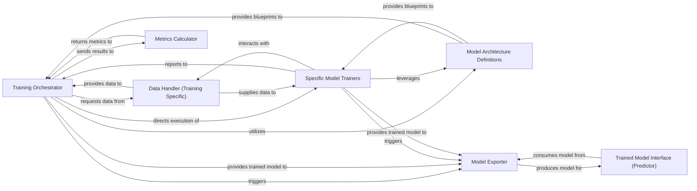

## Details

The `train` subsystem in FoolNLTK is a comprehensive model training pipeline. The **Training Orchestrator** (`train.norm_train_recoard`) acts as the central control, managing the entire training lifecycle from data preparation to model export. It interacts with the **Data Handler (Training Specific)** (`train.data_utils`) to load and preprocess training data. Model structures are provided by **Model Architecture Definitions** (`train.bi_lstm`, `fool.model.Model`), which are then utilized by the orchestrator or specialized **Specific Model Trainers** (`train.train_bert_ner`) for task-specific training. During training, the **Metrics Calculator** (`train.tf_metrics`) evaluates model performance. Upon completion, the **Model Exporter** (`train.export_model`) serializes the trained models into a deployable format, which can then be consumed by the **Trained Model Interface (Predictor)** (`fool.predictor.Predictor`, and the `Predictor` class within `train.export_model`) for inference. This structured approach ensures a clear separation of concerns and a robust training workflow.

### Training Orchestrator
The central controller of the training process. It manages the sequence of operations, including data loading, model initialization, training loops, and evaluation, ensuring the end-to-end flow of the training pipeline.

**Related Classes/Methods**:

- <a href="https://github.com/rockyzhengwu/FoolNLTK/blob/master/train/norm_train_recoard.py#L34-L201" target="_blank" rel="noopener noreferrer">`train.norm_train_recoard`:34-201</a>

### Data Handler (Training Specific)
Responsible for preparing data specifically for the training process. This includes loading, preprocessing, feature engineering, batching, and creating efficient input pipelines for various model architectures. It ensures data is in the correct format and ready for model consumption during training.

**Related Classes/Methods**:

- <a href="https://github.com/rockyzhengwu/FoolNLTK/blob/master/train/data_utils.py#L12-L235" target="_blank" rel="noopener noreferrer">`train.data_utils`:12-235</a>

### Model Architecture Definitions
Encapsulates the definitions of various NLP model architectures (e.g., Bi-LSTM). These components provide the blueprints for models to be trained, defining layers, connections, and overall structure. This includes the foundational Model class.

**Related Classes/Methods**:

- <a href="https://github.com/rockyzhengwu/FoolNLTK/blob/master/train/bi_lstm.py#L11-L135" target="_blank" rel="noopener noreferrer">`train.bi_lstm`:11-135</a>
- <a href="https://github.com/rockyzhengwu/FoolNLTK/blob/master/fool/model.py#L40-L77" target="_blank" rel="noopener noreferrer">`fool.model.Model`:40-77</a>

### Specific Model Trainers
Specialized components that handle the training specifics for particular model types or tasks (e.g., BERT for Named Entity Recognition). They manage fine-tuning, specific loss functions, unique data transformations, or specialized training loops required for their respective models, and implicitly configure the model architecture for the task.

**Related Classes/Methods**:

- <a href="https://github.com/rockyzhengwu/FoolNLTK/blob/master/train/train_bert_ner.py#L105-L292" target="_blank" rel="noopener noreferrer">`train.train_bert_ner`:105-292</a>

### Metrics Calculator
Provides standardized functions for evaluating model performance during and after training. It calculates metrics like precision, recall, and F1-score, crucial for monitoring training progress, assessing model quality, and guiding hyperparameter tuning.

**Related Classes/Methods**:

- <a href="https://github.com/rockyzhengwu/FoolNLTK/blob/master/train/tf_metrics.py#L17-L215" target="_blank" rel="noopener noreferrer">`train.tf_metrics`:17-215</a>

### Model Exporter
Manages the serialization and export of trained models into a deployable format. This component ensures that trained models can be easily loaded and used by inference components or other applications, often handling format conversions and metadata inclusion.

**Related Classes/Methods**:

- <a href="https://github.com/rockyzhengwu/FoolNLTK/blob/master/train/export_model.py#L9-L108" target="_blank" rel="noopener noreferrer">`train.export_model`:9-108</a>

### Trained Model Interface (Predictor)
Represents the deployable interface for trained models, enabling them to perform predictions or inferences. While not directly part of the training process, it is the intended consumer and target format for the models produced by the Model Training Pipeline.

**Related Classes/Methods**:

- <a href="https://github.com/rockyzhengwu/FoolNLTK/blob/master/fool/predictor.py#L40-L78" target="_blank" rel="noopener noreferrer">`fool.predictor.Predictor`:40-78</a>

### [FAQ](https://github.com/CodeBoarding/GeneratedOnBoardings/tree/main?tab=readme-ov-file#faq)