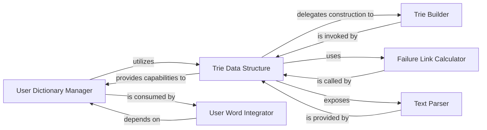

## Details

The `User Dictionary` subsystem in `FoolNLTK` is responsible for managing custom user-defined terms, primarily leveraging a Trie data structure for efficient lookup and matching during lexical analysis.

### User Dictionary Manager
This component serves as the high-level interface for managing user-defined dictionaries. It abstracts the underlying data structure, providing methods to load, add, and query custom terms. It is crucial for allowing users to customize the lexical analysis process.

**Related Classes/Methods**:

- <a href="https://github.com/rockyzhengwu/FoolNLTK/blob/master/fool/dictionary.py#L7-L43" target="_blank" rel="noopener noreferrer">`fool.dictionary.Dictionary`:7-43</a>

### Trie Data Structure
This is the core data structure component, implementing an Aho-Corasick automaton. It is fundamental for efficient storage, retrieval, and multi-pattern matching of words, which is critical for fast dictionary lookups and lexical analysis in an NLP context.

**Related Classes/Methods**:

- <a href="https://github.com/rockyzhengwu/FoolNLTK/blob/master/fool/trie.py#L50-L128" target="_blank" rel="noopener noreferrer">`fool.trie.Trie`:50-128</a>

### Trie Builder
This component is responsible for the recursive construction of the Trie data structure. It orchestrates the process of adding individual keywords to form the complete automaton, which is a key setup phase for the `Trie`.

**Related Classes/Methods**:

- <a href="https://github.com/rockyzhengwu/FoolNLTK/blob/master/fool/trie.py#L131-L132" target="_blank" rel="noopener noreferrer">`fool.trie.create_trie`:131-132</a>

### Failure Link Calculator
This component computes and sets the Aho-Corasick failure links within the Trie. These links are essential for the algorithm's efficiency, enabling fast transitions and pattern matching by avoiding redundant comparisons.

**Related Classes/Methods**:

- <a href="https://github.com/rockyzhengwu/FoolNLTK/blob/master/fool/trie.py#L40-L41" target="_blank" rel="noopener noreferrer">`fool.trie.set_failure`:40-41</a>

### Text Parser
This component provides the primary method for performing text lookup and pattern matching against the constructed Trie. It is the operational interface for utilizing the dictionary during the actual NLP processing.

**Related Classes/Methods**:

- <a href="https://github.com/rockyzhengwu/FoolNLTK/blob/master/fool/trie.py#L111-L128" target="_blank" rel="noopener noreferrer">`fool.trie.parse_text`:111-128</a>

### User Word Integrator
This component is responsible for integrating the words from the user dictionary into the main NLP processing flow. It acts as a bridge, ensuring that custom terms are considered during the overall lexical analysis.

**Related Classes/Methods**:

- <a href="https://github.com/rockyzhengwu/FoolNLTK/blob/master/fool/__init__.py#L91-L130" target="_blank" rel="noopener noreferrer">`fool.__init__._mearge_user_words`:91-130</a>

### [FAQ](https://github.com/CodeBoarding/GeneratedOnBoardings/tree/main?tab=readme-ov-file#faq)