```mermaid
graph LR
    User_API_Orchestration["User API & Orchestration"]
    Lexical_Analysis_Core["Lexical Analysis Core"]
    Model_Inference_Management["Model Inference & Management"]
    User_Dictionary["User Dictionary"]
    Model_Training_Pipeline["Model Training Pipeline"]
    User_API_Orchestration -- "forwards raw text input for processing" --> Lexical_Analysis_Core
    User_API_Orchestration -- "integrates custom vocabulary for enhanced processing" --> User_Dictionary
    Lexical_Analysis_Core -- "requests predictions for NLP tasks" --> Model_Inference_Management
    User_Dictionary -- "provides custom word lists for lexical analysis" --> Lexical_Analysis_Core
    Model_Training_Pipeline -- "exports trained models for deployment" --> Model_Inference_Management
    Model_Inference_Management -- "returns NLP predictions" --> Lexical_Analysis_Core
    click Lexical_Analysis_Core href "https://github.com/CodeBoarding/GeneratedOnBoardings/blob/main/FoolNLTK/Lexical_Analysis_Core.md" "Details"
    click Model_Inference_Management href "https://github.com/CodeBoarding/GeneratedOnBoardings/blob/main/FoolNLTK/Model_Inference_Management.md" "Details"
    click User_Dictionary href "https://github.com/CodeBoarding/GeneratedOnBoardings/blob/main/FoolNLTK/User_Dictionary.md" "Details"
    click Model_Training_Pipeline href "https://github.com/CodeBoarding/GeneratedOnBoardings/blob/main/FoolNLTK/Model_Training_Pipeline.md" "Details"
```

## Details

FoolNLTK's architecture is designed around a modular approach to natural language processing, focusing on efficient lexical analysis and model management. The core of the system revolves around the `Lexical Analysis Core`, which orchestrates various NLP tasks like word segmentation, POS tagging, and Named Entity Recognition. This component heavily relies on the `Model Inference & Management` system for executing pre-trained models and the `User Dictionary` for incorporating custom vocabulary. The `User API & Orchestration` layer provides the primary interface for users, channeling text through the lexical analysis pipeline. While a `Model Training Pipeline` exists, its primary interaction is with the `Model Inference & Management` component, providing trained models for deployment rather than being directly involved in the real-time text processing flow. This clear separation of concerns facilitates maintainability and scalability, allowing for independent development and optimization of each functional area.

### User API & Orchestration
The primary interface for end-users to interact with the NLP functionalities. It handles initial text input and orchestrates calls to the core lexical analysis components.

**Related Classes/Methods**:

- <a href="https://github.com/rockyzhengwu/FoolNLTK/blob/master/fool/__main__.py#L1-L100" target="_blank" rel="noopener noreferrer">`fool.__main__.main`:1-100</a>

### Lexical Analysis Core [[Expand]](./Lexical_Analysis_Core.md)
Implements the fundamental NLP tasks such as word segmentation, Part-of-Speech (POS) tagging, and Named Entity Recognition (NER). It acts as the central processing unit for text at the lexical level.

**Related Classes/Methods**:

- <a href="https://github.com/rockyzhengwu/FoolNLTK/blob/master/fool/lexical.py#L24-L134" target="_blank" rel="noopener noreferrer">`fool.lexical.LexicalAnalyzer`:24-134</a>

### Model Inference & Management [[Expand]](./Model_Inference_Management.md)
Responsible for loading pre-trained models (graphs and weights), executing inference (prediction) based on input data, and managing the lifecycle of deployed models.

**Related Classes/Methods**:

- <a href="https://github.com/rockyzhengwu/FoolNLTK/blob/master/fool/predictor.py#L40-L78" target="_blank" rel="noopener noreferrer">`fool.predictor.Predictor`:40-78</a>
- <a href="https://github.com/rockyzhengwu/FoolNLTK/blob/master/fool/model.py#L40-L77" target="_blank" rel="noopener noreferrer">`fool.model.Model`:40-77</a>

### User Dictionary [[Expand]](./User_Dictionary.md)
Manages custom user dictionaries, typically implemented using a Trie data structure for efficient lookup and matching of user-defined terms during lexical analysis.

**Related Classes/Methods**:

- <a href="https://github.com/rockyzhengwu/FoolNLTK/blob/master/fool/dictionary.py#L7-L43" target="_blank" rel="noopener noreferrer">`fool.dictionary.Dictionary`:7-43</a>
- <a href="https://github.com/rockyzhengwu/FoolNLTK/blob/master/fool/trie.py#L50-L128" target="_blank" rel="noopener noreferrer">`fool.trie.Trie`:50-128</a>

### Model Training Pipeline [[Expand]](./Model_Training_Pipeline.md)
Manages the end-to-end training process for various NLP models, including data preparation, model initialization, training loops, and integration with evaluation metrics. It encapsulates model architectures and data utilities.

**Related Classes/Methods**:

- <a href="https://github.com/rockyzhengwu/FoolNLTK/blob/master/fool/model.py#L40-L77" target="_blank" rel="noopener noreferrer">`fool.model.Model`:40-77</a>
- <a href="https://github.com/rockyzhengwu/FoolNLTK/blob/master/fool/predictor.py#L40-L78" target="_blank" rel="noopener noreferrer">`fool.predictor.Predictor`:40-78</a>

### [FAQ](https://github.com/CodeBoarding/GeneratedOnBoardings/tree/main?tab=readme-ov-file#faq)