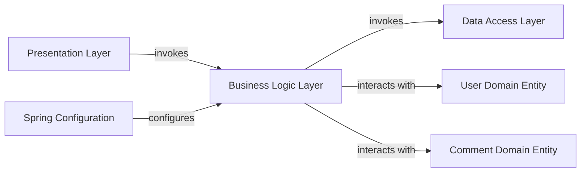

## Details

One paragraph explaining the functionality which is represented by this graph. What the main flow is and what is its purpose.

### Business Logic Layer [[Expand]](./Business_Logic_Layer.md)
Encapsulates the core business rules, performs validations, and coordinates operations. Its main responsibility is implementing application-specific business logic for blog-related operations (e.g., creating, retrieving, updating, deleting blog posts and comments). It orchestrates interactions with the Data Access Layer and various domain entities.

**Related Classes/Methods**:

- `com.forestblog.service.BlogService` (1:1)

### Data Access Layer [[Expand]](./Data_Access_Layer.md)
Responsible for abstracting and encapsulating all access to data sources.

**Related Classes/Methods**:

- `BlogMapper` (1:1)

### User Domain Entity
Represents the core data and behavior related to users within the domain model.

**Related Classes/Methods**:

- `UserEntity` (1:1)

### Comment Domain Entity
Represents the core data and behavior related to comments within the domain model.

**Related Classes/Methods**:

- `CommentEntity` (1:1)

### Presentation Layer [[Expand]](./Presentation_Layer.md)
Handles user interface and translates user interactions into business requests.

**Related Classes/Methods**:

- `BlogController` (1:1)

### Spring Configuration
Manages the configuration and lifecycle of application components using the Spring framework.

**Related Classes/Methods**: _None_

### [FAQ](https://github.com/CodeBoarding/GeneratedOnBoardings/tree/main?tab=readme-ov-file#faq)