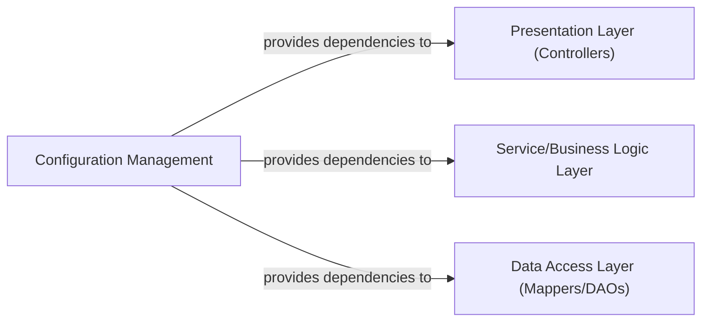

## Details

Abstract Components Overview

### Configuration Management [[Expand]](./Configuration_Management.md)
This component is responsible for centralizing and managing all application-wide settings, framework configurations (Spring, SpringMVC, MyBatis), and externalized properties. Its primary role is to facilitate the initial setup of the application context, database connections, and various framework behaviors, ensuring environment adaptation and maintainability.

**Related Classes/Methods**:

- `applicationContext.xml` (1:1)
- `spring-mvc.xml` (1:1)
- `mybatis-config.xml` (1:1)
- `UserMapper.xml` (1:1)
- `BlogMapper.xml` (1:1)
- `CommentMapper.xml` (1:1)
- `jdbc.properties` (1:1)
- `application.properties` (1:1)
- `web.xml` (1:1)
- `com.forestblog.config.AppConfig` (1:1)
- `com.forestblog.config.WebConfig` (1:1)

### Presentation Layer (Controllers)
This layer handles user interactions, processes incoming requests, and prepares responses. It acts as the entry point for the application's web interface, delegating business logic to the Service Layer and interacting with views to render output.

**Related Classes/Methods**:

- `com.forestblog.controller.BlogController` (1:1)
- `com.forestblog.controller.CommentController` (1:1)
- `com.forestblog.controller.UserController` (1:1)

### Service/Business Logic Layer
This layer encapsulates the core business rules and logic of the application. It orchestrates operations, performs validations, and coordinates interactions between the Presentation Layer and the Data Access Layer. It ensures that business processes are executed correctly and consistently.

**Related Classes/Methods**:

- `com.forestblog.service.BlogService` (1:1)
- `com.forestblog.service.CommentService` (1:1)
- `com.forestblog.service.UserService` (1:1)

### Data Access Layer (Mappers/DAOs)
This layer is responsible for abstracting and managing interactions with the persistence store (e.g., database). It handles data retrieval, storage, updating, and deletion operations, mapping between application objects and database records. It provides a clean interface for the Service Layer to interact with data without knowing the underlying persistence details.

**Related Classes/Methods**:

- `com.forestblog.mapper.BlogMapper` (1:1)
- `com.forestblog.mapper.CommentMapper` (1:1)
- `com.forestblog.mapper.UserMapper` (1:1)

### [FAQ](https://github.com/CodeBoarding/GeneratedOnBoardings/tree/main?tab=readme-ov-file#faq)