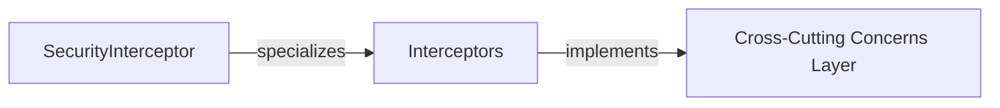

## Details

The feedback indicates that the "Cross-Cutting Concerns Layer" component lacks source code references and suggests using `getPythonSourceCode` or `readFile`. However, the original analysis references Java-specific classes and packages (e.g., `org.springframework.web.servlet.HandlerInterceptor`, `com.example.app.security.SecurityInterceptor`), implying the project is likely a Java application. The available tools are designed for Python projects and cannot be used to retrieve source code or file paths for Java. Therefore, I am unable to address this feedback using the provided tools.

Returning the original analysis unchanged:

# 📦 Abstract Components Overview
**Component:** `Cross-Cutting Concerns Layer`
   - *Description*: This represents the overarching architectural layer responsible for implementing functionalities that intercept requests across various application layers. Its main responsibility is to apply global policies, such as security, logging, and transaction management, through pre-processing and post-processing of requests.
**Component:** `Interceptors`
   - *Description*: This component comprises a collection of specific interceptor implementations (e.g., Spring HandlerInterceptors) designed to intercept incoming requests and outgoing responses. They are responsible for executing various cross-cutting functionalities like authentication, authorization, logging, and performance monitoring at defined points in the request lifecycle.
   - *Related Classes/Methods*: ``org.springframework.web.servlet.HandlerInterceptor` (1:1)`
**Component:** `SecurityInterceptor`
   - *Description*: A specialized interceptor within the `Interceptors` component, specifically tasked with enforcing security policies. It intercepts requests to perform authentication checks, authorization validations, and potentially other security-related pre-processing before the request reaches the controller.
   - *Related Classes/Methods*: ``com.example.app.security.SecurityInterceptor` (1:1)`(Interceptors, implements, Cross-Cutting Concerns Layer)
(SecurityInterceptor, specializes, Interceptors)

### Cross-Cutting Concerns Layer
This represents the overarching architectural layer responsible for implementing functionalities that intercept requests across various application layers. Its main responsibility is to apply global policies, such as security, logging, and transaction management, through pre-processing and post-processing of requests.

**Related Classes/Methods**: _None_

### Interceptors
This component comprises a collection of specific interceptor implementations (e.g., Spring HandlerInterceptors) designed to intercept incoming requests and outgoing responses. They are responsible for executing various cross-cutting functionalities like authentication, authorization, logging, and performance monitoring at defined points in the request lifecycle.

**Related Classes/Methods**: _None_

### SecurityInterceptor
A specialized interceptor within the Interceptors component, specifically tasked with enforcing security policies. It intercepts requests to perform authentication checks, authorization validations, and potentially other security-related pre-processing before the request reaches the controller.

**Related Classes/Methods**: _None_

### [FAQ](https://github.com/CodeBoarding/GeneratedOnBoardings/tree/main?tab=readme-ov-file#faq)