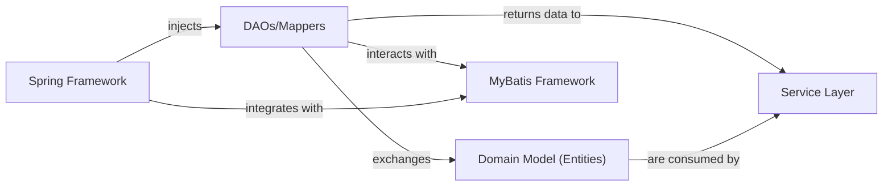

## Details

Abstract Components Overview

### DAOs/Mappers
These are the central components of the Data Access Layer. They provide an abstract interface for interacting with the database, handling CRUD (Create, Read, Update, Delete) operations for specific entities. They utilize the MyBatis framework for mapping Java objects to SQL statements and vice-versa.

**Related Classes/Methods**: _None_

### Domain Model (Entities)
These are plain old Java objects (POJOs) that represent the core business entities and their attributes. They directly map to the tables in the MySQL database and serve as the data structures exchanged between the Data Access Layer and other layers.

**Related Classes/Methods**: _None_

### MyBatis Framework
An external persistence framework that simplifies database interactions by mapping SQL statements to Java objects. It is configured to work with the DAOs/Mappers, handling the low-level JDBC details and result set mapping.

**Related Classes/Methods**: _None_

### Service Layer
This layer encapsulates the business logic of the application. It orchestrates operations, performs validations, and aggregates data, relying on the Data Access Layer to retrieve and persist data. It acts as the primary consumer of the DAOs/Mappers.

**Related Classes/Methods**: _None_

### Spring Framework
The overarching framework providing the Inversion of Control (IoC) container and Dependency Injection (DI). It manages the lifecycle of components, including the DAOs/Mappers, and injects their dependencies (e.g., data sources, MyBatis SqlSession) into other components.

**Related Classes/Methods**: _None_

### [FAQ](https://github.com/CodeBoarding/GeneratedOnBoardings/tree/main?tab=readme-ov-file#faq)