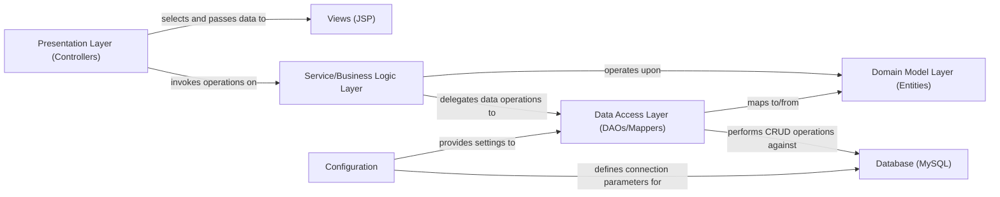

## Details

One paragraph explaining the functionality which is represented by this graph. What the main flow is and what is its purpose.

### Presentation Layer (Controllers)
Handles incoming HTTP requests, processes user input, and orchestrates responses by interacting with the Service Layer. It acts as the entry point for user interactions in the MVC pattern.

**Related Classes/Methods**: _None_

### Service/Business Logic Layer
Encapsulates the core business logic and rules of the application. It orchestrates operations, coordinates multiple DAO calls, and ensures data consistency before interacting with the Data Access Layer.

**Related Classes/Methods**: _None_

### Data Access Layer (DAOs/Mappers)
Provides an abstract interface for interacting with the persistent storage (MySQL Database). It is responsible for performing CRUD (Create, Read, Update, Delete) operations and mapping application objects to relational data.

**Related Classes/Methods**: _None_

### Domain Model Layer (Entities)
Represents the core data structures and business objects of the application. These objects define the structure of data transferred between layers and persisted in the database.

**Related Classes/Methods**: _None_

### Views (JSP)
Responsible for rendering the user interface. It receives processed data from the Presentation Layer and dynamically generates HTML content to be displayed to the end-user.

**Related Classes/Methods**: _None_

### Database (MySQL) [[Expand]](./Database_MySQL_.md)
The persistent storage system for application data. Its primary responsibility is the reliable storage and efficient retrieval of all application-related information.

**Related Classes/Methods**: _None_

### Configuration
Manages application-wide settings, including sensitive information like database connection parameters, external service endpoints, and other environmental configurations.

**Related Classes/Methods**: _None_

### [FAQ](https://github.com/CodeBoarding/GeneratedOnBoardings/tree/main?tab=readme-ov-file#faq)