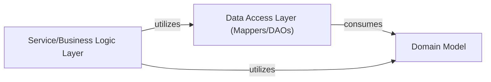

## Details

Abstract Components Overview and Component Relationships for ForestBlog project

### Domain Model [[Expand]](./Domain_Model.md)
Represents the core business objects, data structures (entities, DTOs), and enumerations used throughout the application. Its main responsibility is data representation and encapsulation, providing the foundational data structures for all other layers. This component defines the entities that directly map to database tables and are central to data exchange within the application.

**Related Classes/Methods**:

- `com.liuyanzhao.ssm.blog.entity`
- `com.liuyanzhao.ssm.blog.dto`
- `com.liuyanzhao.ssm.blog.enums`

### Data Access Layer (Mappers/DAOs)
Responsible for interacting with the persistence layer (database). It provides an abstraction over the database, handling data retrieval, storage, and mapping between database records and domain objects. This layer typically contains Mappers or Data Access Objects (DAOs) that perform CRUD (Create, Read, Update, Delete) operations.

**Related Classes/Methods**:

- `com.liuyanzhao.ssm.blog.mapper`

### Service/Business Logic Layer
Encapsulates the core business rules and logic of the application. It orchestrates operations, coordinates between the data access layer and the presentation layer, and ensures that business rules are enforced. This layer often contains services that perform complex operations by combining multiple data access operations and applying business validations.

**Related Classes/Methods**:

- `com.liuyanzhao.ssm.blog.service`

### [FAQ](https://github.com/CodeBoarding/GeneratedOnBoardings/tree/main?tab=readme-ov-file#faq)