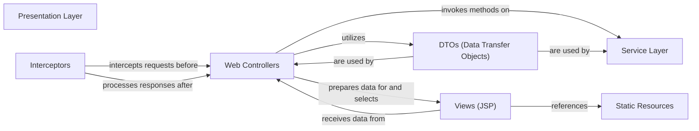

## Details

Abstract Components Overview

### Presentation Layer [[Expand]](./Presentation_Layer.md)
Handles HTTP requests, manages user input, orchestrates application flow, and renders responses. Main Responsibility: User interaction and UI rendering.

**Related Classes/Methods**: _None_

### Web Controllers
The core components of the Presentation Layer, responsible for receiving incoming HTTP requests, parsing user input, delegating business logic execution to the Service Layer, and preparing model data for view rendering. Examples include `BlogController` and `CommentController`.

**Related Classes/Methods**: _None_

### Views (JSP)
JavaServer Pages (JSP) files that serve as the templating engine for rendering dynamic web pages. They combine static HTML content with dynamic data provided by the controllers to generate the final user interface.

**Related Classes/Methods**: _None_

### Interceptors
Spring MVC interceptors provide a mechanism to intercept HTTP requests and responses, allowing for pre-processing before a controller method is executed and post-processing after it completes. They are commonly used for cross-cutting concerns like authentication, authorization, logging, and request validation.

**Related Classes/Methods**: _None_

### Static Resources
This component encompasses all static assets required by the web application, such as CSS stylesheets, JavaScript files, images, fonts, and other media. These resources are directly served to the client by the web server or servlet container.

**Related Classes/Methods**: _None_

### DTOs (Data Transfer Objects)
Plain Java objects designed to transfer data between the Presentation Layer (specifically, Web Controllers) and other layers, such as the Service Layer. They encapsulate data for requests received from the client and responses sent back, ensuring a clean contract and decoupling the internal domain model.

**Related Classes/Methods**: _None_

### Service Layer
Encapsulates the application's business logic, orchestrating operations across multiple domain objects and interacting with the data access layer. It provides a clean API for the Presentation Layer, abstracting complex business rules and data persistence details.

**Related Classes/Methods**: _None_

### [FAQ](https://github.com/CodeBoarding/GeneratedOnBoardings/tree/main?tab=readme-ov-file#faq)